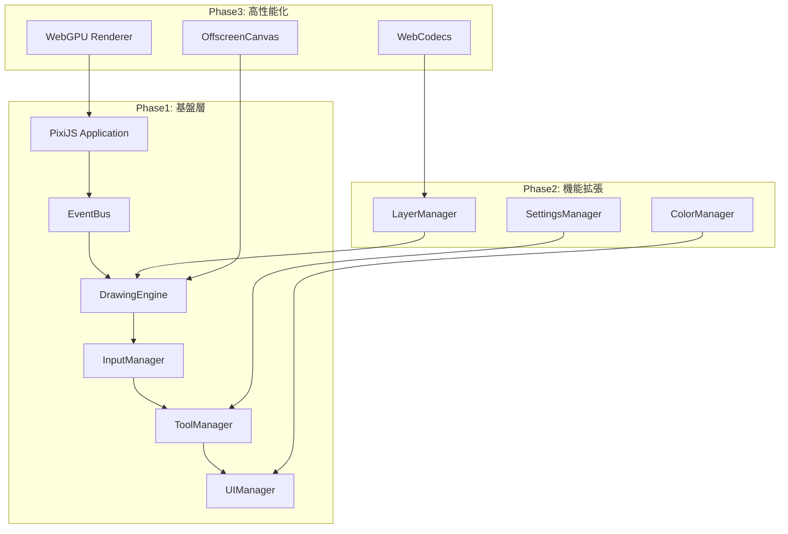

# 技術設計書 v2.0

**最終更新**: 2025年8月6日  
**対象**: Adobe Fresco風 ふたば☆ちゃんねるカラー お絵描きツール  
**技術基盤**: PixiJS v8.11.0 + WebGL2段階対応設計

## 🏗️ システムアーキテクチャ

### 全体構成（段階的成長設計）


### Phase1 技術スタック
```typescript
interface Phase1TechStack {
  // 描画・レンダリング基盤
  rendering: {
    engine: 'PixiJS v8.11.0';
    api: 'WebGL2'; // WebGPU準備完了
    graphics: 'PIXI.Graphics'; // ベクター描画
    textures: 'PIXI.Texture'; // 最適化
  };
  
  // 開発・ビルド環境
  development: {
    language: 'TypeScript 5.0+';
    bundler: 'Vite 5.0+';
    modules: 'ES2022';
    target: 'ES2022';
  };
  
  // UI・デザイン統合  
  ui: {
    icons: '@tabler/icons v3.34.1';
    iconSize: '36px'; // 2.5K最適化
    colors: 'ふたば色システム';
    layout: 'CSS Grid + Flexbox';
  };
  
  // 入力・インタラクション
  input: {
    api: 'Pointer Events';
    frequency: '120Hz準備';
    pressure: '0.1-1.0範囲';
    smoothing: 'ベジエ曲線';
  };
}
```

## 🔧 コアシステム設計

### 1. EventBus（中央イベント管理・型安全）
```typescript
// types/drawing.types.ts - 厳密型定義
export interface IEventData {
  // 描画イベント（120Hz対応準備）
  'drawing:start': { 
    point: PIXI.Point; 
    pressure: number; 
    pointerType: 'mouse' | 'pen';
    button: number;
  };
  'drawing:move': { 
    point: PIXI.Point; 
    pressure: number; 
    velocity: number; 
  };
  'drawing:end': { 
    point: PIXI.Point; 
  };
  
  // ツール・UI イベント
  'tool:change': { 
    toolName: string; 
    previousTool: string; 
  };
  'ui:color-change': { 
    color: number; 
    previousColor: number; 
  };
  'ui:toolbar-click': { 
    tool: string; 
  };
  
  // レイヤーイベント（Phase2準備）
  'layer:create': { layerId: string; name: string; };
  'layer:delete': { layerId: string; };
  'layer:select': { layerId: string; };
}

// EventBus実装（型安全・エラー処理）
export class EventBus {
  private listeners: Map<keyof IEventData, Set<Function>> = new Map();
  
  public on<K extends keyof IEventData>(
    event: K,
    callback: (data: IEventData[K]) => void
  ): () => void {
    // 型安全なリスナー登録・自動解除関数返却
  }
  
  public emit<K extends keyof IEventData>(
    event: K,
    data: IEventData[K]
  ): void {
    // 型安全なイベント発火・エラーハンドリング
  }
}
```

### 2. PixiApplication（描画基盤・段階対応）
```typescript
export class PixiApplication {
  private pixiApp: PIXI.Application | null = null;
  private renderer: 'webgl2' | 'webgpu' = 'webgl2';
  
  public async initialize(container: HTMLElement): Promise<boolean> {
    try {
      // Phase1: WebGL2確実実装
      this.pixiApp = new PIXI.Application();
      await this.pixiApp.init({
        preference: 'webgl2', // Phase3でWebGPU対応
        powerPreference: 'high-performance',
        antialias: true,
        resolution: window.devicePixelRatio || 1,
        autoDensity: true,
        backgroundColor: 0xffffee, // ふたば背景
        width: this.getOptimalWidth(),
        height: this.getOptimalHeight()
      });
      
      container.appendChild(this.pixiApp.canvas);
      return true;
      
    } catch (error) {
      console.error('PixiJS初期化エラー:', error);
      return false;
    }
  }
  
  // 2.5K解像度最適化（2K-4K対応）
  private getOptimalWidth(): number {
    return Math.min(window.innerWidth, 2560);
  }
  
  private getOptimalHeight(): number {
    return Math.min(window.innerHeight, 1440);
  }
}
```

### 3. DrawingEngine（ベクター描画・ふたば色）
```typescript
export class DrawingEngine {
  private pixiApp: PIXI.Application;
  private eventBus: EventBus;
  private currentGraphics: PIXI.Graphics | null = null;
  private drawingContainer: PIXI.Container;
  
  // ふたば色・描画設定
  private currentColor = 0x800000; // ふたばマルーン主線
  private currentSize = 4;
  private currentOpacity = 0.8;
  
  constructor(pixiApp: PIXI.Application, eventBus: EventBus) {
    this.pixiApp = pixiApp;
    this.eventBus = eventBus;
    
    // レイヤーContainer階層（Phase2拡張準備）
    this.drawingContainer = new PIXI.Container();
    this.pixiApp.stage.addChild(this.drawingContainer);
    
    this.setupEventListeners();
  }
  
  private startDrawing(data: IEventData['drawing:start']): void {
    // ベクターGraphics作成・GPU最適化準備
    this.currentGraphics = new PIXI.Graphics();
    
    // ふたば色・筆圧対応線スタイル
    this.currentGraphics.lineStyle({
      width: this.calculateBrushSize(data.pressure),
      color: this.currentColor,
      alpha: this.currentOpacity,
      cap: PIXI.LINE_CAP.ROUND, // 滑らか線端
      join: PIXI.LINE_JOIN.ROUND
    });
    
    this.currentGraphics.moveTo(data.point.x, data.point.y);
    this.drawingContainer.addChild(this.currentGraphics);
  }
  
  // ベジエ曲線スムージング（手ブレ軽減）
  private calculateSmoothPoint(p1: PIXI.Point, p2: PIXI.Point, p3: PIXI.Point): PIXI.Point {
    const smoothFactor = 0.5;
    return new PIXI.Point(
      p2.x + (p3.x - p1.x) * smoothFactor * 0.25,
      p2.y + (p3.y - p1.y) * smoothFactor * 0.25
    );
  }
  
  // 筆圧対応サイズ計算（0.1-1.0範囲）
  private calculateBrushSize(pressure: number): number {
    const minSize = this.currentSize * 0.3;
    const maxSize = this.currentSize * 1.5;
    return minSize + (maxSize - minSize) * pressure;
  }
}
```

### 4. InputManager（120Hz対応準備・筆圧感知）
```typescript
export class InputManager {
  private eventBus: EventBus;
  private canvas: HTMLCanvasElement;
  private isPointerDown = false;
  private pressureHistory: number[] = [];
  
  constructor(eventBus: EventBus, canvas: HTMLCanvasElement) {
    this.eventBus = eventBus;
    this.canvas = canvas;
    this.setupPointerEvents();
  }
  
  // Pointer Events統合（mouse/touch/pen統一）
  private setupPointerEvents(): void {
    this.canvas.addEventListener('pointerdown', this.onPointerDown.bind(this));
    this.canvas.addEventListener('pointermove', this.onPointerMove.bind(this));
    this.canvas.addEventListener('pointerup', this.onPointerUp.bind(this));
  }
  
  private onPointerDown(event: PointerEvent): void {
    if (!event.isPrimary) return; // 主ポインターのみ
    
    const canvasPoint = this.screenToCanvas(event.clientX, event.clientY);
    const pressure = this.processPressure(event.pressure || 0.5);
    
    const drawingData: IEventData['drawing:start'] = {
      point: canvasPoint,
      pressure,
      pointerType: event.pointerType === 'pen' ? 'pen' : 'mouse',
      button: event.button
    };
    
    this.eventBus.emit('drawing:start', drawingData);
  }
  
  // 座標変換（スクリーン→キャンバス・2.5K対応）
  private screenToCanvas(screenX: number, screenY: number): PIXI.Point {
    const rect = this.canvas.getBoundingClientRect();
    const scaleX = this.canvas.width / rect.width;
    const scaleY = this.canvas.height / rect.height;
    
    return new PIXI.Point(
      (screenX - rect.left) * scaleX,
      (screenY - rect.top) * scaleY
    );
  }
  
  // 筆圧処理・スムージング（移動平均）
  private processPressure(rawPressure: number): number {
    this.pressureHistory.push(rawPressure);
    if (this.pressureHistory.length > 5) {
      this.pressureHistory.shift();
    }
    
    const smoothPressure = this.pressureHistory.reduce((sum, p) => sum + p, 0) / this.pressureHistory.length;
    return Math.max(0.1, Math.min(1.0, smoothPressure)); // 0.1-1.0範囲
  }
}
```

## 🎨 UIシステム設計（Adobe Fresco風・ふたば色）

### 1. UIManager（レイアウト・ふたば色統合）
```typescript
export class UIManager {
  private eventBus: EventBus;
  private rootElement: HTMLElement;
  
  public async initializeBasicUI(): Promise<void> {
    this.initializeFutabaCSS(); // ふたば色CSS変数
    this.createMainLayout(); // Grid Layout
    this.createToolbar(); // 36pxアイコン
    this.createColorPalette(); // ふたば色パレット
  }
  
  private initializeFutabaCSS(): void {
    const style = document.createElement('style');
    style.textContent = `
      :root {
        /* ふたば☆ちゃんねるカラーシステム（Adobe Fresco風） */
        --futaba-maroon: #800000;        /* 主線・基調色 */
        --futaba-light-maroon: #aa5a56;  /* セカンダリ・ボタン */
        --futaba-medium: #cf9c97;        /* アクセント・ホバー */
        --futaba-light-medium: #e9c2ba;  /* 境界線・分離線 */
        --futaba-cream: #f0e0d6;         /* キャンバス背景 */
        --futaba-background: #ffffee;    /* アプリ背景 */
        
        /* アイコンサイズ（2.5K最適化） */
        --icon-size-small: 24px;
        --icon-size-medium: 36px;        /* メインツール */
        --icon-size-large: 48px;
      }
      
      body {
        margin: 0;
        padding: 0;
        font-family: -apple-system, BlinkMacSystemFont, 'Segoe UI', sans-serif;
        background: var(--futaba-background);
        overflow: hidden;
      }
      
      /* Adobe Fresco風レイアウト */
      .main-layout {
        display: grid;
        grid-template-columns: 64px 1fr;
        grid-template-rows: 1fr;
        height: 100vh;
        width: 100vw;
      }
      
      .toolbar {
        background: var(--futaba-cream);
        border-right: 1px solid var(--futaba-light-medium);
        display: flex;
        flex-direction: column;
        padding: 16px 12px;
        gap: 8px;
      }
      
      .canvas-area {
        background: var(--futaba-background);
        position: relative;
        overflow: hidden;
        display: flex;
        justify-content: center;
        align-items: center;
      }
      
      /* 36pxツールボタン（2.5K最適化） */
      .tool-button {
        width: var(--icon-size-medium);
        height: var(--icon-size-medium);
        border: 1px solid var(--futaba-light-medium);
        background: var(--futaba-background);
        border-radius: 8px;
        display: flex;
        align-items: center;
        justify-content: center;
        cursor: pointer;
        transition: all 0.2s ease;
        font-size: 18px; /* 36px内で適切なアイコンサイズ */
        color: var(--futaba-maroon);
      }
      
      .tool-button:hover {
        background: var(--futaba-medium);
        border-color: var(--futaba-light-maroon);
        transform: scale(1.05);
      }
      
      .tool-button.active {
        background: var(--futaba-maroon);
        color: white;
        border-color: var(--futaba-maroon);
      }
    `;
    document.head.appendChild(style);
  }
}
```

### 2. レイヤーシステム（Phase1基本・Phase2拡張）
```typescript
// Phase1: 2レイヤー基本システム
export class LayerManager {
  private layers: Map<string, PIXI.Container> = new Map();
  private activeLayerId: string = 'layer1';
  
  public initializeBasicLayers(): void {
    // 背景レイヤー（#f0e0d6塗りつぶし）
    const backgroundLayer = new PIXI.Container();
    const backgroundRect = new PIXI.Graphics();
    backgroundRect.fill(0xf0e0d6); // ふたばクリーム
    backgroundRect.rect(0, 0, 768, 768); // キャンバスサイズ
    backgroundRect.fill();
    backgroundLayer.addChild(backgroundRect);
    
    // 透明レイヤー1（描画対象）
    const activeLayer = new PIXI.Container();
    
    this.layers.set('background', backgroundLayer);
    this.layers.set('layer1', activeLayer);
  }
  
  // 背景削除→市松模様表示（Photoshop風）
  public toggleBackgroundVisibility(): void {
    const backgroundLayer = this.layers.get('background');
    if (backgroundLayer) {
      backgroundLayer.visible = !backgroundLayer.visible;
      // 非表示時はキャンバス要素にcheckered-patternクラス追加
    }
  }
}
```

## 🔧 ツールシステム設計

### 1. IDrawingTool インターフェース（拡張準備）
```typescript
export interface IDrawingTool {
  readonly name: string;
  readonly icon: string; // Tabler Icons統合
  readonly category: 'drawing' | 'editing' | 'selection';
  
  activate(): void;
  deactivate(): void;
  onPointerDown(event: IEventData['drawing:start']): void;
  onPointerMove(event: IEventData['drawing:move']): void;
  onPointerUp(event: IEventData['drawing:end']): void;
  getSettings(): any;
  updateSettings(settings: Partial<any>): void;
}
```

### 2. PenTool実装（Phase1メインツール）
```typescript
export class PenTool implements IDrawingTool {
  public readonly name = 'pen';
  public readonly icon = 'ti ti-pencil'; // Phase3で36px SVG統合
  public readonly category = 'drawing' as const;
  
  private settings = {
    size: 4,
    opacity: 0.8,
    color: 0x800000, // ふたばマルーン
    smoothing: true,
    pressureSensitive: true
  };
  
  public activate(): void {
    document.body.style.cursor = 'crosshair';
    console.log('ペンツール有効化 - ふたばマルーン描画準備完了');
  }
  
  // DrawingEngineが実際の描画処理
  // ツールは設定・カーソル・UI状態のみ管理
}
```

## 📊 パフォーマンス設計

### 1. PerformanceManager（監視・最適化）
```typescript
export class PerformanceManager {
  private readonly MAX_MEMORY_MB = 1024;  // 1GB制限
  private readonly WARNING_MEMORY_MB = 800; // 警告800MB
  private currentFPS = 0;
  
  public checkMemoryUsage(): { status: string; used: number; } {
    const memory = (performance as any).memory;
    if (!memory) return { status: 'unknown', used: 0 };
    
    const usedMB = memory.usedJSHeapSize / (1024 * 1024);
    
    if (usedMB > this.MAX_MEMORY_MB) return { status: 'critical', used: usedMB };
    if (usedMB > this.WARNING_MEMORY_MB) return { status: 'warning', used: usedMB };
    return { status: 'normal', used: usedMB };
  }
  
  public startFPSMonitoring(): void {
    let lastTime = performance.now();
    
    const monitor = (currentTime: number) => {
      const deltaTime = currentTime - lastTime;
      this.currentFPS = 1000 / deltaTime;
      lastTime = currentTime;
      requestAnimationFrame(monitor);
    };
    
    requestAnimationFrame(monitor);
  }
}
```

## 🚀 Phase2-4 拡張設計

### Phase2: UI/UX拡張準備
```typescript
// HSV円形カラーピッカー
export class ColorPicker {
  private size = 120; // 120x120px
  private hsvCanvas: HTMLCanvasElement;
  private isDragging = false;
  
  public createHSVWheel(): void {
    // WebGL2シェーダーで高品質色相環
    // Phase3でWebGPU Compute Shader対応
  }
}

// レイヤーパネル拡張
export class LayerPanel {
  private thumbnailSize = 64; // 64x64pxサムネイル
  private layerHierarchy: LayerNode[] = [];
  
  public generateThumbnail(layer: PIXI.Container): PIXI.RenderTexture {
    // RenderTexture生成・64x64最適化
    // Phase3でOffscreenCanvas並列処理
  }
}
```

### Phase3: WebGPU・120FPS対応
```typescript
// WebGPU統合
export interface WebGPURenderer {
  device: GPUDevice;
  computeShaders: Map<string, GPUComputePipeline>;
  
  initializeWebGPU(): Promise<boolean>;
  createComputeShader(name: string, code: string): void;
  dispatch120FPSRendering(): void;
}

// OffscreenCanvas並列処理
export class OffscreenRenderer {
  private workers: Worker[] = [];
  private canvases: OffscreenCanvas[] = [];
  
  public distributeLayerRendering(): void {
    // レイヤー別並列描画
    // WebWorker + OffscreenCanvas
  }
}
```

この技術設計により、Phase1の確実な基盤構築から始まり、段階的にAdobe Fresco級の高度機能まで発展できる拡張性を確保しています。ふたば☆ちゃんねるカラーシステムとベクター描画の美しさを最優先に、現代的な技術基盤で実装していきます。