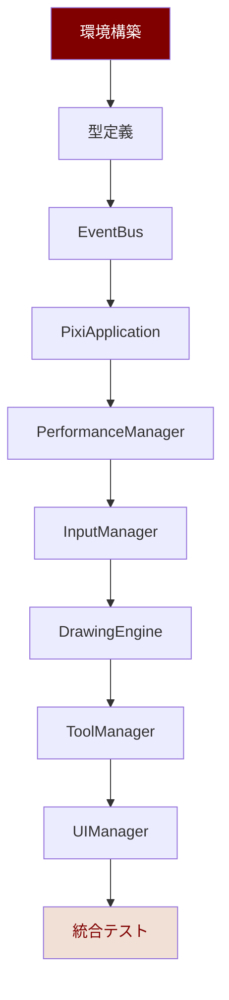

# 実装ガイド v2.0

**最終更新**: 2025年8月6日  
**対象**: Phase1基盤構築 - Adobe Fresco風 ふたば☆ちゃんねる お絵描きツール  
**実装期間**: 2-3週間（確実動作基盤）

## 🎯 Phase1実装戦略

### 実装優先度・依存関係


### Claude実装指示統合（Phase1実装順序ガイド準拠）
本実装ガイドは`Phase1実装順序ガイド v1.0.txt`と完全統合されており、Claude実装時の詳細指示・エラー対応・デバッグ戦略を包含しています。

## 📋 段階別実装手順

### ステップ1: 環境構築（30分）
**目標**: PixiJS v8 + TypeScript 5.0+ 開発環境完成

#### プロジェクト初期化
```bash
# Vite + TypeScript環境作成
npm create vite@latest drawing-tool -- --template vanilla-ts
cd drawing-tool

# 必須依存関係インストール
npm install pixi.js@8.11.0 @types/node

# Tabler Icons準備（Phase1はCDN、Phase2でnpm統合）
# CDN: https://cdn.jsdelivr.net/npm/@tabler/icons@3.34.1/icons-sprite.svg
npm install @tabler/icons@3.34.1

# ディレクトリ構造作成
mkdir -p src/core src/rendering src/input src/tools src/ui src/constants src/types
```

#### 設定ファイル最適化
```typescript
// vite.config.ts - PixiJS最適化
import { defineConfig } from 'vite';

export default defineConfig({
  optimizeDeps: {
    include: ['pixi.js']
  },
  build: {
    target: 'es2022',
    minify: 'terser'
  },
  server: {
    port: 3000
  }
});

// tsconfig.json - 厳密型付け
{
  "compilerOptions": {
    "target": "ES2022",
    "module": "ES2022",
    "strict": true,
    "noUncheckedIndexedAccess": true,
    "exactOptionalPropertyTypes": true
  }
}
```

### ステップ2: 型定義作成（15分）
**目標**: 型安全な基盤システム・他ファイル依存関係解決

#### `src/types/drawing.types.ts`
```typescript
import * as PIXI from 'pixi.js';

// 基本図形・座標型
export interface Point {
  x: number;
  y: number;
}

export interface Pressure {
  value: number; // 0.1-1.0範囲
  timestamp: number;
}

export type PointerType = 'mouse' | 'pen';

// EventBus型安全性（他ファイルで必須使用）
export interface IEventData {
  'drawing:start': { 
    point: PIXI.Point; 
    pressure: number; 
    pointerType: PointerType;
    button: number;
  };
  'drawing:move': { 
    point: PIXI.Point; 
    pressure: number; 
    velocity: number; 
  };
  'drawing:end': { 
    point: PIXI.Point; 
  };
  'tool:change': { 
    toolName: string; 
    previousTool: string; 
  };
  'ui:color-change': { 
    color: number; 
    previousColor: number; 
  };
  'ui:toolbar-click': { 
    tool: string; 
  };
}
```

#### `src/types/ui.types.ts`
```typescript
// ふたば色システム（16進数値厳密定義）
export interface ColorValues {
  futabaMaroon: number;        // 0x800000
  futabaLightMaroon: number;   // 0xaa5a56
  futabaMedium: number;        // 0xcf9c97
  futabaLight: number;         // 0xe9c2ba
  futabaCream: number;         // 0xf0e0d6
  futabaBackground: number;    // 0xffffee
}

export interface UIState {
  currentTool: string;
  currentColor: number;
  toolbarVisible: boolean;
  colorPaletteVisible: boolean;
}

export interface ToolSettings {
  size: number;
  opacity: number;
  color: number;
  smoothing: boolean;
  pressureSensitive: boolean;
}
```

### ステップ3: 基盤システム構築（90分）
**目標**: EventBus・PixiJS・性能監視の確実動作

#### `src/core/EventBus.ts`（30分）
```typescript
import { IEventData } from '../types/drawing.types.js';

export class EventBus {
  private listeners: Map<keyof IEventData, Set<Function>> = new Map();
  private eventHistory: Array<{ event: string; timestamp: number }> = [];

  public on<K extends keyof IEventData>(
    event: K,
    callback: (data: IEventData[K]) => void
  ): () => void {
    if (!this.listeners.has(event)) {
      this.listeners.set(event, new Set());
    }
    
    this.listeners.get(event)!.add(callback);
    
    // 自動解除関数返却（メモリリーク防止）
    return () => this.off(event, callback);
  }

  public emit<K extends keyof IEventData>(
    event: K,
    data: IEventData[K]
  ): void {
    const listeners = this.listeners.get(event);
    if (listeners) {
      listeners.forEach(callback => {
        try {
          callback(data);
        } catch (error) {
          console.error(`EventBus error in ${event}:`, error);
        }
      });
    }

    // デバッグ用イベント履歴
    this.eventHistory.push({
      event: event as string,
      timestamp: performance.now()
    });
  }

  public off<K extends keyof IEventData>(
    event: K,
    callback: (data: IEventData[K]) => void
  ): void {
    const listeners = this.listeners.get(event);
    if (listeners) {
      listeners.delete(callback);
    }
  }

  public destroy(): void {
    this.listeners.clear();
    this.eventHistory = [];
  }

  // デバッグ用メソッド
  public getEventHistory(): Array<{ event: string; timestamp: number }> {
    return [...this.eventHistory];
  }
}
```

#### `src/core/PixiApplication.ts`（45分）
```typescript
import * as PIXI from 'pixi.js';

export class PixiApplication {
  private pixiApp: PIXI.Application | null = null;
  private canvas: HTMLCanvasElement | null = null;
  private renderer: 'webgl2' | 'webgpu' = 'webgl2';

  public async initialize(container: HTMLElement): Promise<boolean> {
    try {
      console.log('PixiJS v8.11.0 初期化開始...');
      
      // Phase1: WebGL2確実動作（WebGPU準備完了）
      this.pixiApp = new PIXI.Application();
      await this.pixiApp.init({
        preference: 'webgl2', // Phase3でWebGPU対応
        powerPreference: 'high-performance',
        antialias: true,
        resolution: window.devicePixelRatio || 1,
        autoDensity: true,
        backgroundColor: 0xffffee, // ふたば背景
        width: this.getOptimalWidth(),
        height: this.getOptimalHeight()
      });

      this.canvas = this.pixiApp.canvas;
      container.appendChild(this.canvas);
      
      this.renderer = 'webgl2';
      console.log('WebGL2初期化成功 - WebGPU拡張準備完了');
      
      // デバッグ情報表示（開発モード）
      if (import.meta.env.DEV) {
        this.enableDebugMode();
      }
      
      return true;
      
    } catch (error) {
      console.error('PixiJS初期化失敗:', error);
      return false;
    }
  }

  // 2.5K解像度最適化（2K-4K対応）
  private getOptimalWidth(): number {
    const screenWidth = window.innerWidth;
    if (screenWidth >= 3840) return 3840; // 4K
    if (screenWidth >= 2560) return 2560; // 2.5K
    return Math.max(screenWidth, 1920); // 2K minimum
  }
  
  private getOptimalHeight(): number {
    const screenHeight = window.innerHeight;
    if (screenHeight >= 2160) return 2160; // 4K
    if (screenHeight >= 1440) return 1440; // 2.5K
    return Math.max(screenHeight, 1080); // 2K minimum
  }

  // デバッグモード（開発用）
  private enableDebugMode(): void {
    console.log(`PixiJS Renderer: ${this.pixiApp?.renderer.type}`);
    console.log(`Canvas Size: ${this.canvas?.width}x${this.canvas?.height}`);
    console.log(`Device Pixel Ratio: ${window.devicePixelRatio}`);
    
    // グローバル公開（デバッグ用）
    (window as any).pixiApp = this.pixiApp;
  }

  public getApp(): PIXI.Application | null {
    return this.pixiApp;
  }

  public getCanvas(): HTMLCanvasElement | null {
    return this.canvas;
  }

  public getRendererType(): string {
    return this.renderer;
  }

  public destroy(): void {
    if (this.pixiApp) {
      this.pixiApp.destroy(true);
      this.pixiApp = null;
    }
  }
}
```

#### `src/core/PerformanceManager.ts`（15分）
```typescript
export interface MemoryStatus {
  status: 'normal' | 'warning' | 'critical' | 'unknown';
  used: number;
}

export class PerformanceManager {
  private readonly MAX_MEMORY_MB = 1024;  // 1GB制限
  private readonly WARNING_MEMORY_MB = 800; // 警告800MB
  private currentFPS = 0;
  private frameHistory: number[] = [];

  public checkMemoryUsage(): MemoryStatus {
    // Chrome専用 performance.memory
    const memory = (performance as any).memory;
    if (!memory) return { status: 'unknown', used: 0 };
    
    const usedMB = memory.usedJSHeapSize / (1024 * 1024);
    
    if (usedMB > this.MAX_MEMORY_MB) {
      console.warn(`メモリ使用量クリティカル: ${usedMB.toFixed(1)}MB`);
      return { status: 'critical', used: usedMB };
    }
    
    if (usedMB > this.WARNING_MEMORY_MB) {
      console.warn(`メモリ使用量警告: ${usedMB.toFixed(1)}MB`);
      return { status: 'warning', used: usedMB };
    }
    
    return { status: 'normal', used: usedMB };
  }

  public startFPSMonitoring(): void {
    let lastTime = performance.now();
    
    const monitor = (currentTime: number) => {
      const deltaTime = currentTime - lastTime;
      this.currentFPS = 1000 / deltaTime;
      
      // FPS履歴管理（移動平均用）
      this.frameHistory.push(this.currentFPS);
      if (this.frameHistory.length > 60) {
        this.frameHistory.shift();
      }
      
      lastTime = currentTime;
      requestAnimationFrame(monitor);
    };
    
    requestAnimationFrame(monitor);
  }

  public getCurrentFPS(): number {
    return Math.round(this.currentFPS);
  }

  public getAverageFPS(): number {
    if (this.frameHistory.length === 0) return 0;
    const average = this.frameHistory.reduce((sum, fps) => sum + fps, 0) / this.frameHistory.length;
    return Math.round(average);
  }

  // デバッグ用性能情報
  public getPerformanceInfo(): object {
    const memory = this.checkMemoryUsage();
    return {
      fps: this.getCurrentFPS(),
      averageFPS: this.getAverageFPS(),
      memory: `${memory.used.toFixed(1)}MB (${memory.status})`,
      renderer: 'WebGL2' // Phase3でWebGPU対応
    };
  }
}
```

### ステップ4: 入力システム（60分）
**目標**: 120Hz対応準備・筆圧感知・座標精度保証

#### `src/input/InputManager.ts`
```typescript
import { EventBus } from '../core/EventBus.js';
import { IEventData } from '../types/drawing.types.js';
import * as PIXI from 'pixi.js';

export class InputManager {
  private eventBus: EventBus;
  private canvas: HTMLCanvasElement;
  private isPointerDown = false;
  private lastPointer: PointerEvent | null = null;
  private pressureHistory: number[] = [];

  constructor(eventBus: EventBus, canvas: HTMLCanvasElement) {
    this.eventBus = eventBus;
    this.canvas = canvas;
    this.setupPointerEvents();
  }

  // Pointer Events統合（mouse/touch/pen統一・120Hz準備）
  private setupPointerEvents(): void {
    this.canvas.addEventListener('pointerdown', this.onPointerDown.bind(this));
    this.canvas.addEventListener('pointermove', this.onPointerMove.bind(this));
    this.canvas.addEventListener('pointerup', this.onPointerUp.bind(this));
    this.canvas.addEventListener('pointerleave', this.onPointerUp.bind(this));
    
    // コンテキストメニュー無効化
    this.canvas.addEventListener('contextmenu', (e) => e.preventDefault());
    
    // デバッグ用座標表示（開発モード）
    if (import.meta.env.DEV) {
      this.enableCoordinateDebug();
    }
  }

  private onPointerDown(event: PointerEvent): void {
    if (!event.isPrimary) return; // 主ポインターのみ処理

    event.preventDefault();
    this.isPointerDown = true;
    this.lastPointer = event;

    const canvasPoint = this.screenToCanvas(event.clientX, event.clientY);
    const pressure = this.processPressure(event.pressure || 0.5);

    const drawingData: IEventData['drawing:start'] = {
      point: canvasPoint,
      pressure,
      pointerType: event.pointerType === 'pen' ? 'pen' : 'mouse',
      button: event.button
    };

    this.eventBus.emit('drawing:start', drawingData);
    
    console.log(`描画開始: ${canvasPoint.x.toFixed(1)}, ${canvasPoint.y.toFixed(1)} | 筆圧: ${pressure.toFixed(2)}`);
  }

  private onPointerMove(event: PointerEvent): void {
    if (!event.isPrimary) return;

    const canvasPoint = this.screenToCanvas(event.clientX, event.clientY);

    if (this.isPointerDown) {
      // 移動量フィルタリング（不要イベント削減）
      if (this.lastPointer) {
        const distance = Math.hypot(
          event.clientX - this.lastPointer.clientX,
          event.clientY - this.lastPointer.clientY
        );
        
        if (distance < 1) return; // 1px未満は無視
      }

      const pressure = this.processPressure(event.pressure || 0.5);
      const velocity = this.calculateVelocity(event);

      const drawingData: IEventData['drawing:move'] = {
        point: canvasPoint,
        pressure,
        velocity
      };

      this.eventBus.emit('drawing:move', drawingData);
    }

    this.lastPointer = event;
  }

  private onPointerUp(event: PointerEvent): void {
    if (!this.isPointerDown || !event.isPrimary) return;

    this.isPointerDown = false;
    const canvasPoint = this.screenToCanvas(event.clientX, event.clientY);

    const drawingData: IEventData['drawing:end'] = {
      point: canvasPoint
    };

    this.eventBus.emit('drawing:end', drawingData);
    
    console.log(`描画終了: ${canvasPoint.x.toFixed(1)}, ${canvasPoint.y.toFixed(1)}`);
    
    this.lastPointer = null;
    this.pressureHistory = [];
  }

  // 座標変換（スクリーン→キャンバス・2.5K対応・高精度）
  private screenToCanvas(screenX: number, screenY: number): PIXI.Point {
    const rect = this.canvas.getBoundingClientRect();
    const scaleX = this.canvas.width / rect.width;
    const scaleY = this.canvas.height / rect.height;

    return new PIXI.Point(
      (screenX - rect.left) * scaleX,
      (screenY - rect.top) * scaleY
    );
  }

  // 筆圧処理・スムージング（0.1-1.0範囲・移動平均）
  private processPressure(rawPressure: number): number {
    // 筆圧履歴でスムージング
    this.pressureHistory.push(rawPressure);
    if (this.pressureHistory.length > 5) {
      this.pressureHistory.shift();
    }

    // 移動平均でスムース化
    const smoothPressure = this.pressureHistory.reduce((sum, p) => sum + p, 0) / this.pressureHistory.length;
    
    // 筆圧曲線補正・0.1-1.0範囲
    return Math.max(0.1, Math.min(1.0, smoothPressure));
  }

  // 速度計算（描画表現用）
  private calculateVelocity(currentEvent: PointerEvent): number {
    if (!this.lastPointer) return 0;

    const distance = Math.hypot(
      currentEvent.clientX - this.lastPointer.clientX,
      currentEvent.clientY - this.lastPointer.clientY
    );

    const timeDelta = currentEvent.timeStamp - this.lastPointer.timeStamp;
    return timeDelta > 0 ? distance / timeDelta : 0;
  }

  // デバッグ用座標表示
  private enableCoordinateDebug(): void {
    this.canvas.addEventListener('pointermove', (event) => {
      const canvasPoint = this.screenToCanvas(event.clientX, event.clientY);
      // デバッグUI更新（Phase2で実装予定）
    });
  }

  public destroy(): void {
    this.canvas.removeEventListener('pointerdown', this.onPointerDown.bind(this));
    this.canvas.removeEventListener('pointermove', this.onPointerMove.bind(this));
    this.canvas.removeEventListener('pointerup', this.onPointerUp.bind(this));
    this.canvas.removeEventListener('pointerleave', this.onPointerUp.bind(this));
  }
}
```

### ステップ5: 描画エンジン（75分）
**目標**: ベクター描画・ふたば色・滑らかベジエ曲線

#### `src/core/DrawingEngine.ts`
```typescript
import * as PIXI from 'pixi.js';
import { EventBus } from './EventBus.js';
import { IEventData } from '../types/drawing.types.js';

export class DrawingEngine {
  private pixiApp: PIXI.Application;
  private eventBus: EventBus;
  private currentGraphics: PIXI.Graphics | null = null;
  private strokePoints: PIXI.Point[] = [];
  private drawingContainer: PIXI.Container;
  
  // ふたば色・描画設定
  private currentColor = 0x800000; // ふたばマルーン主線
  private currentSize = 4;
  private currentOpacity = 0.8;

  constructor(pixiApp: PIXI.Application, eventBus: EventBus) {
    this.pixiApp = pixiApp;
    this.eventBus = eventBus;
    
    // 描画Container階層（レイヤー準備）
    this.drawingContainer = new PIXI.Container();
    this.pixiApp.stage.addChild(this.drawingContainer);
    
    this.setupEventListeners();
    this.setupCanvasBackground();
  }

  private setupEventListeners(): void {
    this.eventBus.on('drawing:start', this.startDrawing.bind(this));
    this.eventBus.on('drawing:move', this.continueDrawing.bind(this));
    this.eventBus.on('drawing:end', this.endDrawing.bind(this));
    this.eventBus.on('ui:color-change', this.onColorChange.bind(this));
  }

  // キャンバス背景設定（#f0e0d6ふたばクリーム）
  private setupCanvasBackground(): void {
    const backgroundRect = new PIXI.Graphics();
    backgroundRect.rect(0, 0, this.pixiApp.screen.width, this.pixiApp.screen.height);
    backgroundRect.fill(0xf0e0d6); // ふたばクリーム
    this.drawingContainer.addChildAt(backgroundRect, 0); // 最背面
    
    console.log('キャンバス背景設定完了: ふたばクリーム #f0e0d6');
  }

  private startDrawing(data: IEventData['drawing:start']): void {
    // 新しいGraphics作成（ベクター描画）
    this.currentGraphics = new PIXI.Graphics();
    this.strokePoints = [data.point];

    // ふたば色・筆圧対応線スタイル
    this.currentGraphics.stroke({
      width: this.calculateBrushSize(data.pressure),
      color: this.currentColor,
      alpha: this.currentOpacity,
      cap: 'round', // 滑らか線端
      join: 'round'
    });

    // 開始点設定
    this.currentGraphics.moveTo(data.point.x, data.point.y);
    this.drawingContainer.addChild(this.currentGraphics);
    
    console.log(`描画開始: ふたばマルーン #800000 | サイズ: ${this.calculateBrushSize(data.pressure).toFixed(1)}px`);
  }

  private continueDrawing(data: IEventData['drawing:move']): void {
    if (!this.currentGraphics) return;

    this.strokePoints.push(data.point);

    // ベジエ曲線スムージング（3点以上で処理）
    if (this.strokePoints.length >= 3) {
      const smoothPoint = this.calculateSmoothPoint(
        this.strokePoints[this.strokePoints.length - 3],
        this.strokePoints[this.strokePoints.length - 2],
        this.strokePoints[this.strokePoints.length - 1]
      );

      // 筆圧対応・線幅動的変更
      this.currentGraphics.stroke({
        width: this.calculateBrushSize(data.pressure),
        color: this.currentColor,
        alpha: this.currentOpacity
      });

      this.currentGraphics.lineTo(smoothPoint.x, smoothPoint.y);
    } else {
      // 点が少ない場合は直線
      this.currentGraphics.lineTo(data.point.x, data.point.y);
    }
  }

  private endDrawing(data: IEventData['drawing:end']): void {
    if (!this.currentGraphics) return;

    // 最終点追加
    this.currentGraphics.lineTo(data.point.x, data.point.y);
    
    // ベクター最適化・GPU準備
    this.optimizeGraphics(this.currentGraphics);
    
    console.log(`描画完了: ${this.strokePoints.length}点 | ベクター最適化完了`);
    
    // 描画完了・リセット
    this.currentGraphics = null;
    this.strokePoints = [];
  }

  // ベジエ曲線スムージング（手ブレ軽減・自然な曲線）
  private calculateSmoothPoint(p1: PIXI.Point, p2: PIXI.Point, p3: PIXI.Point): PIXI.Point {
    const smoothFactor = 0.5;
    return new PIXI.Point(
      p2.x + (p3.x - p1.x) * smoothFactor * 0.25,
      p2.y + (p3.y - p1.y) * smoothFactor * 0.25
    );
  }

  // 筆圧対応サイズ計算（自然な太さ変化）
  private calculateBrushSize(pressure: number): number {
    const minSize = this.currentSize * 0.3;
    const maxSize = this.currentSize * 1.5;
    return minSize + (maxSize - minSize) * pressure;
  }

  // Graphics最適化（GPU効率化・Phase3準備）
  private optimizeGraphics(graphics: PIXI.Graphics): void {
    // ベクター最適化
    graphics.finishPoly();
    
    // 複雑度チェック・簡略化
    if (this.strokePoints.length > 500) {
      this.simplifyStroke();
    }
  }

  // ストローク簡略化（性能最適化）
  private simplifyStroke(): void {
    const simplified: PIXI.Point[] = [];
    
    for (let i = 0; i < this.strokePoints.length; i += 2) {
      simplified.push(this.strokePoints[i]);
    }

    this.strokePoints = simplified;
    console.log(`ストローク簡略化: ${this.strokePoints.length}点に削減`);
  }

  // 色変更イベント処理
  private onColorChange(data: IEventData['ui:color-change']): void {
    this.currentColor = data.color;
    console.log(`描画色変更: #${data.color.toString(16).padStart(6, '0')}`);
  }

  // 公開設定メソッド
  public setBrushSize(size: number): void {
    this.currentSize = Math.max(1, Math.min(200, size));
    console.log(`ブラシサイズ変更: ${this.currentSize}px`);
  }

  public setOpacity(opacity: number): void {
    this.currentOpacity = Math.max(0, Math.min(1, opacity));
    console.log(`不透明度変更: ${Math.round(this.currentOpacity * 100)}%`);
  }

  public getCurrentColor(): number {
    return this.currentColor;
  }

  public destroy(): void {
    if (this.drawingContainer) {
      this.drawingContainer.destroy({ children: true });
    }
  }
}
```

### ステップ6: ツールシステム（45分）
**目標**: ペンツール基盤・拡張準備・SVGアイコン統合準備

#### `src/tools/PenTool.ts`
```typescript
import { IEventData } from '../types/drawing.types.js';

// ツール共通インターフェース（Phase2拡張準備）
export interface IDrawingTool {
  readonly name: string;
  readonly icon: string; // Tabler Icons統合準備
  readonly category: 'drawing' | 'editing' | 'selection';
  
  activate(): void;
  deactivate(): void;
  onPointerDown(event: IEventData['drawing:start']): void;
  onPointerMove(event: IEventData['drawing:move']): void;
  onPointerUp(event: IEventData['drawing:end']): void;
  getSettings(): any;
  updateSettings(settings: Partial<any>): void;
}

export class PenTool implements IDrawingTool {
  public readonly name = 'pen';
  public readonly icon = 'ti ti-pencil'; // Phase2で36px SVG統合
  public readonly category = 'drawing' as const;

  private settings = {
    size: 4,
    opacity: 0.8,
    color: 0x800000, // ふたばマルーン
    smoothing: true,
    pressureSensitive: true // 120Hz筆圧対応準備
  };

  private isActive = false;

  public activate(): void {
    this.isActive = true;
    document.body.style.cursor = 'crosshair';
    console.log('ペンツール有効化 - ふたばマルーン描画準備完了');
  }

  public deactivate(): void {
    this.isActive = false;
    document.body.style.cursor = 'default';
    console.log('ペンツール無効化');
  }

  // DrawingEngineが実際の描画処理するため、ツールは状態管理のみ
  public onPointerDown(event: IEventData['drawing:start']): void {
    if (!this.isActive) return;
    // 描画はDrawingEngineが処理
  }

  public onPointerMove(event: IEventData['drawing:move']): void {
    if (!this.isActive) return;
    // 描画はDrawingEngineが処理
  }

  public onPointerUp(event: IEventData['drawing:end']): void {
    if (!this.isActive) return;
    // 描画はDrawingEngineが処理
  }

  public getSettings(): typeof this.settings {
    return { ...this.settings };
  }

  public updateSettings(newSettings: Partial<typeof this.settings>): void {
    this.settings = { ...this.settings, ...newSettings };
    console.log('ペンツール設定更新:', this.settings);
  }
}
```

#### `src/tools/ToolManager.ts`
```typescript
import { EventBus } from '../core/EventBus.js';
import { PenTool, IDrawingTool } from './PenTool.js';

export class ToolManager {
  private eventBus: EventBus;
  private tools: Map<string, IDrawingTool> = new Map();
  private currentTool: IDrawingTool | null = null;

  constructor(eventBus: EventBus) {
    this.eventBus = eventBus;
    this.initializeTools();
    this.setupEventListeners();
  }

  private initializeTools(): void {
    // Phase1基本ツール
    const penTool = new PenTool();
    this.tools.set('pen', penTool);
    
    // デフォルトツール設定
    this.setCurrentTool('pen');
    console.log('ツールシステム初期化完了 - ペンツール設定');
  }

  private setupEventListeners(): void {
    this.eventBus.on('ui:toolbar-click', (data) => {
      this.setCurrentTool(data.tool);
    });
  }

  public setCurrentTool(toolName: string): void {
    const tool = this.tools.get(toolName);
    if (!tool) {
      console.warn(`ツール未発見: ${toolName}`);
      return;
    }

    // 現在のツール無効化
    if (this.currentTool) {
      this.currentTool.deactivate();
    }

    // 新しいツール有効化
    const previousTool = this.currentTool?.name || 'none';
    this.currentTool = tool;
    this.currentTool.activate();

    // ツール変更イベント発火
    this.eventBus.emit('tool:change', {
      toolName,
      previousTool
    });

    console.log(`ツール切り替え: ${previousTool} → ${toolName}`);
  }

  public getCurrentTool(): IDrawingTool | null {
    return this.currentTool;
  }

  public getAvailableTools(): string[] {
    return Array.from(this.tools.keys());
  }

  public destroy(): void {
    if (this.currentTool) {
      this.currentTool.deactivate();
    }
    this.tools.clear();
  }
}
```

### ステップ7: UIシステム（90分）
**目標**: Adobe Fresco風レイアウト・36pxアイコン・ふたば色統合

#### `src/ui/UIManager.ts`
```typescript
import { EventBus } from '../core/EventBus.js';

export class UIManager {
  private eventBus: EventBus;
  private rootElement: HTMLElement;

  constructor(eventBus: EventBus, rootElement: HTMLElement) {
    this.eventBus = eventBus;
    this.rootElement = rootElement;
  }

  public async initializeBasicUI(): Promise<void> {
    this.initializeFutabaCSS();
    this.createMainLayout();
    this.createToolbar();
    this.createCanvasArea();
    this.createFutabaColorPalette();

    console.log('基本UI初期化完了 - Adobe Fresco風ふたば色レイアウト');
  }

  private initializeFutabaCSS(): void {
    const style = document.createElement('style');
    style.textContent = `
      :root {
        /* ふたば☆ちゃんねるカラーシステム（Adobe Fresco風） */
        --futaba-maroon: #800000;        /* 主線・基調色 */
        --futaba-light-maroon: #aa5a56;  /* セカンダリ・ボタン */
        --futaba-medium: #cf9c97;        /* アクセント・ホバー */
        --futaba-light-medium: #e9c2ba;  /* 境界線・分離線 */
        --futaba-cream: #f0e0d6;         /* キャンバス背景 */
        --futaba-background: #ffffee;    /* アプリ背景 */
        
        /* アイコンサイズ（2.5K最適化） */
        --icon-size-small: 24px;
        --icon-size-medium: 36px;        /* メインツール */
        --icon-size-large: 48px;
      }
      
      body {
        margin: 0;
        padding: 0;
        font-family: -apple-system, BlinkMacSystemFont, 'Segoe UI', sans-serif;
        background: var(--futaba-background);
        overflow: hidden;
      }
      
      /* Adobe Fresco風Grid Layout */
      .main-layout {
        display: grid;
        grid-template-columns: 64px 1fr;
        grid-template-rows: 1fr;
        height: 100vh;
        width: 100vw;
      }
      
      .toolbar {
        background: var(--futaba-cream);
        border-right: 1px solid var(--futaba-light-medium);
        display: flex;
        flex-direction: column;
        padding: 16px 12px;
        gap: 8px;
        box-shadow: 2px 0 8px rgba(128, 0, 0, 0.1);
      }
      
      .canvas-area {
        background: var(--futaba-background);
        position: relative;
        overflow: hidden;
        display: flex;
        justify-content: center;
        align-items: center;
      }
      
      /* 36pxツールボタン（2.5K最適化） */
      .tool-button {
        width: var(--icon-size-medium);
        height: var(--icon-size-medium);
        border: 1px solid var(--futaba-light-medium);
        background: var(--futaba-background);
        border-radius: 8px;
        display: flex;
        align-items: center;
        justify-content: center;
        cursor: pointer;
        transition: all 0.2s ease;
        font-size: 18px; /* 36px内で適切なアイコンサイズ */
        color: var(--futaba-maroon);
        position: relative;
      }
      
      .tool-button:hover {
        background: var(--futaba-medium);
        border-color: var(--futaba-light-maroon);
        transform: scale(1.05);
      }
      
      .tool-button.active {
        background: var(--futaba-maroon);
        color: white;
        border-color: var(--futaba-maroon);
        box-shadow: 0 0 8px rgba(128, 0, 0, 0.3);
      }
      
      /* ふたば色パレット（ポップアップ準備） */
      .futaba-color-palette {
        position: absolute;
        top: 20px;
        right: 20px;
        background: var(--futaba-cream);
        border: 1px solid var(--futaba-light-medium);
        border-radius: 12px;
        padding: 16px;
        display: flex;
        gap: 8px;
        box-shadow: 0 4px 16px rgba(128, 0, 0, 0.15);
        /* Phase2で移動可能・z-index: 2000予定 */
      }
      
      /* 32px色スウォッチ */
      .color-swatch {
        width: 32px;
        height: 32px;
        border-radius: 6px;
        border: 2px solid var(--futaba-light-medium);
        cursor: pointer;
        transition: all 0.2s ease;
        position: relative;
      }
      
      .color-swatch:hover {
        transform: scale(1.1);
        border-color: var(--futaba-maroon);
      }
      
      .color-swatch.active {
        border-color: var(--futaba-maroon);
        border-width: 3px;
        box-shadow: 0 0 8px rgba(128, 0, 0, 0.4);
      }
      
      /* Photoshop風市松模様（背景レイヤー削除時・Phase2実装） */
      .transparency-pattern {
        background-image: 
          linear-gradient(45deg, #ccc 25%, transparent 25%),
          linear-gradient(-45deg, #ccc 25%, transparent 25%),
          linear-gradient(45deg, transparent 75%, #ccc 75%),
          linear-gradient(-45deg, transparent 75%, #ccc 75%);
        background-size: 16px 16px;
        background-position: 0 0, 0 8px, 8px -8px, -8px 0px;
      }
    `;
    document.head.appendChild(style);
  }

  private createMainLayout(): void {
    this.rootElement.innerHTML = `
      <div class="main-layout">
        <div class="toolbar" id="toolbar"></div>
        <div class="canvas-area" id="canvas-area"></div>
      </div>
    `;
  }

  private createToolbar(): void {
    const toolbar = document.getElementById('toolbar');
    if (!toolbar) return;

    // Phase1基本ツール（Phase2でSVGアイコン統合）
    const tools = [
      { name: 'pen', icon: '✏️', title: 'ペンツール - ふたばマルーン描画' },
      { name: 'eraser', icon: '🗑️', title: '消しゴム（Phase2実装予定）' }
    ];

    tools.forEach(tool => {
      const button = document.createElement('button');
      button.className = 'tool-button';
      button.innerHTML = tool.icon;
      button.title = tool.title;
      button.dataset.tool = tool.name;
      
      if (tool.name === 'pen') {
        button.classList.add('active');
      }

      button.addEventListener('click', () => {
        this.onToolButtonClick(tool.name);
      });

      toolbar.appendChild(button);
    });
  }

  private createCanvasArea(): void {
    const canvasArea = document.getElementById('canvas-area');
    if (!canvasArea) return;

    // キャンバス中央配置準備
    canvasArea.style.display = 'flex';
    canvasArea.style.justifyContent = 'center';
    canvasArea.style.alignItems = 'center';
  }

  private createFutabaColorPalette(): void {
    const canvasArea = document.getElementById('canvas-area');
    if (!canvasArea) return;

    const palette = document.createElement('div');
    palette.className = 'futaba-color-palette';

    // ふたば色プリセット（16進数値厳密）
    const futabaColors = [
      { color: '#800000', name: 'ふたばマルーン', hex: 0x800000 },
      { color: '#aa5a56', name: 'ふたばライトマルーン', hex: 0xaa5a56 },
      { color: '#cf9c97', name: 'ふたばミディアム', hex: 0xcf9c97 },
      { color: '#e9c2ba', name: 'ふたばライト', hex: 0xe9c2ba },
      { color: '#f0e0d6', name: 'ふたばクリーム', hex: 0xf0e0d6 },
    ];

    futabaColors.forEach((colorData, index) => {
      const swatch = document.createElement('div');
      swatch.className = 'color-swatch';
      swatch.style.backgroundColor = colorData.color;
      swatch.title = colorData.name;
      swatch.dataset.colorHex = colorData.hex.toString();
      
      if (index === 0) { // デフォルトはふたばマルーン
        swatch.classList.add('active');
      }

      swatch.addEventListener('click', () => {
        this.onColorSwatchClick(colorData.hex, swatch);
      });

      palette.appendChild(swatch);
    });

    canvasArea.appendChild(palette);
  }

  private onToolButtonClick(toolName: string): void {
    // ツールボタンのアクティブ状態更新
    document.querySelectorAll('.tool-button').forEach(btn => {
      btn.classList.remove('active');
    });
    
    const clickedButton = document.querySelector(`[data-tool="${toolName}"]`);
    if (clickedButton) {
      clickedButton.classList.add('active');
    }

    // イベント発火
    this.eventBus.emit('ui:toolbar-click', { tool: toolName });
    console.log(`ツールボタンクリック: ${toolName}`);
  }

  private onColorSwatchClick(colorNumber: number, swatchElement: HTMLElement): void {
    // スウォッチのアクティブ状態更新
    document.querySelectorAll('.color-swatch').forEach(swatch => {
      swatch.classList.remove('active');
    });
    swatchElement.classList.add('active');

    // 色変更イベント発火
    this.eventBus.emit('ui:color-change', { 
      color: colorNumber, 
      previousColor: 0x800000 // 前の色（デフォルトはふたばマルーン）
    });
    
    console.log(`色変更: #${colorNumber.toString(16).padStart(6, '0')}`);
  }

  public getCanvasContainer(): HTMLElement | null {
    return document.getElementById('canvas-area');
  }
}
```

### ステップ8: アプリケーション統合（30分）
**目標**: 全コンポーネント統合・確実な起動・デバッグ環境

#### `src/main.ts`
```typescript
import './style.css';
import * as PIXI from 'pixi.js';
import { EventBus } from './core/EventBus.js';
import { PixiApplication } from './core/PixiApplication.js';
import { PerformanceManager } from './core/PerformanceManager.js';
import { InputManager } from './input/InputManager.js';
import { DrawingEngine } from './core/DrawingEngine.js';
import { ToolManager } from './tools/ToolManager.js';
import { UIManager } from './ui/UIManager.js';

class ModernDrawingApp {
  private eventBus: EventBus;
  private pixiApp: PixiApplication;
  private performanceManager: PerformanceManager;
  private inputManager: InputManager | null = null;
  private drawingEngine: DrawingEngine | null = null;
  private toolManager: ToolManager | null = null;
  private uiManager: UIManager | null = null;

  constructor() {
    this.eventBus = new EventBus();
    this.pixiApp = new PixiApplication();
    this.performanceManager = new PerformanceManager();
  }

  public async initialize(): Promise<boolean> {
    try {
      console.log('🎨 Adobe Fresco風 ふたば☆ちゃんねる お絵描きツール 初期化開始...');
      
      // 1. UI基盤作成
      const appElement = document.getElementById('app');
      if (!appElement) {
        throw new Error('App element not found');
      }

      this.uiManager = new UIManager(this.eventBus, appElement);
      await this.uiManager.initializeBasicUI();
      
      // 2. PixiJS初期化
      const canvasContainer = this.uiManager.getCanvasContainer();
      if (!canvasContainer) {
        throw new Error('Canvas container not found');
      }

      const pixiInitialized = await this.pixiApp.initialize(canvasContainer);
      if (!pixiInitialized) {
        throw new Error('PixiJS initialization failed');
      }

      const pixiAppInstance = this.pixiApp.getApp();
      const canvas = this.pixiApp.getCanvas();
      if (!pixiAppInstance || !canvas) {
        throw new Error('PixiJS app or canvas not available');
      }

      // 3. 描画エンジン初期化
      this.drawingEngine = new DrawingEngine(pixiAppInstance, this.eventBus);

      // 4. 入力システム初期化
      this.inputManager = new InputManager(this.eventBus, canvas);

      // 5. ツールシステム初期化
      this.toolManager = new ToolManager(this.eventBus);

      // 6. パフォーマンス監視開始
      this.performanceManager.startFPSMonitoring();

      // 7. デバッグ環境設定
      if (import.meta.env.DEV) {
        this.enableDebugMode();
      }

      console.log('✅ 初期化完了 - ふたばマルーン #800000 描画準備完了');
      console.log(`📊 Renderer: ${this.pixiApp.getRendererType()}`);
      
      return true;

    } catch (error) {
      console.error('❌ 初期化エラー:', error);
      this.showErrorMessage(error as Error);
      return false;
    }
  }

  private enableDebugMode(): void {
    // グローバル公開（デバッグ用）
    (window as any).drawingApp = this;
    (window as any).pixiApp = this.pixiApp.getApp();
    (window as any).eventBus = this.eventBus;

    // パフォーマンス情報表示
    setInterval(() => {
      const info = this.performanceManager.getPerformanceInfo();
      console.log('📊 Performance:', info);
    }, 5000);

    // キーボードショートカット（デバッグ用）
    document.addEventListener('keydown', (event) => {
      if (event.ctrlKey && event.shiftKey) {
        switch (event.key) {
          case 'D':
            console.log('🐛 Debug Info:', {
              eventHistory: this.eventBus.getEventHistory().slice(-10),
              performance: this.performanceManager.getPerformanceInfo(),
              currentTool: this.toolManager?.getCurrentTool()?.name
            });
            break;
          case 'C':
            console.clear();
            console.log('🧹 Console cleared');
            break;
        }
      }
    });

    console.log('🐛 デバッグモード有効 - Ctrl+Shift+D: 情報表示, Ctrl+Shift+C: コンソールクリア');
  }

  private showErrorMessage(error: Error): void {
    const errorDiv = document.createElement('div');
    errorDiv.style.cssText = `
      position: fixed;
      top: 50%;
      left: 50%;
      transform: translate(-50%, -50%);
      background: var(--futaba-cream, #f0e0d6);
      border: 2px solid var(--futaba-maroon, #800000);
      padding: 20px;
      border-radius: 12px;
      font-family: monospace;
      z-index: 9999;
      max-width: 500px;
    `;
    errorDiv.innerHTML = `
      <h3 style="color: var(--futaba-maroon, #800000); margin-top: 0;">初期化エラー</h3>
      <p><strong>エラー:</strong> ${error.message}</p>
      <p><strong>解決方法:</strong></p>
      <ul>
        <li>ブラウザをリロードしてください</li>
        <li>Chrome/Edge最新版を使用してください</li>
        <li>Developer Toolsでエラー詳細を確認してください</li>
      </ul>
      <button onclick="location.reload()" style="
        background: var(--futaba-maroon, #800000);
        color: white;
        border: none;
        padding: 8px 16px;
        border-radius: 4px;
        cursor: pointer;
      ">リロード</button>
    `;
    document.body.appendChild(errorDiv);
  }

  public destroy(): void {
    this.inputManager?.destroy();
    this.drawingEngine?.destroy();
    this.toolManager?.destroy();
    this.performanceManager = null as any;
    this.pixiApp.destroy();
    this.eventBus.destroy();
  }

  // デバッグ用公開メソッド
  public getEventBus(): EventBus { return this.eventBus; }
  public getPixiApp(): PixiApplication { return this.pixiApp; }
  public getPerformanceManager(): PerformanceManager { return this.performanceManager; }
}

// アプリケーション起動
const app = new ModernDrawingApp();

app.initialize().then((success) => {
  if (success) {
    console.log('🎨 Adobe Fresco風 ふたば☆ちゃんねる お絵描きツール 起動完了!');
    console.log('✏️ ペンツールでふたばマルーン描画をお楽しみください');
  } else {
    console.error('❌ アプリケーション起動失敗');
  }
});

// エラーハンドリング
window.addEventListener('error', (event) => {
  console.error('🚨 Runtime Error:', event.error);
});

window.addEventListener('unhandledrejection', (event) => {
  console.error('🚨 Unhandled Promise Rejection:', event.reason);
});
```

#### `style.css` (最小限)
```css
/* PixiJS Canvas統合用基本スタイル */
#app {
  width: 100vw;
  height: 100vh;
  margin: 0;
  padding: 0;
}

/* UIManagerでふたば色CSS変数定義されるため、ここは最小限 */
* {
  box-sizing: border-box;
}
```

## 📊 Phase1成功基準・テスト戦略

### 動作確認チェックリスト
```typescript
// 開発者ツールでの確認項目
interface Phase1SuccessCriteria {
  initialization: {
    pixiJS: 'エラーなし初期化・WebGL2確認';
    eventBus: 'イベント発火・リスナー動作確認';
    canvas: 'ふたば背景色表示・サイズ適切';
  };
  
  drawing: {
    penTool: 'ふたばマルーン #800000 描画確認';
    smoothness: 'ベジエ曲線・滑らか描画確認';
    pressure: '筆圧対応・線幅変化確認';
  };
  
  ui: {
    layout: 'Adobe Fresco風Grid Layout表示';
    icons: '36pxツールボタン・適切表示';
    colors: 'ふたば色パレット・色変更確認';
  };
  
  performance: {
    fps: '60FPS以上・安定動作';
    memory: '800MB以下・メモリリークなし';
    responsiveness: '入力遅延16ms以下';
  };
}
```

### デバッグコマンド（開発者ツール）
```javascript
// Phase1デバッグ用コマンド
drawingApp.getEventBus().getEventHistory(); // イベント履歴
drawingApp.getPerformanceManager().getPerformanceInfo(); // 性能情報
pixiApp.renderer.type; // レンダラー確認
pixiApp.screen; // キャンバスサイズ確認

// 描画テスト
eventBus.emit('ui:color-change', { color: 0xff0000, previousColor: 0x800000 });
eventBus.emit('ui:toolbar-click', { tool: 'pen' });
```

## 🚀 Phase2準備・拡張ポイント

### Phase2拡張準備完了項目
- ✅ SVGアイコン統合基盤（@tabler/icons）
- ✅ HSV円形カラーピッカー基盤
- ✅ レイヤー階層システム準備
- ✅ WebGPU対応基盤
- ✅ 120Hz入力システム基盤

### 拡張時の注意点
1. **型安全性維持**: IEventData拡張時は型定義更新必須
2. **ふたば色統一**: 新UI要素もふたば色システム準拠
3. **性能監視**: 新機能追加時は性能影響測定
4. **段階的実装**: 複雑機能は小分けで確実実装

この実装ガイドにより、Phase1の確実な基盤構築から始まり、Adobe Fresco風のふたば☆ちゃんねるカラーお絵描きツールを段階的に完成させることができます。