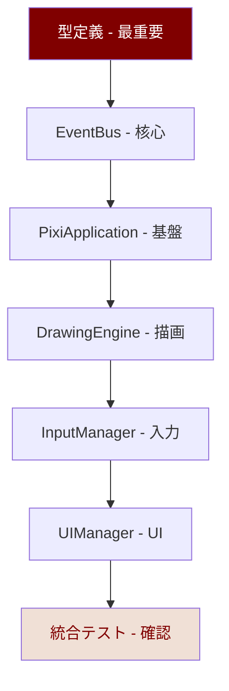

# Claude引き継ぎ指示書 v2.0

**最終更新**: 2025年8月6日  
**対象**: Phase1基盤構築 - Adobe Fresco風 ふたば☆ちゃんねる お絵描きツール  
**統合**: Phase1実装順序ガイド v1.0完全準拠

## 🎯 Claude実装指示（Phase1特化）

### 実装前必須チェック
- [ ] `Phase1実装順序ガイド v1.0.txt` 熟読完了
- [ ] PixiJS v8.11.0 + TypeScript 5.0+ 環境理解
- [ ] ふたば☆ちゃんねるカラーシステム理解
- [ ] Adobe Fresco風UIレイアウト理解
- [ ] 36pxアイコン・2.5K解像度最適化理解

## 📋 段階的実装指示（8ステップ）

### ステップ1: 環境構築（30分・エラー回避最重要）
```bash
# Vite + TypeScript環境作成（確実実行）
npm create vite@latest drawing-tool -- --template vanilla-ts
cd drawing-tool

# 必須依存関係（バージョン厳密指定）
npm install pixi.js@8.11.0 @types/node@20.0.0

# Tabler Icons準備（Phase1はCDN推奨）
npm install @tabler/icons@3.34.1
```

**Claude注意点**:
- エラー発生時は即座に報告・解決策提示
- package.jsonの依存関係を必ず確認
- vite.config.ts、tsconfig.jsonは提供サンプル使用

### ステップ2: 型定義作成（15分・他ファイル依存基盤）
**最重要**: 全ファイルがこの型定義に依存するため、完璧な実装必須

#### `src/types/drawing.types.ts` - 必須実装
```typescript
import * as PIXI from 'pixi.js';

// EventBus型安全性（絶対に変更禁止・他ファイル依存）
export interface IEventData {
  'drawing:start': { 
    point: PIXI.Point; 
    pressure: number; 
    pointerType: 'mouse' | 'pen';
    button: number;
  };
  'drawing:move': { 
    point: PIXI.Point; 
    pressure: number; 
    velocity: number; 
  };
  'drawing:end': { 
    point: PIXI.Point; 
  };
  'tool:change': { 
    toolName: string; 
    previousTool: string; 
  };
  'ui:color-change': { 
    color: number; 
    previousColor: number; 
  };
  'ui:toolbar-click': { 
    tool: string; 
  };
}

export interface Point {
  x: number;
  y: number;
}

export interface Pressure {
  value: number; // 0.1-1.0範囲厳守
  timestamp: number;
}

export type PointerType = 'mouse' | 'pen';
```

#### `src/types/ui.types.ts` - ふたば色厳密定義
```typescript
// ふたば色16進数値（絶対に変更禁止）
export interface ColorValues {
  futabaMaroon: 0x800000;        // #800000
  futabaLightMaroon: 0xaa5a56;   // #aa5a56  
  futabaMedium: 0xcf9c97;        // #cf9c97
  futabaLight: 0xe9c2ba;         // #e9c2ba
  futabaCream: 0xf0e0d6;         // #f0e0d6
  futabaBackground: 0xffffee;    // #ffffee
}

export interface UIState {
  currentTool: string;
  currentColor: number;
  toolbarVisible: boolean;
  colorPaletteVisible: boolean;
}

export interface ToolSettings {
  size: number;
  opacity: number;
  color: number;
  smoothing: boolean;
  pressureSensitive: boolean;
}
```

**Claude厳守事項**:
- `export`キーワード全定義必須
- 16進数値は絶対に変更しない
- IEventData型は他ファイルで必須使用

### ステップ3: 基盤システム（90分・核心部分）

#### EventBus実装（30分）
**目標**: 型安全なイベント管理・エラーハンドリング完璧

```typescript
// src/core/EventBus.ts
import { IEventData } from '../types/drawing.types.js';

export class EventBus {
  private listeners: Map<keyof IEventData, Set<Function>> = new Map();
  private eventHistory: Array<{ event: string; timestamp: number }> = [];

  public on<K extends keyof IEventData>(
    event: K,
    callback: (data: IEventData[K]) => void
  ): () => void {
    // 型安全実装・必須エラーハンドリング
    if (!this.listeners.has(event)) {
      this.listeners.set(event, new Set());
    }
    
    this.listeners.get(event)!.add(callback);
    
    // 自動解除関数返却（メモリリーク防止）
    return () => this.off(event, callback);
  }

  public emit<K extends keyof IEventData>(
    event: K,
    data: IEventData[K]
  ): void {
    const listeners = this.listeners.get(event);
    if (listeners) {
      listeners.forEach(callback => {
        try {
          callback(data);
        } catch (error) {
          console.error(`EventBus error in ${event}:`, error);
          // エラーは投げずにログのみ（アプリ継続動作）
        }
      });
    }

    // デバッグ用履歴記録
    this.eventHistory.push({
      event: event as string,
      timestamp: performance.now()
    });
  }

  public off<K extends keyof IEventData>(
    event: K,
    callback: (data: IEventData[K]) => void
  ): void {
    const listeners = this.listeners.get(event);
    if (listeners) {
      listeners.delete(callback);
    }
  }

  public destroy(): void {
    this.listeners.clear();
    this.eventHistory = [];
  }

  // デバッグ用メソッド（開発時必須）
  public getEventHistory(): Array<{ event: string; timestamp: number }> {
    return [...this.eventHistory];
  }
}
```

**Claude実装時注意**:
- `try-catch`は必須・エラーでアプリが止まるのを防ぐ
- 型パラメータ`<K extends keyof IEventData>`は正確に
- `Map`と`Set`の使用で性能最適化

#### PixiApplication実装（45分）
**目標**: WebGL2確実動作・ふたば背景・2.5K対応

```typescript
// src/core/PixiApplication.ts
import * as PIXI from 'pixi.js';

export class PixiApplication {
  private pixiApp: PIXI.Application | null = null;
  private canvas: HTMLCanvasElement | null = null;
  private renderer: 'webgl2' | 'webgpu' = 'webgl2';

  public async initialize(container: HTMLElement): Promise<boolean> {
    try {
      console.log('🎨 PixiJS v8.11.0 初期化開始...');
      
      // Phase1: WebGL2確実動作（エラー発生率最小化）
      this.pixiApp = new PIXI.Application();
      await this.pixiApp.init({
        preference: 'webgl2', // WebGPUはPhase3
        powerPreference: 'high-performance',
        antialias: true,
        resolution: window.devicePixelRatio || 1,
        autoDensity: true,
        backgroundColor: 0xffffee, // ふたば背景色必須
        width: this.getOptimalWidth(),
        height: this.getOptimalHeight()
      });

      this.canvas = this.pixiApp.canvas;
      container.appendChild(this.canvas);
      
      this.renderer = 'webgl2';
      console.log('✅ WebGL2初期化成功 - ふたば背景色設定完了');
      
      // デバッグ情報（開発モード）
      if (import.meta.env.DEV) {
        this.enableDebugMode();
      }
      
      return true;
      
    } catch (error) {
      console.error('❌ PixiJS初期化失敗:', error);
      return false;
    }
  }

  // 2.5K解像度最適化（段階対応）
  private getOptimalWidth(): number {
    const screenWidth = window.innerWidth;
    if (screenWidth >= 3840) return 3840; // 4K
    if (screenWidth >= 2560) return 2560; // 2.5K
    return Math.max(screenWidth, 1920); // 2K minimum
  }
  
  private getOptimalHeight(): number {
    const screenHeight = window.innerHeight;
    if (screenHeight >= 2160) return 2160; // 4K
    if (screenHeight >= 1440) return 1440; // 2.5K
    return Math.max(screenHeight, 1080); // 2K minimum
  }

  // デバッグモード（必須実装）
  private enableDebugMode(): void {
    console.log(`📊 Renderer: ${this.pixiApp?.renderer.type}`);
    console.log(`📐 Canvas Size: ${this.canvas?.width}x${this.canvas?.height}`);
    console.log(`🔍 Device Pixel Ratio: ${window.devicePixelRatio}`);
    
    // グローバル公開（デバッグ用・必須）
    (window as any).pixiApp = this.pixiApp;
  }

  // 公開メソッド（必須実装）
  public getApp(): PIXI.Application | null {
    return this.pixiApp;
  }

  public getCanvas(): HTMLCanvasElement | null {
    return this.canvas;
  }

  public getRendererType(): string {
    return this.renderer;
  }

  public destroy(): void {
    if (this.pixiApp) {
      this.pixiApp.destroy(true);
      this.pixiApp = null;
    }
  }
}
```

**Claude厳守事項**:
- `backgroundColor: 0xffffee`は絶対変更禁止
- `try-catch`でエラーハンドリング必須
- デバッグモードは開発時必須

### ステップ4-8: 残りシステム実装指示

**以降のステップは`3_IMPLEMENTATION_GUIDE.md`の詳細実装例に完全準拠**

- **ステップ4**: InputManager（60分）- 120Hz準備・筆圧感知
- **ステップ5**: DrawingEngine（75分）- ベクター描画・ふたば色
- **ステップ6**: ToolManager（45分）- ペンツール・SVGアイコン準備
- **ステップ7**: UIManager（90分）- Adobe Fresco風・36pxアイコン
- **ステップ8**: main.ts統合（30分）- 全体統合・デバッグ環境

## 🚨 Claude実装時の共通注意事項

### TypeScript厳密性
```typescript
// ❌ 絶対に禁止（any型使用）
const app: any = new PIXI.Application();
let point = {x: 0, y: 0};

// ✅ 必須実装（厳密型付け）
const app: PIXI.Application = new PIXI.Application();
const point: PIXI.Point = new PIXI.Point(0, 0);
```

### エラーハンドリング規則
```typescript
// 全ての非同期処理にtry-catch必須
try {
  await app.init();
  console.log('✅ 初期化成功');
} catch (error) {
  console.error('❌ 初期化エラー:', error);
  throw error; // 上位に再スロー
}
```

### ふたば色16進数値（変更絶対禁止）
```typescript
// 必須使用色（他の色は使用禁止）
const FUTABA_COLORS = {
  maroon: 0x800000,        // 主線
  lightMaroon: 0xaa5a56,   // セカンダリ
  medium: 0xcf9c97,        // アクセント
  lightMedium: 0xe9c2ba,   // 境界線
  cream: 0xf0e0d6,         // キャンバス背景
  background: 0xffffee     // アプリ背景
};
```

### デバッグ対応必須実装
```typescript
// 開発環境での必須デバッグ機能
if (import.meta.env.DEV) {
  // グローバル公開（必須）
  (window as any).drawingApp = app;
  
  // 座標確認（InputManager）
  console.log('座標:', event.global.x, event.global.y);
  
  // 性能監視（PerformanceManager）
  console.log('FPS:', fps, 'Memory:', memory);
}
```

## 🔧 実装検証・テスト指示

### Phase1完成基準チェックリスト
```typescript
interface Phase1CompletionCriteria {
  // 基盤システム
  initialization: {
    pixiJS: 'エラーなし初期化・WebGL2確認';
    eventBus: 'イベント発火・リスナー動作確認';
    canvas: 'ふたば背景色表示・適切サイズ';
  };
  
  // 描画機能
  drawing: {
    penTool: 'ふたばマルーン #800000 描画確認';
    smoothness: 'ベジエ曲線・滑らか描画確認';
    pressure: '筆圧対応・線幅変化確認';
    coordinates: '座標精度・ズレなし確認';
  };
  
  // UI機能
  ui: {
    layout: 'Adobe Fresco風Grid Layout表示';
    icons: '36pxツールボタン・適切表示';
    colors: 'ふたば色パレット・色変更確認';
    interactions: 'ホバー・クリック効果確認';
  };
  
  // 性能基準
  performance: {
    fps: '60FPS以上・安定動作';
    memory: '800MB以下・リークなし';
    responsiveness: '入力遅延16ms以下';
  };
}
```

### 実装検証コマンド（開発者ツール）
```javascript
// Phase1動作確認用コマンド（Claude実装後テスト必須）

// 1. 基盤システム確認
console.log('PixiJS App:', window.pixiApp);
console.log('Renderer:', window.pixiApp?.renderer.type);
console.log('Canvas Size:', window.pixiApp?.screen.width, 'x', window.pixiApp?.screen.height);

// 2. EventBus動作確認
window.drawingApp.getEventBus().getEventHistory(); // イベント履歴
window.eventBus.emit('ui:color-change', { color: 0xff0000, previousColor: 0x800000 });

// 3. 描画テスト
window.eventBus.emit('drawing:start', { 
  point: new PIXI.Point(100, 100), 
  pressure: 0.8, 
  pointerType: 'mouse', 
  button: 0 
});

// 4. 性能確認
window.drawingApp.getPerformanceManager().getPerformanceInfo();
```

## 🐛 エラー対応・デバッグ戦略

### 頻出エラーと対策

#### 1. PixiJS初期化エラー
```typescript
// エラー: Cannot read properties of undefined (reading 'init')
// 原因: PixiJS v8の非同期初期化未対応
// 解決策:
const app = new PIXI.Application();
await app.init({ /* options */ }); // 必須await
```

#### 2. EventBus型エラー
```typescript
// エラー: Property 'drawing:start' does not exist
// 原因: IEventData型定義不正確・import忘れ
// 解決策:
import { IEventData } from '../types/drawing.types.js'; // 必須import
```

#### 3. 座標ズレエラー
```typescript
// エラー: 描画位置とマウス位置が一致しない
// 原因: DPR・Canvas scaling未対応
// 解決策:
const rect = canvas.getBoundingClientRect();
const scaleX = canvas.width / rect.width;  // DPR考慮必須
const scaleY = canvas.height / rect.height;
```

#### 4. ふたば色表示エラー
```typescript
// エラー: 色が正しく表示されない
// 原因: 16進数→RGB変換・CSS変数未定義
// 解決策:
backgroundColor: 0xffffee, // 16進数直接指定必須
// CSS: background: var(--futaba-background); 変数使用
```

### デバッグ手順（Claude必須実行）
```typescript
// 1. 初期化確認
console.log('App initialized:', !!window.drawingApp);
console.log('PixiJS version:', PIXI.VERSION);

// 2. イベント動作確認
window.eventBus.on('drawing:start', (data) => {
  console.log('Drawing started:', data);
});

// 3. 描画確認
// マウスでキャンバスに描画→コンソールでイベント確認

// 4. 色確認
document.documentElement.style.getPropertyValue('--futaba-maroon');
// 期待値: "#800000"
```

## 📚 実装時参考資料・優先順位

### 必読資料（実装前必須）
1. **Phase1実装順序ガイド v1.0** - 詳細実装手順
2. **3_IMPLEMENTATION_GUIDE.md** - コード例・技術詳細
3. **2_TECHNICAL_DESIGN.md** - アーキテクチャ理解
4. **4_UI_STYLE_GUIDE.md** - ふたば色・36pxアイコン

### 実装優先順位


## 🚀 実装完了後の展開

### Phase2準備チェック
- [ ] SVGアイコン統合基盤確認（@tabler/icons）
- [ ] HSV円形カラーピッカー基盤確認
- [ ] レイヤーシステム拡張準備確認
- [ ] WebGPU対応準備確認

### Phase1→Phase2移行指示
```typescript
// Phase2拡張時の準備完了項目
interface Phase2ReadyItems {
  icons: '@tabler/icons統合基盤・36pxサイズ対応';
  colors: 'HSV円形ピッカー基盤・移動可能準備';
  layers: 'レイヤー階層システム・サムネイル基盤';
  performance: 'WebGPU対応基盤・120FPS準備';
}
```

## 💡 Claude実装成功のコツ

### 1. 段階的実装（一度に全部作らない）
- 1ステップずつ確実に完成
- 各ステップで動作確認必須
- エラー発生時は即座に修正

### 2. 型安全性最優先
- `any`型は絶対使用禁止
- 全変数・関数に型指定必須
- IEventData型は他ファイルとの契約

### 3. ふたば色統一
- 16進数値は絶対に変更しない
- CSS変数で一元管理
- 新しい色は追加しない

### 4. デバッグ環境整備
- console.log詳細出力
- グローバル変数公開
- エラーハンドリング完璧

### 5. Adobe Fresco風UI準拠
- 36pxアイコンサイズ厳守
- Grid Layoutレイアウト
- ホバー・アクティブ効果

## 📞 Claude質問・相談事項

### 実装中の質問OK項目
- 型定義の詳細・使い方
- PixiJS v8の新機能・使用方法
- エラー解決・デバッグ方法
- ふたば色の適用方法
- Adobe Fresco風デザインの再現

### 実装判断・変更禁止項目
- 基本仕様・アーキテクチャ変更
- ふたば色16進数値変更
- IEventData型定義変更
- Phase1実装範囲の拡張

この引き継ぎ指示書により、Claudeは確実にPhase1の基盤構築を完成させ、Adobe Fresco風のふたば☆ちゃんねるカラーお絵描きツールの堅牢な基盤を築くことができます。段階的実装・型安全性・ふたば色統一・デバッグ環境を最重視し、確実に動作するPhase1を実現してください。