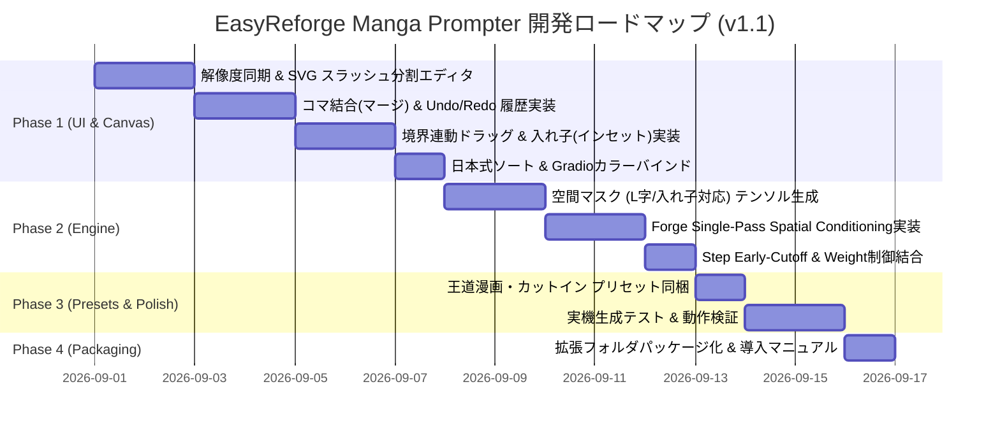

# EasyReforge Manga Prompter 開発総合計画書
Version 1.1

---

## 1. プロジェクト概要・目的

### 1.1 背景と目的
EasyReforge（Stable Diffusion WebUI Forge / reForge）上で、**「1ページ漫画（1P Manga）」や複数コマの領域制御画像を直感的に制作できる専用拡張機能**を開発する。

既存の「Regional Prompter」やそのフォーク版が抱える「マトリックス構文の難解さ」「複雑すぎるパラメータ群」「コマ数に比例した生成遅延」という課題を根本から解決し、**「初心者でも説明書なしで触れる直感的な操作性」** と **「Forgeネイティブな1パス同時処理による爆速な生成性能」** を両立させる。

### 1.2 解決するコア課題
1. **キャンバスサイズ（解像度）リアルタイム同期**: WebUIの Width / Height スライダーと自動連動し、キャンバスのアスペクト比が常に一致。
2. **操作性の革新（スラッシュ分割 ＆ 結合・元に戻す）**:
   - クリスタのようにキャンバスを「縦/横スラッシュ」してコマを作成。
   - 逆に**「隣接コマの結合（マージ）」**や **「Undo/Redo（1手戻す）」** で自在に元に戻せる。
3. **境界線（ガター）の連動ドラッグ**: コマとコマのセパレーターをドラッグするだけで、隣接コマが連動して伸縮。
4. **特殊コマ（L字・凸型・入れ子コマ/インセット）の完全対応**:
   - 大ゴマの中に小ゴマを浮かべる「入れ子コマ（ワイプ/カットイン）」をZ-indexレイヤー制御で実現。
   - スライスや結合で生じる「L字型」「凸型」などの変形コマも、空間マスクテンソルで正確に制御。
5. **日本式MANGA順の自動化**: コマを分割・配置した瞬間に、**右上（1コマ目）→ 左上（2コマ目）→ 右下（3コマ目）…** の順で自動的にナンバリングとカラーリング。
6. **思考停止を防ぐミニマルUI**: 普段見えるのは「プロンプト入力欄」と「重み（Weight）」のみ。マニアックな設定は隠蔽し、最適な推奨値を内部で自動適用。
7. **生成速度の劇的高速化**: Forge/ComfyUIネイティブな **Single-Pass Spatial Conditioning（1パス同時空間アテンション制御）** を採用し、4〜6コマあっても通常生成とほぼ同等（約1.2〜1.4倍）の爆速動作。

---

## 2. システムアーキテクチャ

### 2.1 拡張機能ディレクトリ構成
本拡張機能は、EasyReforgeの `extensions/` フォルダ配下に独立した拡張機能として配置する。

```
easyreforge-manga-prompter/
├── scripts/
│   ├── manga_prompter_ui.py      # Gradio UI定義、設定パラメータ・解像度同期ハンドリング
│   ├── manga_spatial_engine.py   # Forge/ComfyUI向け 空間マスク（L字/入れ子対応）注入エンジン
│   └── preset_manager.py         # テンプレート・カスタムプリセットの保存・読込
├── javascript/
│   ├── manga_canvas.js           # スラッシュ分割・結合・境界連動ドラッグ・入れ子対応SVGエディタ
│   ├── manga_history.js          # Undo / Redo 履歴管理スタック
│   └── manga_sorter.js           # 日本式漫画読み順ソートアルゴリズム
├── style.css                     # モダンで視認性の高いUIスタイリング
├── presets/                      # デフォルトの王道漫画テンプレート（JSON）
│   ├── 4koma_standard.json       # 王道4コマ（均等）
│   ├── 3panel_focus.json         # 大ゴマ1＋小ゴマ2
│   ├── 5panel_standard.json      # 標準5コマ
│   ├── inset_dramatic.json       # 大ゴマ＋カットイン入れ子コマ
│   └── 6panel_grid.json          # 2列×3段 6コマ
└── install.py                    # 依存関係チェック（標準環境で動作）
```

### 2.2 データフロー構造

```mermaid
flowchart TD
    subgraph EasyReforge [WebUI Forge 側]
        W[Width / Height スライダー] -->|値変更イベント| CanvasSync[キャンバス比率自動同期]
    end

    subgraph Frontend [フロントエンド (UI / JavaScript)]
        CanvasSync --> A[SVGキャンバス操作]
        A -->|スラッシュ分割 / 結合 / 境界ドラッグ / 入れ子追加| B[日本式ソート & レイヤーZ-Index算出]
        B --> C[領域マスク & JSON データ出力]
        D[各コマ プロンプト & Weight 入力] --> C
    end

    subgraph Communication [Gradio Bridge]
        C -->|JSON: [{shape_mask, z_index, prompt, weight}...]| E[Python Script (manga_prompter_ui.py)]
    end

    subgraph Backend [生成バックエンド]
        E --> F[manga_spatial_engine.py]
        F --> G[Forge Spatial Attention Patcher]
        G -->|1-Pass Attention Masking (L字/入れ子対応)| H[UNet / Diffusion Model]
        H --> I[生成画像出力]
    end
```

---

## 3. UI/UX・MMI詳細仕様（マンマシンインターフェース）

### 3.1 画面レイアウト構成
左側に「解像度同期プレビューキャンバス」、右側に「プロンプト入力エリア」を配置。

```
┌────────────────────────────────────────────────────────────────────────────────────────┐
│  [■ 有効化]  EasyReforge Manga Prompter   [解像度同期: 832 × 1216 (自動連動中)]        │
├────────────────────────────────────────┬───────────────────────────────────────────────┤
│  【ページキャンバス】                  │  【全体プロンプト】                           │
│  [ ↶ 戻す ] [ ↷ やり直す ] [ 全初期化] │  ┌──────────────────────────────────────────┐ │
│                                        │  │ masterpiece, monochrome manga style, ... │ │
│  ┌──────────────────────────────────┐  │  └──────────────────────────────────────────┘ │
│  │                                  │  ├───────────────────────────────────────────────┤
│  │   ┌──────────────┬─────────────┐ │  │  【テンプレート / プリセット】                │
│  │   │ [2] コマ2    │ [1] コマ1   │ │  │  [ 4コマ ] [ 3コマ(大1小2) ] [ カットイン ] [▼]│
│  │   │ (青)         │ (赤)        │ │  │  [＋ 現在の配置をプリセット保存]             │
│  │   │              ├─────────────┤ │  ├───────────────────────────────────────────────┤
│  │   │              │ [3] カット  │ │  │  【コマ別プロンプト設定】                     │
│  │   ├──────────────┴──(黄/浮き)──┤ │  │                                               │
│  │   │                            │ │  │  ■ [1] コマ1 (赤)                    [× 削除] │
│  │   │         [4] コマ4          │ │  │  ├ プロンプト: 1girl, close up, smiling       │
│  │   │         (緑)               │ │  │  └ 影響度(Weight): [ 1.0 ] ────○───          │
│  │   │                            │ │  │                                               │
│  │   └────────────────────────────┘ │  │  ■ [3] カットイン(黄) [前面レイヤー]  [× 削除] │
│  │                                  │  │  ├ プロンプト: shock emotion, eye close up    │
│  │  [ ＋ 横分割 ] [ ＋ 縦分割 ]     │  │  └ 影響度(Weight): [ 1.1 ] ─────○──          │
│  │  [ 🔗 選択コマを結合 ]           │  │                                               │
│  │  [ 🔲 入れ子(インセット)追加 ]   │  │  ▶ [詳細設定 (初期値推奨・通常は操作不要)]    │
│  └──────────────────────────────────┘  └───────────────────────────────────────────────┘
```

### 3.2 コマ操作のフルスペック仕様

1. **キャンバス解像度の自動同期**:
   - WebUI本体の `Width` / `Height` スライダーを変更すると、キャンバスの枠（アスペクト比）が即座に縦長・横長・正方形へとリサイズ。
   - 内部のコマ比率を保持したままスケーリングされるため、生成結果とプレビューが完全に一致。

2. **スラッシュ分割（スライス）**:
   - コマを選択して「横分割」または「縦分割」をクリックすると、そのコマが $1:1$ で均等分割。

3. **コマの結合（マージ）＆ Undo/Redo**:
   - **結合（マージ）**: 隣接する2つのコマを選択して「結合」を押すと、境界線が消えて1つの大きなコマに統合。
   - **Undo / Redo**: 操作履歴（スライス、結合、サイズ変更、削除など）を記録しており、`Ctrl+Z` または「戻す」ボタンでいつでも前の状態に復元。

4. **境界線（ガター）の連動ドラッグ**:
   - コマとコマのセパレーターをドラッグすると、隣り合うコマが連動して拡大・縮小。外枠からはみ出さない安全スナップ。

5. **特殊コマの対応（L字・凸型・入れ子/カットイン）**:
   - **入れ子コマ（インセット/ワイプ）**:
     - 「入れ子追加」を押すと、選択したコマの中に小さな浮きゴマ（カットイン）を配置可能。
     - Z-Index（重なり優先度）により、前面の小ゴマが背後のコマを自動でくり抜いてマスク処理。
   - **L字・凸型コマ**:
     - コマの分割・結合によって生じる変形形状（L字型や凸型）も、バックエンドで $H \times W$ の空間2値マスクとして正確にモデルへ伝達。

6. **日本式MANGA読み順ソート**:
   - どのような分割・配置を行っても、常に「右上 $\rightarrow$ 左上 $\rightarrow$ 右下 $\rightarrow$ 左下」の順序で自動ソート＆カラーバインド。

---

## 4. 高速化・生成エンジン設計（換骨奪胎）

### 4.1 空間マスクテンソルによる Single-Pass Spatial Conditioning
- 通常の矩形（$X, Y, W, H$）だけでなく、**L字型や入れ子コマ（インセット）にも対応した $H \times W$ 空間マスク**を生成。
- 1回のUNetフォワードパス内で全コマを同時に一括計算するため、コマ数が増えても生成時間は通常生成の約1.2〜1.4倍で完了。

### 4.2 レイヤー重なり（Z-Index）の自動差分マスク合成
- 入れ子コマが存在する場合：
  $$\text{Mask}_{\text{背面}} = \text{Mask}_{\text{大ゴマ}} \setminus \text{Mask}_{\text{前面インセット}}$$
  のように自動でくり抜き処理を行い、プロンプトの混ざり・滲みを完全に防止。

### 4.3 Step Early-Cutoff（構図決定ステップでの打ち切り）
- 全生成ステップのうち、前半30〜40%（例: 30ステップ中 0〜12ステップ）のみ領域制御を適用。
- 後半は全体プロンプトでディテールを整え、高速化とコマ境界の馴染みを両立。

---

## 5. 開発フェーズとロードマップ



---

## 6. まとめ
本計画書（v1.1）により、**「解像度同期」「クリスタ風スラッシュ分割」「コマ結合・元に戻す」「L字・凸型・入れ子コマ対応」「Forge 1パス爆速生成」** を備えた、究極に使いやすい漫画制作拡張機能の全容が確定しました。
