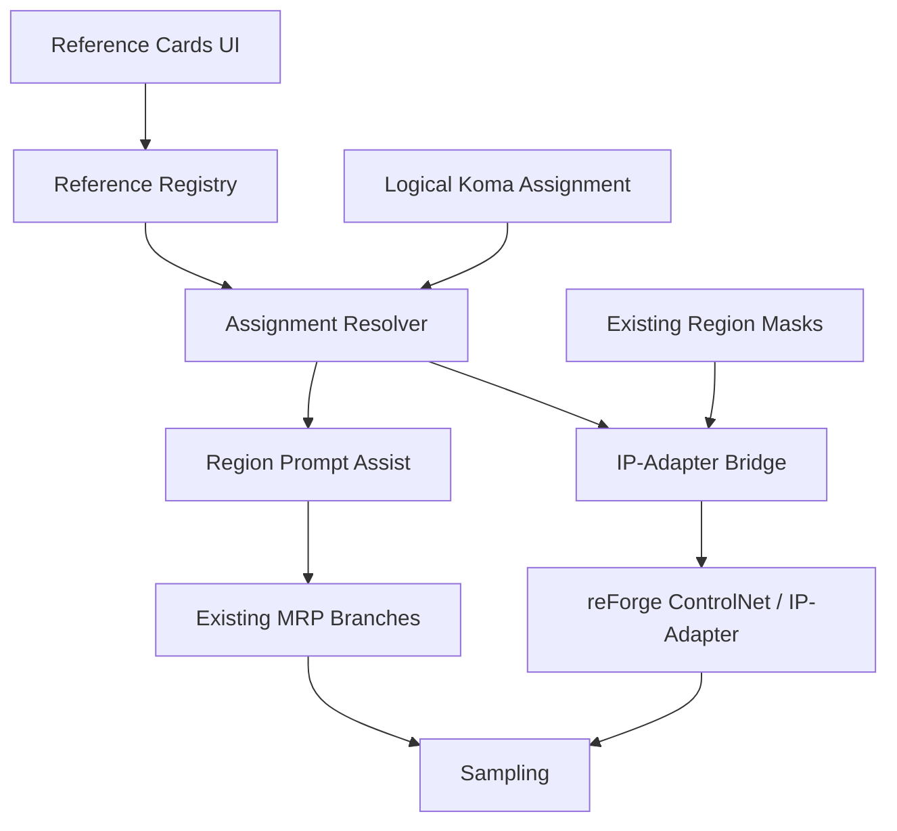

# Manga Region Prompter v3.8
## Reference Cast / IP-Adapter 基本設計書

作成日: 2026-09-12
対象基準: MRP v3.7.7 Frozen Baseline
文書種別: 基本設計（実装着手前）
格納予定先: `D:\GitHub\tegaki\EasyReforgeExtension\計画書\MRP_v3.8_Reference_Cast_IPAdapter_基本設計書.md`

---

## 0. 本書の結論

MRP v3.8では、単純な「IP-Adapter入力欄」を追加するのではなく、次の2層からなる **Reference Cast System** を追加する。

1. **Reference Card**
   - Character（人物）
   - Outfit（衣装）
   - Prop（小物・機材）
   - Performance（表情・ポーズ。後期段階）
2. **Logical Koma Assignment**
   - 参照カードを論理コマ番号へ明示的に割り当てる
   - 生成直前に論理コマ番号から物理Region maskへ解決する

IP-Adapterは、MRP既存のAttention Couple生成コアへ直接組み込まない。reForge内蔵ControlNet/IP-Adapterの外部制御経路を利用し、MRPが参照画像・強度・適用Region maskを渡す **Bridge方式** を第一候補とする。

この方式が対象環境で成立しない場合は、`manga_attention.py` や `manga_spatial_engine.py` を改変して強行せず、Phase 0調査報告をもって一旦停止する。v3.7.7の日常利用を守ることを、機能追加より優先する。

---

## 1. 正本・ミラー・旧型バックアップの運用契約

本書以降、次を正式なSource of Truthとする。

| パス | 役割 | AIによる編集 |
| --- | --- | --- |
| `D:\GitHub\tegaki\EasyReforgeExtension` | 唯一の正本。Git、設計書、実装、報告書の作業先 | **ここだけ編集可** |
| `E:\EasyReforge\stable-diffusion-webui-reForge\extensions\easyreforge-manga-prompter` | reForge実行用ミラー | **直接編集禁止** |
| `E:\EasyReforgeExtension` | 旧型バックアップ | **参照・編集・同期とも禁止** |

### 1.1 ミラーの意味

- E実行用フォルダが通常コピーなら、同期方向は常に **D正本 → E実行ミラー** の一方向とする。
- E実行用フォルダがNTFSジャンクションなら、EはDの別名であり独立コピーではない。
- どちらの方式でも、Codex / GeminiはD正本のみを編集し、E実行側を直接直さない。
- 本書はジャンクション化そのものを必須要件とはしない。現在の配置を実機で確認してから別作業として決める。
- 旧 `E:\EasyReforgeExtension` は、過去の三重同期ルールから完全に除外する。

---

## 2. 背景と目的

MRPは、EasyReforge / stable-diffusion-webui-reForge上で複数コマ・複数領域をSingle-Passで制御する漫画制作拡張である。v3.7.7までに次が確立している。

- PAGE / STYLE / REGIONの役割分離
- Global Effect branchとRegion branchの協調
- ControlNetのコマ枠構造とAttention Coupleによる内容分離の併用
- Exclusive / Overlapの領域関係
- Canvas-firstのコマ編集
- 物理Regionと論理コマ番号の分離
- BREAK位置保持型パースとN+2 Slot契約
- 生成コアの凍結

一方、同じ登場人物や小物を複数コマへ安定して再登場させる機能は持っていない。v3.8の目的は、MRPの軽快な漫画ページ生成を維持したまま、次の用途を補助することである。

- コマをまたいで人物A / Bの顔・髪型・外見を安定させる
- 人物AとBを異なる領域へ割り当て、混線を減らす
- 顔の同一性を優先しつつ、コマごとに衣装を変更する
- 同じ衣装を複数コマで維持する
- 放送用TVカメラなど、テキストだけでは誤解されやすい物体を参照画像で補強する
- 将来のComfyUI / H3版でも再利用できる、生成器非依存のカード／割当データを作る

---

## 3. 非目標

v3.8の初期実装では、次を保証しない。

- 参照人物の完全な同一性
- 1回の全ページ生成における、複数人物の完全な無漏洩分離
- 衣装の模様・ロゴ・アクセサリの完全一致
- 参照画像と同一のポーズ・演技・カメラ角度
- 文章中の人名を自然言語解析して自動割当する機能
- LoRA本体のRegion単位分離
- IP-Adapter本体、ControlNet本体、reForge本体のフォーク
- ComfyUI版と同等のノード単位自由度
- v3.7.7生成コアの再設計

IP-Adapterは「誰／何に見せるか」を補助する。ポーズや演技は「何をしているか」の制御であり、Region prompt、OpenPose等のControlNet、将来のPerformance Cardが別に担当する。

---

## 4. v3.7.7から継承する不変条件

### 4.1 Prompt Slot契約

プロンプトのSource of Truthはラベル文字列ではなく、BREAKで区切られたスロット位置である。

```text
Slot 0 = STYLE
Slot 1 = PAGE
Slot 2 = logical koma 1
Slot 3 = logical koma 2
Slot 4 = logical koma 3
...
```

`koma N:` は人間向けラベル兼診断情報であり、mapping命令ではない。Reference Cast機能はこの契約を変更しない。

### 4.2 物理Regionと論理コマ番号

```text
stable_region_id      = 物理領域を識別する不変ID
logical_koma_number   = 読み順・プロンプト・キャストを結ぶ論理番号
```

Reference Assignmentは **論理コマ番号** をキーとして保存する。生成直前に、同じ論理番号を持つパネルを検索し、その `stable_region_id` とmaskへ解決する。

これによりコマ番号をswapした場合、矩形は動かず、次が一緒に新しい物理領域へ移る。

- 該当BREAKスロットのRegion prompt
- Region weight
- Reference Card割当
- Reference Card由来の補助prompt
- IP-Adapterの適用mask

### 4.3 生成コア凍結

| ファイル | v3.8方針 |
| --- | --- |
| `scripts/manga_attention.py` | **凍結。変更禁止** |
| `scripts/manga_spatial_engine.py` | **凍結。変更禁止** |
| `scripts/manga_prompter.py` | Bridge呼出しとUI受け渡しに限り変更候補 |
| `javascript/manga_canvas.js` | 論理コマ割当表示・状態連携に限り変更候補 |
| `style.css` | Reference UI用の追加のみ |

凍結ファイルに変更が必要と判明した場合は、実装者の判断で編集せず、調査結果・理由・代替案を報告して停止する。

---

## 5. 実現性評価

| ユースケース | 実現性 | v3.8での扱い | 主な制約 |
| --- | --- | --- | --- |
| 人物A/Bの再現性向上 | 高 | Character Card | 完全固定ではなく、ぶれの低減 |
| Aをコマ1、Bをコマ2へ割当 | 中～高 | Region mask付きReference Assignment | reForge側のEffective Region Maskと複数Unit共存に依存 |
| 同じ顔で衣装を毎回変更 | 中～高 | Face優先Character Card + Region prompt | 全身参照を強くすると衣装も引きずる |
| 同じ衣装を維持 | 中 | Outfit Card | 人物同一性との同時利用はUnit数と相互干渉が増える |
| 放送用TVカメラの形状補強 | 中～高 | Prop Card + 補助prompt | 小さいコマや遠景では細部が潰れる |
| 表情の安定 | 中 | Face参照 + prompt。後期Performance | 顔identityと表情の強さが競合する場合がある |
| ポーズ・演技の直接制御 | 低（IP-Adapter単独） | 初期範囲外 | OpenPose等を別Unitで併用する方が適切 |
| 同一コマ内の人物A/B完全分離 | 低～中 | v3.8後期調査 | 1つのRegion mask内では個人別の空間境界がない |

IP-Adapterは、画像特徴とテキスト特徴を分離したcross-attentionで併用する軽量adapterであり、テキストpromptや構造制御との併用を意図した方式である。ただし、この一般的能力がMRPの論理コマへ自動的に対応するわけではない。MRP側でmaskと割当を明示的に構築する必要がある。

---

## 6. 用語と基本概念

### 6.1 Reference Card

再利用する参照対象を登録する論理カード。表示名と内部IDを分離する。

| 項目 | 例 |
| --- | --- |
| Internal ID | `char_mika_01` |
| Display Name | `ミカ` |
| Type | `character` |
| Reference Image | `mika_face_front.png` |
| Prompt Assist | `short black hair, narrow eyes` |
| Adapter Profile | `face_identity` |
| Default Weight | `0.65` |

### 6.2 Card Type

- `character`: 顔・髪型・人物全体の継続性
- `outfit`: 衣装・装飾・配色の継続性
- `prop`: 小物・機械・乗り物・背景物体の視覚補助
- `performance`: 表情・姿勢・演技。v3.8初期はテキストプリセット、画像制御は後期検討

### 6.3 Region Assignment

カードを論理コマ番号へ割り当てる情報。自由文の人名検索ではなく、UIの選択操作を正本とする。

```text
logical koma 1
  primary_character = char_mika_01
  outfit             = outfit_reporter_01
  props              = [prop_broadcast_camera_01]
```

### 6.4 Adapter Profile

ユーザーの目的を、対象環境で利用可能なIP-Adapter model / preprocessor / weight typeへ解決する抽象設定。

初期の論理名は次を候補とする。

- `identity_face`: 顔の同一性を優先
- `character_general`: 髪・顔・服を含む人物全体
- `appearance_general`: 衣装や物体を含む一般参照
- `style_only`: 画風参照。MRPのSTYLE branchと競合しやすいため初期は非推奨

実model名をJSONへ固定せず、Phase 0で検出した利用可能modelから解決する。SD1.5用とSDXL用を混在させない。

---

## 7. IDとプロンプトのリンク方針

### 7.1 採用方針

- 内部IDは英小文字・数字・underscoreで安定化する。
- 表示名は日本語を含め自由にする。
- Regionへの割当はドロップダウン／チップ等で明示的に選ぶ。
- 表示名をRegion promptから自動検出してリンクしない。
- `CharacterA` のような語をモデルに理解させることも主方式にしない。

理由は、`ミカ`、`Mika`、`主人公`、`彼女`などの表記揺れや否定文を安全に判定できず、誤割当が見えにくくなるためである。

### 7.2 Prompt Assist

各カードは任意の補助promptを持てる。割当時に、MRPがその文字列を対象Regionのテキストconditioningへ追加する。

```text
Region Slot本文
  + Character Card prompt_assist
  + Outfit Card prompt_assist
  + Prop Card prompt_assist
```

追加順序と重複除去は一意に定め、生成ログへ解決後promptを出力する。カード表示名や内部ID自体は、ユーザーが明示していない限り生成promptへ入れない。

### 7.3 将来の明示マクロ

高度利用向けに `[[ref:char_mika_01]]` のような衝突しにくいマクロは将来候補とするが、v3.8初期の必須要件にはしない。UI割当とマクロの二重Source of Truthを早期に作らない。

---

## 8. システム構成



### 8.1 責務分離

| コンポーネント | 責務 |
| --- | --- |
| Reference Cards UI | カード作成、画像選択、目的・強度設定、状態表示 |
| Reference Registry | カード、画像相対パス、profile、既定値の保存・検証 |
| Assignment Resolver | 論理コマ番号から `stable_region_id` とmaskへの解決 |
| Prompt Assist | カードの補助promptを既存Region textへ合成 |
| IP-Adapter Bridge | reForge側APIの検出、Unit生成、既存Unitとの共存、失敗時の安全退避 |
| Existing MRP Core | STYLE / PAGE / Region conditioningとAttention Couple。原則無変更 |

### 8.2 接続方式の優先順位

1. **既存ControlNet外部Script APIを介したUnit追加（第一候補）**
   - 対象処理オブジェクト内の既存ControlNet Unitを保持する
   - MRP管理Unitのみを追加する
   - 参照画像とEffective Region MaskをUnitへ渡す
2. **ControlNet UIへ設定を反映する補助方式（fallback候補）**
   - 自動注入が不安定な場合、MRPが必要な画像・mask・設定を準備し、ユーザーに適用操作を委ねる
3. **reForge内蔵IP-Adapter内部実装の直接import / patch**
   - 原則禁止
   - 公開APIが存在せず、かつ小さく隔離可能なAdapter層でのみ、別設計審査を経て検討する

ControlNet系には外部extensionからUnitを作成・更新するAPIがあるが、Forge / reForge統合版では配置・型・対応フィールドが異なる可能性がある。そのため、名前やimport pathを推測して実装しない。

---

## 9. データ設計

### 9.1 保存単位

推奨構成:

```text
easyreforge-manga-prompter/
├─ user_data/
│  └─ reference_cast/
│     ├─ registry.json
│     ├─ assets/
│     │  ├─ char_mika_01/
│     │  └─ prop_broadcast_camera_01/
│     └─ thumbnails/
```

- `user_data/` はGit追跡対象外とする。
- 画像import時は、外部絶対パスをそのまま永続保存せず、可能なら管理領域へコピーして相対パス化する。
- 元画像は再エンコードせず保持し、サムネイルだけ別生成する。
- D正本とE実行ミラーの形式がコピー／ジャンクションのどちらでも、相対パスで解決できるようにする。
- 自動ダウンロードや外部送信は行わない。

### 9.2 Registry Schema案

```json
{
  "schema_version": 1,
  "cards": [
    {
      "card_id": "char_mika_01",
      "display_name": "ミカ",
      "card_type": "character",
      "enabled": true,
      "prompt_assist": "short black hair, narrow eyes",
      "negative_assist": "",
      "reference_images": [
        {
          "image_id": "img_face_front",
          "relative_path": "assets/char_mika_01/mika_face_front.png",
          "role": "face",
          "enabled": true
        }
      ],
      "adapter_profile": "identity_face",
      "default_weight": 0.65,
      "guidance_start": 0.0,
      "guidance_end": 0.8
    }
  ]
}
```

### 9.3 Assignment Schema案

```json
{
  "schema_version": 1,
  "assignments_by_logical_koma": {
    "1": {
      "primary_character_id": "char_mika_01",
      "secondary_character_id": null,
      "outfit_id": "outfit_reporter_01",
      "prop_ids": ["prop_broadcast_camera_01"],
      "performance_id": null,
      "use_prompt_assist": true,
      "use_image_reference": true,
      "weight_overrides": {}
    }
  }
}
```

### 9.4 保存対象と履歴

- Card Registryはプロジェクト横断で再利用するため独立保存する。
- Koma Assignmentは現在のキャンバス／プリセット状態と同時保存する。
- v3.8 MVPで画像参照に使うのは、各Card内でPrimary指定された有効画像1枚とする。複数画像合成はPhase 4以降へ送る。
- `negative_assist` は将来予約fieldとし、Region negative conditioningの安全な接続点が確認できるまで生成へ適用しない。全画面negative promptへ代用注入してはならない。
- Undo / RedoではAssignment変更も履歴対象とする。
- Card Registryそのものの画像削除はUndo対象外でもよいが、参照中カードの削除時は確認を出す。
- 未解決Card IDは勝手に削除せず、`missing reference` として保持・警告する。
- Schema移行はversion番号で行い、未知の新versionを旧コードで上書きしない。

---

## 10. GUI基本設計

MRPのミニマルUIを守るため、Reference機能は既定で折りたたむ。

### 10.1 上位セクション

```text
▶ CAST / REFERENCE
  [＋ Character] [＋ Outfit] [＋ Prop]
  [Reference Preflight: 利用可能 / 未構成 / 警告]
```

### 10.2 Card UI

```text
┌ ミカ                         [Character] [有効]
│ [thumbnail]
│ Profile: 顔を優先
│ Weight : 0.65
│ Prompt : short black hair, narrow eyes
│ [編集] [複製] [無効化] [削除]
└
```

必須操作:

- 画像追加／差替え
- 表示名と内部IDの確認
- Card Type選択
- Adapter Profile選択
- prompt assist ON/OFF
- image reference ON/OFF
- weight設定
- 参照画像が見つからない場合の警告

### 10.3 各コマカードへの割当UI

```text
コマ 1
  Cast:   [ミカ ▼]
  Outfit: [記者服 ▼]
  Props:  [放送用TVカメラ ×] [＋]
  Ref:    [画像ON] [Prompt補助ON] [詳細]
```

初期MVPでは表示の複雑化を避け、**1コマにつきPrimary Reference 1件** を先に実装する。Character + Outfit + Propの同時適用は、複数IP-Adapter Unitの共存とVRAMを実測してから解禁する。

### 10.4 Preflight表示

- `✓ Reference利用可能: 2 cards / 2 assignments`
- `⚠ IP-Adapter model未選択: char_mika_01`
- `⚠ SDXL checkpointにSD1.5 adapterが選択されています`
- `⚠ ControlNet Unit上限不足: 必要3 / 利用可能2`
- `⚠ logical koma 4が存在しないため割当を保留`
- `⚠ Effective Region Mask APIを確認できないため画像参照をスキップ`

警告は生成を黙って失敗させないためのものであり、原則として既存MRP生成は継続できる。

---

## 11. 生成時処理フロー

1. MRP有効状態とN+2 Slot整合性を既存Preflightで確認する。
2. Reference RegistryとKoma Assignmentを読み込む。
3. 各論理コマ番号を、現在のPanel stateから `stable_region_id` へ解決する。
4. 対象Regionの実マスクを取得する。
5. Cardのprompt assistを対象Region textへ決定的順序で合成する。
6. 対象checkpoint系統（SD1.5 / SDXL等）とAdapter Profileの互換性を検証する。
7. 既存ControlNet Unitを読み取り、MRP管理Unitに使える枠数を計算する。
8. MRP管理IP-Adapter Unitを生成し、参照画像・mask・weight・start/endを設定する。
9. 既存Unitを保持したまま、処理オブジェクトへMRP管理Unitを追加する。
10. 既存MRPのGlobal / Region branchを従来どおり構築する。
11. 生成前ログへ最終割当を出力し、samplingを開始する。
12. 処理終了時に一時状態と画像embedding cacheを適切に解放する。

### 11.1 Unit所有権

- ユーザーがControlNet UIで設定したUnitは **user-owned** とする。
- Reference Bridgeが追加したUnitは **MRP-managed** とする。
- MRPはuser-owned Unitを上書き・並べ替え・無効化しない。
- 同じprocessへ複数回hookが呼ばれても、MRP-managed Unitを重複追加しない。
- MRP無効時はMRP-managed Unitを一切追加しない。
- Unit上限不足時は勝手にuser-owned Unitを削らず、Referenceのみをスキップして警告する。

### 11.2 mask方針

- 基本maskはMRPが生成済みのRegion maskを再利用する。
- Exclusiveでは、前面Regionによるくり抜き後の実効maskを優先する。
- Overlapでは複数参照が重なる可能性を明示し、初期段階では重複領域の完全分離を保証しない。
- UIプレビューと生成maskが同じ座標系・解像度変換を通ることを検証する。
- maskの白黒極性、alpha、resize、Highres fixでの再計算はPhase 0で確認し、推測で固定しない。

---

## 12. 失敗時の安全設計

Reference機能の失敗は、原則 **fail-open to existing MRP** とする。

| 状況 | 挙動 |
| --- | --- |
| IP-Adapter未導入 | Reference画像をスキップ。既存MRP生成は継続 |
| model / preprocessor未検出 | 該当Cardのみスキップし警告 |
| 画像ファイル欠損 | 該当Cardの画像参照をスキップ。prompt assistは設定に従い継続 |
| model family不一致 | 画像参照を適用せず警告 |
| Unit上限不足 | 優先順位の低いMRP-managed Unitを黙って落とさず、生成前に明示警告 |
| mask API未対応 | 全画面参照へ自動fallbackしない。画像参照をスキップ |
| Reference Bridge例外 | Bridgeを解除し、既存MRP pathを保つ |
| N+2 Slot不整合 | v3.7.7既存規則どおりregional patchをfail-closed |

Region maskが使えない場合に全画面IP-Adapterへ自動fallbackすると、人物A/Bの混線という最も避けたい故障になる。そのため、このケースだけは「弱い代替」ではなく安全な無効化を選ぶ。

---

## 13. Model / Profile互換性

### 13.1 自動判定

- 現在のcheckpoint familyを検出する。
- 利用可能なIP-Adapter model / preprocessorを実環境から列挙する。
- family不一致を選択肢から除外、または明確な警告付きで無効化する。
- model名やhashを設計書の固定値にしない。

### 13.2 顔参照

FaceID系は人物同一性に有望だが、InsightFace等の追加依存や版相性がある。reForgeでは過去にFaceID SDXLの互換障害報告もあるため、初期MVPの必須経路にしない。

推奨順:

1. 対象環境で標準的に動く一般IP-Adapter / face向けIP-AdapterでRegion maskの成立を確認
2. face identity profileを追加
3. FaceID系は別Oracleテストに分離

### 13.3 衣装・物体

Outfit / Propは顔専用adapterではなく、一般的なappearance参照profileを基本とする。放送用TVカメラでは、参照画像だけに依存せず、次のような意味補助をCard promptへ持たせる。

```text
shoulder-mounted broadcast television camera,
professional ENG video camera,
large side viewfinder, top handle, matte box,
television news crew equipment,
not a DSLR, not a still camera
```

negative語の効き方はmodel依存であり、最終文面はOracleテストで詰める。

---

## 14. 性能・VRAM方針

- Card数ではなく、1回の生成で有効なReference Assignment数を負荷指標とする。
- 初期MVPは1コマ1Primary Referenceに制限する。
- 同一Cardを複数Regionへ割り当てる場合、画像encoderの結果を可能な範囲で再利用する。
- cache keyは少なくとも画像内容hash、adapter model、preprocessor/profile、主要前処理設定を含める。
- cacheが対象ControlNet実装と競合する場合は、MRP独自cacheを持たない。
- Reference無効時の生成時間・VRAM・出力はv3.7.7基準から変化させない。
- Unit数増加による速度低下は「MRP本体が遅くなった」と混同しないようログへ分離して記録する。

---

## 15. ログ・診断・生成メタデータ

### 15.1 起動時Probeログ

```text
[MangaPrompter][REF PROBE] ControlNet bridge: AVAILABLE
[MangaPrompter][REF PROBE] Effective region mask: AVAILABLE
[MangaPrompter][REF PROBE] IP-Adapter profiles: 3
```

### 15.2 生成前Reference Map

```text
[MangaPrompter][REFERENCE MAP]
  logical_koma=1 stable_region_id=p_abc123
  card=char_mika_01 type=character profile=identity_face weight=0.65
  mask=regional prompt_assist=ON image_reference=ON
```

### 15.3 生成情報へ残す項目

- Reference Cast schema version
- logical koma → card ID
- 解決したprofile名
- model識別子／hash（取得可能な範囲）
- weight / guidance start / guidance end
- mask適用の有無
- スキップされたCardと理由

個人情報になり得る外部絶対パスは、生成メタデータへ原則記録しない。

---

## 16. 実装候補ファイル

### 16.1 新規追加候補

| ファイル | 役割 |
| --- | --- |
| `scripts/manga_reference_manager.py` | Registry schema、保存、画像資産、検証、migration |
| `scripts/manga_ipadapter_bridge.py` | ControlNet/IP-Adapter検出、Unit構築、mask接続、cleanup |
| `javascript/manga_reference_cards.js` | Card編集、Koma割当、Preflight、状態同期 |
| `docs/REFERENCE_CAST_SCHEMA.md` | 実装確定後のschema仕様 |

### 16.2 既存ファイルの最小変更

| ファイル | 変更内容 |
| --- | --- |
| `scripts/manga_prompter.py` | UI入出力、Reference Resolver / Bridge呼出し、ログのみ |
| `javascript/manga_canvas.js` | AssignmentをPanel state / Undo / Presetへ接続 |
| `style.css` | Card、chip、警告、折りたたみ表示 |

### 16.3 変更禁止

- `scripts/manga_attention.py`
- `scripts/manga_spatial_engine.py`
- reForge本体
- `extensions-builtin/sd_forge_controlnet`
- `extensions-builtin/sd_forge_ipadapter`

---

## 17. 段階実装計画

### Phase 0: Environment Probe（実装前の必須関門）

目的: 対象EasyReforgeの実体において、安全な公開接続点が存在するか確認する。

確認項目:

1. reForge commit / build識別子
2. 内蔵ControlNet / IP-Adapterの配置とversion
3. 外部extension向けAPIまたは安定import path
4. `ControlNetUnit` 相当型のfield一覧
5. 参照画像の渡し方
6. Effective Region Maskのfield・極性・shape・resize規則
7. 複数IP-Adapter Unitの同時利用
8. 既存コマ枠ControlNet Unitとの共存
9. Unit上限と設定取得方法
10. MRP hookとControlNet hookの呼出し順
11. txt2img / img2img / Highres fixの挙動
12. SDXLで利用可能なmodel / preprocessor

成果物:

- `MRP_v3.8_Phase0_IPAdapter_Environment_Probe_Report.md`
- コード変更なし、または削除可能な診断scriptのみ

停止条件:

- Region maskを外部から渡せない
- user-owned Unitを保持した安全な追加ができない
- hook順を安定して制御できない
- 生成コアまたはreForge内蔵extensionの直接改変が必要

上記のいずれかに該当した場合、Phase 1以降へ進まず、UI補助方式またはComfyUI / H3側実装へ切り替える。

### Phase 1: Reference Registry / UIのみ

- Card CRUD
- 画像importと相対パス保存
- Character / Outfit / Prop Type
- Komaへの明示割当
- AssignmentのUndo / Redo / Preset保存
- Preflight表示
- まだ生成へ画像参照を接続しない

### Phase 2: Prompt Assist

- Card promptを対象Region textへ追加
- Slot契約と論理コマswapを検証
- Reference画像なしでもCard概念が有効か確認
- 解決後promptをログへ出す

### Phase 3: Single Regional IP-Adapter MVP

- 1コマにつきPrimary Reference 1件
- 既存ControlNet Unitを保持
- Effective Region Maskを適用
- Character A/Bの2領域Oracle
- 失敗時は既存MRPへ安全fallback

### Phase 4: Multi-Card Composition

- Character + Outfit
- Character + Prop
- 同一Cardの複数Region利用
- Unit budget / VRAM表示
- 優先順位と競合ルール

### Phase 5: Performance / Advanced

- Performance Cardのテキストプリセット
- OpenPose等との併用支援
- FaceID系の独立検証
- 同一コマ内複数人物の部分maskは別設計とする

---

## 18. Oracleテスト計画

### 18.1 回帰テスト

| Test | 条件 | 合格基準 |
| --- | --- | --- |
| R-01 | Reference機能OFF、固定Seed | v3.7.7と同じ処理path。Reference Unit追加なし |
| R-02 | Reference Card登録済みだが全割当OFF | R-01と同じ |
| R-03 | MRP OFF | Reference Bridgeを含めMRPが生成へ介入しない |
| R-04 | 既存コマ枠ControlNet ON | v3.7.7のコマ枠構造が維持される |
| R-05 | Exclusive / Overlap切替 | 既存Region挙動を壊さない |

完全なpixel一致が環境上困難な場合でも、ログ上のhook、Unit、prompt、mask構成がv3.7.7と一致することを最低条件とする。

### 18.2 2領域Character Oracle

固定条件:

- 同一checkpoint、VAE、Seed、Sampler、Steps、CFG、解像度
- LoRA OFF
- 追加ControlNetはテスト指定以外OFF
- 参照画像A/Bは髪色・顔・服の差が明確なもの

テスト:

1. Koma 1 = A、Koma 2 = B
2. A/B Assignmentだけswap
3. Koma 1だけA→Cへ変更
4. BだけReference画像OFF
5. Reference weight低／中／高
6. maskを可視化保存し、Koma領域と一致するか確認

合格基準:

- swapでA/Bの主な外見特徴が対応領域とともに移動する
- 一方の変更が他方へ全面的に波及しない
- mask座標の左右／上下反転がない
- Card名や内部IDをpromptに書かなくても割当が動作する
- Reference OFFで画像参照の効果が消える

### 18.3 顔と衣装の分離テスト

1. Face優先Character Cardを固定
2. Komaごとに異なる衣装promptを指定
3. Outfit Cardなし／ありを比較
4. 顔の類似性と衣装追従の両方を目視評価

目的は「完全固定」ではなく、顔を保ちながら衣装の自由度が残るweight範囲を見つけることである。

### 18.4 Prop Oracle: 放送用TVカメラ

比較条件:

1. text only: `camera`
2. 強化prompt only
3. Prop Card画像のみ
4. 強化prompt + Prop Card画像

評価項目:

- DSLR / still camera化していない
- shoulder-mounted broadcast cameraのシルエット
- side viewfinder、top handle、matte box等の特徴
- 隣接Regionへカメラ形状が漏れない

---

## 19. 受入基準

Phase 3 MVPの受入条件は次の通り。

1. v3.7.7生成コア2ファイルが未変更である。
2. Reference OFF時にMRP既存挙動が維持される。
3. Card表示名と内部IDが分離されている。
4. 自然文の人名自動認識に依存しない。
5. Assignmentが論理コマ番号へ保存される。
6. コマ番号swap時にReference割当もRegion promptとともに移る。
7. IP-Adapter UnitへRegion maskが実際に渡る。
8. user-owned ControlNet Unitを上書きしない。
9. A/B 2領域Oracleで、割当swapの効果を目視確認できる。
10. Reference失敗時も既存MRP生成を継続できる。
11. model family不一致、画像欠損、Unit不足がUIとログに明示される。
12. 保存→再起動→復元でCardとAssignmentが維持される。

---

## 20. リスクと対策

| リスク | 影響 | 対策 |
| --- | --- | --- |
| IP-Adapter特徴が別Regionへ漏れる | A/B混線 | Effective Region Mask必須。mask不可なら全画面fallback禁止 |
| 複数UnitでVRAM増加 | OOM・速度低下 | MVPは1コマ1件、Unit budget表示、段階解禁 |
| 顔参照が衣装・構図も引く | 演技・衣装自由度低下 | Face profile、weight/end調整、用途別画像 |
| Propが人物外見へ干渉 | 画面全体の誤誘導 | Prop専用mask、低～中weight、prompt assist併用 |
| ControlNet API差異 | 起動不能 | Phase 0 probe、遅延import、機能単位無効化 |
| hook順競合 | Unit未反映・二重適用 | 実測ログ、idempotent guard、固定ライフサイクル |
| Card画像の絶対パス依存 | D/Eで不一致 | 管理領域へのcopyと相対パス |
| Card削除でPreset破損 | 割当消失 | missing ID保持、警告、参照中削除確認 |
| 範囲拡大で凍結版が巨大化 | 保守困難 | Card単位、Bridge分離、停止条件、Comfy/H3へ委譲 |

---

## 21. 実装Card分割案

各Cardは1回のAI作業で完了・検証・報告できる範囲に限定する。

1. **Card 00 — D/E運用状態確認**
   - D正本、E実行ミラー、旧Eバックアップの状態確認
   - コード変更禁止
2. **Card 01 — Phase 0 ControlNet/IP-Adapter Probe**
   - API、Unit、mask、hook順、model一覧
   - 調査報告書のみ
3. **Card 02 — Reference Schema確定**
   - JSON schema、migration、テストfixture
4. **Card 03 — Registry Backend**
   - 保存、読込、検証、画像相対パス
5. **Card 04 — Reference Cards UI**
   - Card CRUDとPreflight
6. **Card 05 — Logical Koma Assignment**
   - UI、swap、Undo / Redo、Preset
7. **Card 06 — Prompt Assist**
   - Region text合成とログ
8. **Card 07 — Single Regional IP-Adapter Bridge**
   - Primary Reference 1件、mask、Unit共存
9. **Card 08 — A/B Oracle**
   - 固定Seed、swap、single change、mask可視化
10. **Card 09 — Prop Oracle**
    - 放送用TVカメラ比較
11. **Card 10 — Multi-Card可否判断**
    - VRAM、Unit budget、品質を測りPhase 4 Go / No-Go

各Card完了時は、変更ファイル、変更理由、未変更凍結ファイル、テスト結果、既知の問題、D→E反映状況を報告する。

---

## 22. AI担当とトークン節約方針

現在の利用可能量を踏まえ、広い一括実装を避ける。

| 役割 | 推奨モデル | 制限 |
| --- | --- | --- |
| Phase 0環境Probe、ログ採取、定型調査 | Gemini 3.8 Low | 調査範囲を12項目に固定。コード改修禁止 |
| 小さな実装Card | Codex LUNA Max | 1 Cardずつ。対象ファイル・受入基準・停止条件を明記 |
| 複数hook競合など難所の救援 | SOL ExHigh | 原因診断または限定修正だけ。全面再設計禁止 |
| 重要なGo / No-Go監査 | Astra Low | 読むファイル、質問数、出力長、停止条件を厳格に限定 |

運用原則:

- まずGemini 3.8 LowでPhase 0を完了する。
- Codex 10%を一括監査に使わず、危険度の高いBridge実装など限定Cardに温存する。
- 同じ調査をGemini / Codexへ重複させない。
- AIにD正本以外を編集させない。
- 旧 `E:\EasyReforgeExtension` の探索・同期・比較を依頼しない。
- 成功報告だけでなく、必ず実機ログまたは固定Seed Oracleで確認する。
- Card外の改善を見つけても、その場で実装せず次Card候補として報告する。

---

## 23. Go / No-Go判断

### Go

次を全て満たす場合、Phase 1以降へ進む。

- D正本とE実行ミラーの関係が確認済み
- 外部からControlNet/IP-Adapter Unitを安全に設定できる
- Region maskをIP-Adapterへ渡せる
- user-owned Unitと共存できる
- MRP凍結コアを変更しない
- hook順が再現可能

### Conditional Go

画像参照のRegion mask接続は未成立だが、Card UIとPrompt Assistが独立して有用な場合、Phase 1～2のみ実装してv3.8 Text Reference版として止める。

### No-Go / 移管

次の場合、reForge版での画像参照統合を打ち切り、ComfyUI / H3版へ設計を移す。

- Region maskなしの全画面IP-Adapterしか使えない
- 内蔵ControlNet / IP-Adapterの直接改造が必須
- MRP Attention Hookとの競合を安全に解消できない
- 複数Unitで日常利用に耐えない速度・VRAMになる
- v3.7.7回帰を解消するため生成コア改変が必要

Reference Card / Assignmentのschemaは生成器非依存に保ち、No-Goでも将来版へ流用する。

---

## 24. 参照資料

### MRP内部資料

- `EasyReforge Manga Prompter 開発総合計画書.md`
- `EasyReforge_Manga_Prompter_v3.7.2_Implementation_Report.md`
- `EasyReforge_Manga_Prompter_v3.7.3_Implementation_Report.md`
- `EasyReforge_Manga_Prompter_v3.7.4_Implementation_Report.md`
- `MRP_改修完了報告書_内部構造ブラッシュアップ_コマ番号再割当版.md`
- `MRP_v3.7.6_改修完了報告書.md`
- `MRP_v3.7.7_改修完了報告書.md`
- `GitHubURL_ERE.txt`

### 外部技術資料

- [IP-Adapter論文](https://arxiv.org/abs/2308.06721)
- [ControlNet for Stable Diffusion WebUI](https://github.com/Mikubill/sd-webui-controlnet)
- [ControlNet External Script API](https://github.com/Mikubill/sd-webui-controlnet/wiki/API)
- [Forge ControlNet breaking changes](https://github.com/lllyasviel/stable-diffusion-webui-forge/discussions/40)
- [Forge IP-Adapter model / image encoder対応表](https://github.com/lllyasviel/stable-diffusion-webui-forge/discussions/178)

---

## 25. 文書承認後の次作業

本書は基本設計であり、実装許可書ではない。次は **Card 00（D/E運用状態確認）** と **Card 01（Phase 0 Environment Probe）** の指示書を作成し、対象Windows環境で事実確認を行う。

Phase 0がGo判定になるまで、Reference UI本実装、IP-Adapter Bridge実装、凍結コア変更を開始しない。
