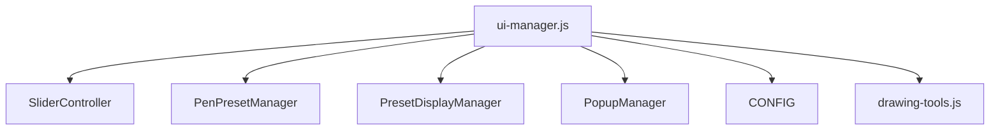
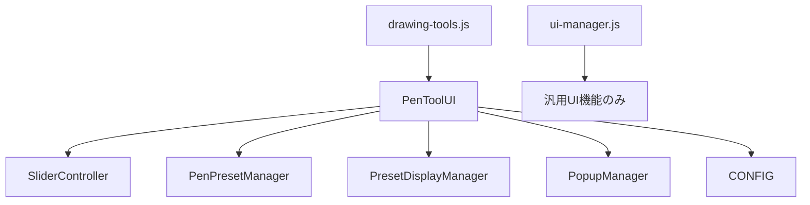

# STEP 1: ペンUI責務移譲詳細分析報告書

## 1. 現状コード分析結果

### ui-manager.js 責務分析（1200行超）

#### ペン関連責務の詳細マッピング
| 機能カテゴリ | 関数名 | 行数推定 | 依存関係 | 移譲対象 |
|-------------|--------|----------|----------|----------|
| **スライダー制御** | `setupSliders()`, `createSlider()`, `updateSliderValue()` | ~80行 | SliderController, CONFIG | ✅ 高優先度 |
| **プレビュー連動** | `updatePresetLiveValues()`, `updateActivePresetPreview()` | ~40行 | PenPresetManager, PresetDisplayManager | ✅ 高優先度 |
| **ポップアップ制御** | `handleToolButtonClick()`, `showPopup()`, `hidePopup()` | ~30行 | PopupManager | ✅ 中優先度 |
| **プリセット管理** | `selectPreset()`, `resetActivePreset()`, `resetAllPreviews()` | ~50行 | PenPresetManager | ✅ 中優先度 |
| **キーボード処理** | `handleKeyboardShortcuts()` の一部 | ~20行 | Event処理 | ✅ 低優先度 |

#### 問題のあるコード構造の特定
```javascript
// 問題1: ui-manager.js内のペン専用コード（SRP違反）
setupSliders() {
    // ペンサイズスライダー（プレビュー連動強化版）
    this.createSlider('pen-size-slider', minSize, maxSize, defaultSize, 
        (value, displayOnly = false) => {
            if (!displayOnly) {
                this.toolsSystem.updateBrushSettings({ size: value });
                this.updatePresetLiveValues(value, null);
                this.updateActivePresetPreview(value, null);
            }
            return value.toFixed(1) + 'px';
        });
}

// 問題2: 汎用UIマネージャーにペン特化処理
updatePresetLiveValues(size, opacity) {
    if (this.penPresetManager && this.penPresetManager.updateActivePresetLive) {
        // ペン専用処理が汎用システムに混在
    }
}
```

### drawing-tools.js 現状分析（600行）

#### 現在の責務構成
- ✅ **描画ロジック**: VectorPenTool, EraserTool
- ✅ **ツール管理**: ToolManager, DrawingToolsSystem  
- ✅ **履歴管理API**: undo/redo機能
- ❌ **UI制御機能**: なし（移譲対象）

#### UI機能追加の設計方針
```javascript
// 提案: PenToolUI クラスをDrawingToolsSystemに統合
class DrawingToolsSystem {
    constructor(app) {
        this.app = app;
        this.toolManager = null;
        this.historyManager = null;
        
        // 新規追加: UI制御システム
        this.penToolUI = null; // PenToolUIクラス
    }
    
    // 新規API: UI制御の初期化
    async initUI() {
        this.penToolUI = new PenToolUI(this);
        await this.penToolUI.init();
    }
}
```

## 2. 依存関係分析

### 重要な依存関係の洗い出し

#### ui-manager.js → external systems


#### 移譲後の理想的な構造


### 循環依存リスクの評価

#### 現在の循環依存
1. `ui-manager.js` ⇄ `drawing-tools.js` (updateBrushSettings呼び出し)
2. `PenPresetManager` ⇄ `ui-manager.js` (プレビュー更新)

#### 移譲後の解決策
- **Interface分離**: UI更新のイベント通知システム導入
- **依存注入**: PenToolUIが必要な外部システムを注入で受け取る

## 3. グローバル変数・イベント分析

### ui-manager.js内のグローバル参照
| 変数名 | 用途 | 移譲後の扱い |
|--------|------|--------------|
| `window.CONFIG` | 設定値参照 | PenToolUIでも継続使用 |
| `window.uiManager` | グローバルアクセス | 一部をPenToolUIに移管 |
| `window.SliderController` | スライダー制御 | PenToolUIに移管 |

### イベントリスナーの移譲対象
```javascript
// 移譲対象のイベント処理
setupSliderButtons() {
    // ペンサイズ調整ボタン
    { id: 'pen-size-decrease-small', slider: 'pen-size-slider', delta: -0.1 },
    { id: 'pen-size-increase-large', slider: 'pen-size-slider', delta: 10 },
    
    // 不透明度調整ボタン  
    { id: 'pen-opacity-decrease', slider: 'pen-opacity-slider', delta: -1 },
    // ... 全12個のボタン
}

handleKeyboardShortcuts(event) {
    // R: プリセットリセット
    // Shift+R: 全プレビューリセット
    // P+数字: プリセット選択（ui-events.jsにあり）
}
```

## 4. PenToolUI クラス設計

### 基盤クラス設計
```javascript
/**
 * ⚠️ 【重要】開発・改修時の注意事項:
 * 必ずdebug/またはmonitoring/ディレクトリの既存モジュールを確認し、重複を避けてください。
 * - debug/debug-manager.js: デバッグ機能統合
 * - debug/diagnostics.js: システム診断  
 * - debug/performance-logger.js: パフォーマンス測定
 * - monitoring/system-monitor.js: システム監視
 * これらの機能はこのファイルに重複実装しないでください。
 */

class PenToolUI {
    constructor(drawingToolsSystem) {
        this.drawingToolsSystem = drawingToolsSystem;
        this.app = drawingToolsSystem.app;
        
        // 外部システム参照（依存注入）
        this.sliderController = null;
        this.penPresetManager = null;
        this.presetDisplayManager = null;
        this.popupManager = null;
        
        // UI制御状態
        this.sliders = new Map();
        this.previewSyncEnabled = true;
        this.previewUpdateThrottle = null;
        this.lastPreviewUpdate = 0;
        
        this.isInitialized = false;
    }
    
    async init() {
        console.log('🎨 PenToolUI初期化開始...');
        
        // 外部システムの取得・初期化
        this.initializeExternalSystems();
        
        // UI要素の初期化
        this.initSliders();
        this.initPopupControl();
        this.initPreviewSystem();
        this.initKeyboardShortcuts();
        
        this.isInitialized = true;
        console.log('✅ PenToolUI初期化完了');
    }
    
    // STEP 2で実装予定
    initSliders() { /* スライダー制御移譲 */ }
    
    // STEP 3で実装予定  
    initPreviewSystem() { /* プレビュー連動移譲 */ }
    
    // STEP 4で実装予定
    initPopupControl() { /* ポップアップ制御移譲 */ }
    
    // STEP 5で実装予定
    initKeyboardShortcuts() { /* イベント処理移譲 */ }
}
```

### APIインターフェース設計
```javascript
// DrawingToolsSystem 拡張API
class DrawingToolsSystem {
    // UI制御API
    getPenUI() {
        return this.penToolUI;
    }
    
    async initUI() {
        if (!this.penToolUI) {
            this.penToolUI = new PenToolUI(this);
        }
        return await this.penToolUI.init();
    }
    
    // 既存APIとの統合
    updateBrushSettings(settings) {
        // 既存のロジック
        // + UI更新通知
        if (this.penToolUI) {
            this.penToolUI.onBrushSettingsChanged(settings);
        }
    }
}
```

## 5. 移譲計画詳細化

### STEP 2: スライダー制御移譲
**移譲対象関数**:
- `setupSliders()` (78行) → `PenToolUI.initSliders()`
- `createSlider()` (15行) → `PenToolUI.createSlider()`  
- `updateSliderValue()` (8行) → `PenToolUI.updateSliderValue()`
- `getAllSliderValues()` (10行) → `PenToolUI.getAllSliderValues()`
- `setupSliderButtons()` (30行) → `PenToolUI.initSliderButtons()`

**移譲後のファイルサイズ予測**:
- ui-manager.js: 1200行 → 1059行 (-141行)
- drawing-tools.js: 600行 → 741行 (+141行)

### STEP 3: プレビュー連動機能移譲
**移譲対象関数**:
- `updatePresetLiveValues()` (20行) → `PenToolUI.updatePresetLiveValues()`
- `updateActivePresetPreview()` (25行) → `PenToolUI.updateActivePresetPreview()`
- `setupPreviewSync()` (15行) → `PenToolUI.initPreviewSystem()`

**依存コンポーネント**: PenPresetManager, PresetDisplayManager

### STEP 4-6: 残り機能の段階的移譲
各STEPで20-40行程度の移譲を想定。

## 6. リスク評価と対策

### 高リスク要因
1. **プレビュー連動の複雑さ**: 複数システム間の協調動作
2. **循環依存の発生**: ui-manager ⇄ drawing-tools
3. **グローバル関数の破損**: window.debugPreviewSync等

### リスク軽減策
1. **段階的移譲**: 各STEPでの動作確認徹底
2. **インターフェース統一**: 統一されたAPI設計
3. **フォールバック機能**: 外部システム不在時の安全動作
4. **十分なテスト**: 非回帰テスト・統合テスト

## 7. STEP 1完了判定基準

### 成果物確認
- ✅ 詳細責務マッピング完了
- ✅ PenToolUIクラス設計完了  
- ✅ 依存関係分析完了
- ✅ リスク評価・対策策定完了

### 次STEP実行準備
- ✅ STEP 2実装計画明確化
- ✅ テスト方針確定
- ✅ バックアップ・ロールバック計画策定

---

## 📋 STEP 2実行計画（次回）

### 実装対象
1. **PenToolUIクラス作成**: drawing-tools.js内に実装
2. **スライダー制御移譲**: setupSliders等5関数の移植
3. **DrawingToolsSystem拡張**: initUI API追加
4. **main.js連携**: 初期化処理の修正

### 期待効果
- ui-manager.js: 約140行削減
- ペンツール専用UI制御の独立性確保
- 将来的なレイヤー機能追加時の基盤完成

**STEP 1分析完了 - STEP 2実装準備完了** ✅