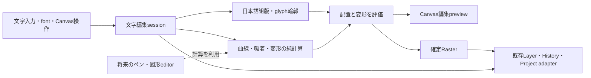

# 文字編集と小さな幾何基盤の仮設計

状態: REFERENCE / 検討・仮設計。製品実装や保存schemaの承認ではない。

2026-10-04、`D:\GitHub\tegaki`、main / `f245c354f63b808e3f5c89facfed19f5b0184eaf`。既存差分を保持。前提は[操作案](2026-10-04-text-editing-proposal.md)、部品の事実確認は[OSS調査](2026-10-04-text-vector-oss-shortlist.md)。今回のOwner指示で、ライブラリ採用自体を目的にしない判断へ更新する。

## 推奨する作り方

**Tegaki独自の操作・編集データを中心に作り、難しい専門処理は交換可能な部品に任せる。** 曲線計算まで自作するかは小さな比較で決める。HarfBuzz/Paper/Moveable等のdata modelを製品の土台として採用することは、今回の必須条件にしない。

文字toolを最初の利用者にして、純粋な曲線・座標・吸着・変形の計算を小さく分離する。ペンや図形にも同じ操作感を展開できる余地を作るが、通常ペンの入力処理や保存を文字toolへ合わせて改造しない。共用のためだけに汎用editor/frameworkを先に作らない。

優先する完成条件は、文字を選ぶ→置く→数点で整える→後から文字/書体を直す、が迷わず速くできること。部品数・コード行数・agent消費の少なさは、その完成条件を満たす方法同士の比較で使う。

## 作り方の比較

5点満点の仮評点。操作適合50%、日本語/変形品質25%、拡張性15%、初期負担の小ささ10%。未実測。品質評価は今回の限られた範囲で到達する見込みであり、自作が原理的に低品質という意味ではない。

| 作り方 | 操作適合 | 品質 | 拡張性 | 負担の小ささ | 加重得点 | 判断 |
|---|---:|---:|---:|---:|---:|---|
| 完成済vector framework/editorを土台に寄せる | 3 | 4 | 3 | 4 | 3.4 | 既製の選択/scene graphが必要になれば候補。今はCanvas・Historyへの適合負担が読めない |
| **独自の編集骨格＋必要な専門部品** | **5** | **5** | **4** | **4** | **4.8** | **推奨**。libraryの都合より操作を先に固定、交換範囲を小さくする |
| 日本語組版から幾何・UIまで全面自作 | 5 | 2 | 4 | 1 | 3.7 | 独自性は高いが、日本語の字形/結合文字まで新規実装する負担が大きい |

幾何の数関数だけ自作する案は「全面自作」ではなく推奨案の範囲。専門部品の採用と、製品全体をその部品の設計に合わせることは別判断。

## 制作中に見える操作

漫画の「文字」tabを開くと、入力・font・サイズ/字間・色/縁取りがある。Canvasで文字をdragして配置。既存のfont情報/大きな補助previewは開閉式、比較pageは必要時に開く。

- 普段の対象は文字全体。枠の移動・回転・拡縮を行う。
- 「線に沿わせる」を押すと、配置線と少数の点を表示。直線/弧/波/楕円/折れ線から始め、点を追加/移動する。
- 「形を変える」を押すと、配置線の編集を休止してenvelopeの四隅を表示。辺/中心の点は詳細操作で出す。
- 編集対象を上部に「文字全体 / 配置線 / 変形」と表示。Escは一段戻る。切替だけで確定・取り消し・History追加をしない。
- 点追加は線上ダブルクリックとbuttonの両方。penでダブルクリックを必須にしない。hoverだけで編集を始めない。
- 字間、線上の位置、字形の歪み、先頭→末尾のサイズ勾配は別操作。例えば「ゴゴゴ」を波に置いた時、字形を曲げるかどうかは別に選べる。

動かしている点・吸着先・今回変わる範囲をCanvasで確認できることを重視する。詳細な接線handleは初期UIに出さず、将来の詳細操作として追加できる形にする。

## 構成と境界

以下は提案する責務で、すべてを新classにする指示ではない。

| 部分 | 所有するもの | 持たせないもの |
|---|---|---|
| 文字の編集データ | 文字列、書体識別、組版/装飾設定、配置線、変形、配置 | DOM、font bytes、glyph cache、GPU資源 |
| 編集session | 編集対象、選択点、drag開始値、未確定変更、preview世代 | 第二のProjectや全tool共通の保存正本 |
| 組版adapter | script/language/direction、glyph/cluster/advance/offset、輪郭 | Canvasの入力、点選択、Layer確定 |
| 純幾何 | 曲線評価/分割/距離、座標計算、吸着候補、点の変形 | 文字列、font、pointer event、Project/History |
| 操作controller | 現在mode、hit、drag、keyboard/pen入口 | 描画engineの所有、他toolの保存形式 |
| Tegaki接続adapter | preview/確定/取消、Layer対象、既存History/Projectへの受渡し | 外部libraryのscene graphを保存正本にする処理 |

独自の編集データからlibraryへ渡し、結果を数値/輪郭へ戻す。library独自objectをそのままProjectへ保存しない。外部libraryを外した時も、文字列・点の並び・編集の意味が残るようにする。

## 共用する候補と現行コード

現行codeを静的確認した。以下は共用可能性であって、文字toolへの接続が済んでいるという報告ではない。

| 候補 | 現行の足場 | 文字で使う範囲 | 他toolへの効用・条件 |
|---|---|---|---|
| affine座標計算 | `system/transform-math.js` | 文字local↔文書座標、全体配置、bounds | 図形/ペン編集の座標計算。cameraへの接続はhost側、既存client→local処理を一括置換しない |
| 四角/楕円の幾何 | `system/shape-geometry.js` | quad編集、楕円配置線の形、四隅の変形 | 現行図形との共用候補。内部の射影関数は未公開なので必要なら限定抽出。退化時fallbackを文字変形の正解と仮定しない |
| 方向/角度への射影 | `system/ruler-geometry.js` / `shape-geometry.js` | 軸制約、角度、近い点の計算の参考 | 定規や図形へ展開可能。ただし定規は描き始めのanchorを使うため、editorのsnap全体と同一ではない |
| 曲線の評価 | `system/drawing/curve-interpolator.js` | 自動接線/曲線の試験・既存penとの比較 | 現行penがcentripetal Catmull-Romを利用。文字の追加点を保形する処理は別途必要 |
| 画面上のhandle幾何 | `system/transform-overlay-geometry.js` | screen pxでのつかみやすさ、worldからの表示の考え方 | 点操作の共通文法。V固有のtransform/anchor semanticsをそのまま文字へ移さない |
| font tree/比較 | 現行font library/tree/comparison | 選択・見本・favorite・分類 | fontを使う別tool。drawing penのために一般化する必要はない |

現行`shape-geometry`は4頂点quadから楕円を射影し、点列を作る。文字用の楕円をゼロから別実装する前に、この形との一致を試す。ただし点列から接線/弧長を評価する精度と、文字配置の開始位置は別に確認する。

現行penは入力sampleの筆圧/傾き等も扱う。文字用point editorとpen live strokeを一つのclassへまとめない。将来の「描いた線を点で修正するペン」なら曲線・hit・snapを利用できる。一方、通常ペンの追従性・筆圧・stamp・opacity・Historyはそのまま別責務。

## 曲線の仮データと点操作

配置線は、線上のanchor点と、その間のBezier区間を独自に表す。点ID、順序、開/閉、角/なめらかを持つ。内部の接線はUIで隠せるが、保形に必要な値まで毎回捨てない。UIの点と、描画/測定のための細分点は別。

1. プリセットや点列から初期区間を生成する。自由曲線の初期は少数点と自動接線。
2. 点追加は最寄り区間を求め、de Casteljau分割で二区間へ置換する。元形を維持し、その時点で全体をCatmull-Rom再生成しない。[曲線分割の解説](https://pomax.github.io/bezierinfo/#splitting)。
3. 点のdragは開始時の値から毎回計算する。移動点と接する区間を更新し、隣接anchorの外側へ影響を広げない方針を先に試す。なめらかさに必要な接線の更新範囲を表示/検証する。
4. 点削除は一般に完全な保形ができない。接する二区間を統合した結果をpreviewし、一回の取り消しで戻せるようにする。
5. 文字位置は曲線の弧長で扱う。始端/終端/中央、字間、閉じた線の開始点と方向を別値にする。パラメータtの等間隔を均等な字間と説明しない。

最初に必要な計算境界は、`evaluate`、`split`、`nearestPoint`、`buildLengthTable`、`pointAtDistance`程度。これらの名前は仮で、既存責務を調べてからfile/APIを確定する。自作/Bezier.jsのいずれも同じ入力・出力と試験を通し、editor側にlibraryのclassを漏らさない。

将来penの線幅/筆圧を同じ線に沿わせるなら、曲線とは別に距離上の値を持つchannelとして評価する。保存済pen strokeへ新形式を自動移行する案ではない。現在のペン機能を文字のために書き換えない。

## Grid・吸着と座標

編集データは文字localの作品px、配置は文書座標、hit許容距離は画面pxに分ける。cameraのzoom/rotation/flipで許容距離や吸着先の見え方を確認する。

snapは「toolが候補を渡す→純計算が最寄り候補/guideを返す→toolが適用」を基本にする。初期候補はgrid、軸/角度、同じ文字の点、枠の中心/端。全Layerの画素輪郭を常時走査する吸着は対象外。

同じ近さの候補でguideが頻繁に切り替わらないよう、取得/解除の距離差を試す。吸着する対象の優先と、axis lockとの順序はcontrollerで明示する。dragged point自身を候補に含めない。将来図形editorでは候補を差し替えられるが、定規の固定anchor方式を無理にこのcontrollerへ統合しない。

## 変形の仮設計

初期は一つのenvelopeに絞り、次の方式を区別する。

- 四隅の平行四辺形/遠近: affine/projective map。既存quadの計算を候補にする。凸・非退化の入力を試し、分母が極端に小さい状態を無言fallbackで確定しない。
- 弧/波/膨らみ/先細り: 元boundsで正規化したu/vから評価する少数パラメータの関数。presetの強さと方向を操作する。
- 詳細の辺/中心: 四辺の曲線を使うCoons patch等と中心補正を候補にする。例えば境界で0、中心で1となる重み`16u(1-u)v(1-v)`を使えば、中心点操作を境界へ漏らさず表現できる。これは数学的な候補で、未採用・未測定。

UIが四隅→辺/中心へ移る時に形が跳ねないかをproofする。projective mapとCoons patchは同じ結果と仮定せず、詳細化時は差分補正を元mapへ加える方式も比較する。操作点は最大9点程度、評価用の細分密度は字形の複雑さと出力精度で別に決める。

適用順は **文字の組版/範囲設定→配置線上で各clusterを配置→文字全体のenvelope→全体の移動/回転/拡縮** を既定候補にする。順序を変えた多段effect stackは初期対象外。線に沿って字形全体を剛体回転させる処理と、字形の中まで曲げる処理を分ける。

曲線control pointを非線形mapで写すだけでは、曲線全体の正確な変形にならない。輪郭を適応的に細分し、許容誤差で評価する候補を用意する。穴・細線・縁取り・重なり・折返しを画素で確認する。previewと確定は同じ変形定義を使い、previewの軽いサンプリングをそのまま最終品質の上限にしない。

## 日本語・書体と応答

日本語shapingは成熟したengineを最初の候補にする。HarfBuzz.jsは依存名であって編集data modelの正本ではない。adapterからglyph/cluster/位置/輪郭を取り、禁則/改行/行送り/縦中横等は必要な用途から順にtool側で設計する。[HarfBuzz.js公式経路](https://github.com/harfbuzz/harfbuzzjs)。

文字数、glyph数、見た目の一文字を同一に扱わない。結合濁点や合字のまとまりを壊さず、範囲指定は文字列の位置と組版結果の対応を保つ。12→20は文字範囲へのサイズ指定として再組版し、envelopeの台形で代用しない。縦の約物・長音・小かな、font不足、色glyphは対応範囲を別に確かめる。

cacheは三段: 読込font/engine、入力ごとの未変形輪郭、形/配置だけ変えた評価結果。点dragではfont解析・再fetch・再shapingを行わない。変形済み輪郭を次frameの元にせず、元形から毎回評価する。

pointer更新はframe単位にまとめ、遅い解析の結果はsession/input世代が一致する場合だけ採用する。worker/WASM転送は初めから必須にせず、cold/warmとdragを測って重い工程だけ分離する。canvas全体の巨大な中間画像を作る方式を既定にしない。

OS font family名だけではoutline用bytesを取得できない。Eのfont/本人importとOS fontでは可能な処理が異なる。browser組版経路を残すか、初期の曲線/変形はbytesを読めるfontに絞るかは次proofの判断。書体の無言置換や画面と確定の異なるfallbackは避ける。

## 保存・履歴と他の拡張

### ベクターレイヤーを先に作るか

Ownerの追加質問に対する推奨は、**編集する形はベクターとして保持し、当面の作品表示/保存/出力は既存Raster経路で扱う**方式。文字の操作試作は先に進められる。ただし元データと確定画素の関係は製品接続前に決め、再編集できない画素だけのtoolを先に完成させない。

| 方式 | 得られるもの | 今回の判断 |
|---|---|---|
| 文字の確定時に画素だけ残す | 既存Layerへ早く接続できる | 後から文字/書体/点を直す目的を満たさず、初期製品の完成形にはしない |
| **編集データを持つ通常Raster Layer** | 表示/合成は従来通り、専用toolで元データから再生成して更新できる | **初期の推奨**。文字・コマ・図形で使う幾何の共用と両立する |
| 正式な汎用Vector Layer | vector object自体を描画/保存の中心にできる | 汎用path編集、複数object、SVG出力等の要求が確定した段階で別設計 |

現行のコマ/吹き出しにも通常Rasterとoptional再編集情報の先例がある。`project-manager.js`は画像に加えて`panelLayout`/`balloon`を明示保存/復元する。これを文字toolへ一括流用するという意味ではなく、構造情報と画素を併存させる落としどころが既存経路で成立する根拠。新しい文字情報の保存fieldはなお次Cardで確定する。

初期の文字Layerは「元の文字/曲線/変形」と「その結果の画素」を持つ。専用編集では元の形から計算し、適用時に画素と情報を同時更新する。閉じた後は既存Layerと同じ画素合成、fontが不在でも保存済の見た目は維持。これを汎用Vector Layer実装済、無制限に拡大しても常に鮮明、任意SVGへ書出し可能と説明しない。

日常の編集のために毎回「戻せないラスタライズ」を求めない。画像を作って表示しても、元情報を保持すれば文字の再編集を続けられる。「画像として独立させる/通常画像へ変換」は元情報から切り離す別操作。元の文字Layerを残したRaster複製を優先候補とする。

二つの編集内容が食い違う場合を先に決める。生成文字Layerに直接手描きや外部Transformが入った後、古い元データでその画素を上書きしてはいけない。初期は情報の整合確認と、新規Layerへの再生成経路で保護する。後から元データだけを再描画して「画素は単なるcacheだった」と扱わない。手描きは別Layerに載せて重ねる運用も自然な入口。

**今決める境界**は、編集元データの独自形式/座標、適用と取消、画素と情報の一回のHistory、Project往復、手描き/外部変更との不整合処理。**後に判断できるもの**は、正式Vector Layer、複数objectのscene graph、汎用SVG入出力、既存Layer/Animeの保存モデル統合。

vector化を先に行う価値が強くなるのは、文字以外も専用toolを開かず共通node editorで編集する、vector/rasterを頻繁に混在させる、出力寸法を変えて元形から全体を再描画する、SVG等を制作物として出す、という具体的な需要が出た時。拡大品質が不足するだけなら、まず元情報から指定解像度へ再生成する経路を試せる。ただし現行Project/Exportにその再生成出力が既にあるわけではない。

共通geometryはlayer種別に依存させない。後にVector Layerを追加する場合も文字の操作・curve/snap/evaluatorを利用できる余地を作るが、新しいrenderer/保存adapterへの接続まで自動で済むとは約束しない。文字の制作動線を確認する前に、Raster Layer全体を新layer体系へ移行しない。

確定Rasterと再編集情報を既存Layerのadapterへ渡す。optional文字情報には文字列・書体識別・設定・curve/envelope/placementの独自version付き値を保存する案。glyph輪郭やfont bytes、選択/hover、評価細分点は保存しない。fontが無くても確定済画素は表示/出力できる。

sessionの点操作には小さな編集Undoを持つ候補。適用/更新時は画素と再編集情報をProject Historyへ一件で渡す。確定後にglobal Undoがsession内だけを戻すなどの混同を避け、session中は状態を示す。Esc一段戻る、明示取消で元へ、明示適用で確定する方針を実操作で確かめる。

文字Layerへの手描き加筆や外部Transform後は元情報の整合を確認する。文字の再生成で加筆を消さないよう、情報が整合しない場合は新Layerへ作る経路を用意する。この保存/History接続と不整合判定は次Cardで確定する。今回schemaを変更しない。

| 将来候補 | 共用できるもの | 固有のままにするもの |
|---|---|---|
| 点編集できるペン/曲線描画 | curve評価/分割、hit、snap、画面pxのhandle | live strokeの筆圧/stamp/追従/履歴 |
| 図形・楕円・多角形 | local座標、点の選択/移動、quad、snap、bounds | shape生成規則、塗り/線幅/確定 |
| 吹き出し | font選択/組版、curve評価、少点の操作文法 | しっぽ/文字の自動fit、既存balloon保存 |
| Animeの形補間 | 純評価器、安定点ID/接続構造、数値パラメータ | Timeline/KEY/Bind/Poseの所有と保存 |
| 別のUI拡張 | 共通palette、penで触れるhandle、focus/session終了の文法 | 一切curveが不要なtoolへ幾何基盤を持ち込まない |

共用は同じ保存形式に揃えることではない。geometryの同じ関数と、ユーザーが覚えた操作を共用する。第二の実利用者が現れた時に不足分を追加し、今回から全toolへの移行計画を抱えない。

Animeへの応用も、同じ点ID/接続構造なら評価器や数値補間を使えるという範囲。点数変更、別文字、書体変更で輪郭が変わる場合の対応付けは別途必要。文字toolを作れば任意字形のモーフが完成するとは扱わない。

## 非商用研究から取り入れる考え方

参考対象とコード/資産の採用対象を別にする。非商用という理由だけで設計ヒントを除外しない。[Word-As-Image公式研究](https://wordasimage.github.io/Word-As-Image-Page/)は、意味に合わせて輪郭を変えながら可読性・元書体の特徴を保つ目標を示す。今回の応用提案は、その目的を手動編集へ置き換えること。

- 「怖い/震え/勢い/膨らみ」等は、font folderの分類とは別に変形presetの候補になる。font自体と形状効果を混ぜない。
- 原形との差を確認する一時表示、変形の強さを戻せる操作を用意する。
- 読みやすさを保つモードでは、細線・穴・折返し等を検査/表示する候補。ただし機械的な検査だけで読めると保証しない。意図的な歪みは明示操作で許す。

これらはTegaki向けの独自提案。AI最適化やloss実装、研究のcode/モデル/画像を移植する案ではない。意味から新しい絵文字を生成する機能は今は別件。まず手動presetが制作に有効かを確認する。直接流用のlicense条件は[OSS調査](2026-10-04-text-vector-oss-shortlist.md)の区分を維持する。

## 部品の採用・参考・自作

| 対象 | 初期判断 | 採用を変える条件 |
|---|---|---|
| toolのUI/session/編集データ | 独自設計 | 外部editorへ合わせる理由が実際の制作例で生じた時だけ再比較 |
| 日本語shaping/輪郭 | HarfBuzz.jsを交換可能adapterで試す | 手持ちfont/format、縦書き、応答で不足した時 |
| 曲線の数関数 | 小さな独自実装とBezier.jsを同じ試験で比較 | 精度、点追加保形、依存規模、保守の実測で決める |
| 四隅変形/楕円 | 現行純幾何を優先評価 | 必要な精度・退化処理を満たさない時だけ限定追加 |
| 点controller/grid/snap | Tegaki独自、参考は外部製品 | 汎用widget導入より軽いかを実操作で判断 |
| Warp.js | 細分/変形の参考と比較候補 | 自作map評価の不足を具体的に埋める時に採用 |
| Moveable/Paper.js | 参考・対案 | 全体選択/汎用path編集を増やす段階で統合負担と比較 |
| 非商用のsemantic typography | 目的/設計ヒントの参考 | 直接code/資産を使う計画なら条件を別途確認 |

## 先に試す制作例と進め方

1. 同じ小pageで「タイトル」「波のゴゴゴ」「楕円に沿う見出し」を作る。操作枠・点追加/移動・軸/grid吸着を、font engine採用とは独立して試す。
2. セリフ/角字/筆文字の少数fontで、横/縦、濁点/約物、12/20pxと大サイズ、字形の穴を確認。曲線自作/Bezier.js比較は数関数だけを差し替え、二つの完成toolを並行開発しない。
3. 一つのenvelopeと原形復帰、文字変更後の再評価を試す。4→9点の詳細化が跳ねず、warm dragの応答と出力品質が十分か確認する。
4. この操作と品質が合ってから漫画tabへ接続し、保存load/更新/取消/UndoRedoを確かめる。Project接続前の実験値を制作受入と扱わない。
5. 幾何の分離が有効かは、将来の利用を想像するだけでなく、小さな非文字shapeの点操作で確認する。これを通常ペン改修や汎用vector editorの完成条件へ拡大しない。

最初の採否は「用意した制作例が気持ちよく作れるか」で決める。library比較を延々増やすより、同じ入力/操作/画素条件を短い試作で比較する。駄目ならその部品か操作の境界を直し、既に合った部分は再調査しない。

今回は新しいagentを起動せず、前件の公式調査を再利用し、共用候補の現行純幾何とpen接点だけを限定確認した。実装/依存追加/Browser性能測定は未実施。文書の整合を検証し、Ownerが次の実装範囲を判断できる仮設計として残す。未commit/未push。
