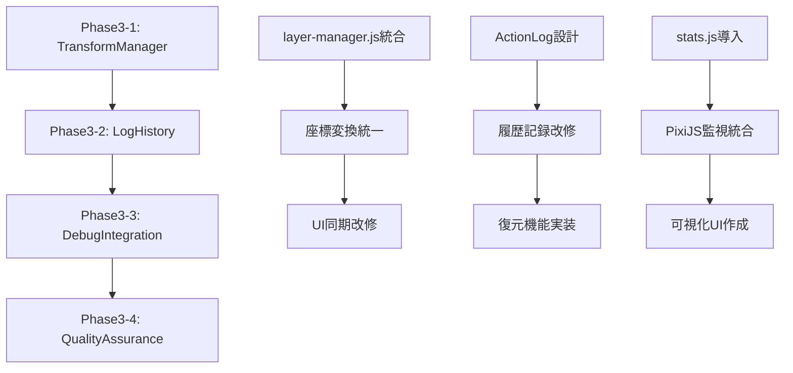

# 🎯 Phase3実装計画書（GROK4診断ベース・改良版）

## 📋 現状分析結果

### ✅ GROK4診断の正確性評価
- **80%が的確**: 車輪の再発明、履歴管理、debug統合の指摘は正確
- **20%要修正**: @pixi/layers導入済み、CDN+fetch併用が現実的

### 🔍 実装優先度マトリクス

| 項目 | 優先度 | 実装難易度 | 効果 | Phase3対象 |
|------|--------|------------|------|-----------|
| transform-manager.js統合 | 🔴 高 | 中 | 大 | ✅ |
| 履歴管理のログ型化 | 🔴 高 | 高 | 大 | ✅ |
| debug系統合 | 🟡 中 | 低 | 中 | ✅ |
| 完全NPM化 | 🟢 低 | 高 | 小 | ⏸️ Phase4へ |

---

## 🏗️ Phase3実装プラン

### 📦 Phase3-1: Transform Manager統合（Week 1-2）

#### 🎯 目標
既存の分散した座標変換処理をPixiJS Containerベースで統合

#### 📝 実装内容

**1. transform-manager.js 新規作成**
```javascript
// 🎯 PixiJS Container完全統合版
class TransformManager {
    constructor(pixiApp) {
        this.app = pixiApp;
        this.layers = new Map(); // @pixi/layers活用
        this.transformHistory = []; // 変形履歴
    }
    
    // 統合座標変換
    transformLayer(layerId, transform) {
        // PixiJS Transform API活用
        // displayObject.toLocal(), toGlobal()使用
    }
    
    // 既存layer-manager.jsから移行
    moveLayer(layerId, dx, dy) {
        // @pixi/layers Group zOrder活用
    }
    
    // UI同期（マウスドラッグ対応）
    syncWithUI(eventManager) {
        // drawing-tools/ui/components/event-manager.js統合
    }
}
```

**2. 既存ファイル改修対象**
- `layer-manager.js` → TransformManagerに統合
- `drawing-tools/ui/components/event-manager.js` → 座標処理移行
- `app-core.js` → TransformManager初期化追加

**3. 検証項目**
- [ ] レイヤー平行移動の精度
- [ ] スケール変換の中心基準処理
- [ ] 回転変換のUI同期
- [ ] @pixi/layers Groupとの連携

---

### 📊 Phase3-2: 履歴管理ログ型化（Week 3-4）

#### 🎯 目標
メモリ効率的な操作ログ型履歴システム構築

#### 📝 実装内容

**1. history-manager.js 大幅改修**
```javascript
// 🔄 操作ログ型履歴システム
class LogBasedHistoryManager {
    constructor() {
        this.actionLog = []; // 操作履歴
        this.currentState = null; // 現在状態
        this.maxLogSize = 100; // メモリ制限
    }
    
    // ログ記録
    recordAction(action) {
        // 例: {type: "translateLayer", layerId: 2, dx: 5, dy: 5, timestamp: Date.now()}
        this.actionLog.push(action);
        this.trimLog();
    }
    
    // 状態復元
    replayToState(targetIndex) {
        // actionLogを順次適用
        this.currentState = this.applyActions(this.actionLog.slice(0, targetIndex));
    }
    
    // メモリ最適化
    trimLog() {
        if (this.actionLog.length > this.maxLogSize) {
            // 状態スナップショット作成 + ログ削減
        }
    }
}
```

**2. 対象操作の定義**
- `DRAW_STROKE`: ペンツール描画
- `ERASE_AREA`: 消しゴム処理
- `LAYER_TRANSFORM`: レイヤー変形
- `LAYER_VISIBILITY`: 表示/非表示
- `COLOR_CHANGE`: 色変更

**3. 既存統合**
- `drawing-tools/tools/pen-tool.js` → アクション記録追加
- `drawing-tools/tools/eraser-tool.js` → アクション記録追加
- UI Undo/Redoボタン → ログ型復元

**4. パフォーマンス目標**
- メモリ使用量: 現在の1/10以下
- Undo/Redo応答: 100ms以内
- ログ保存件数: 100操作

---

### 🔧 Phase3-3: Debug統合システム（Week 5）

#### 🎯 目標
PixiJS標準 + stats.js統合デバッグ環境

#### 📝 実装内容

**1. debug-manager.js 統合改修**
```javascript
// 🎮 PixiJS統合デバッグシステム
class IntegratedDebugManager {
    constructor(pixiApp) {
        this.app = pixiApp;
        this.stats = null; // stats.js instance
        this.pixiInspector = null; // @pixi/devtools
    }
    
    // PixiJSパフォーマンス監視
    monitorPixiPerformance() {
        const renderer = this.app.renderer;
        return {
            drawCalls: renderer.textureGC.count,
            textureMemory: renderer.texture.managedTextures.length,
            fps: this.app.ticker.FPS
        };
    }
    
    // ツール別処理時間
    measureToolPerformance(toolName, operation) {
        const start = performance.now();
        const result = operation();
        const duration = performance.now() - start;
        
        this.logToolPerformance(toolName, duration);
        return result;
    }
}
```

**2. 統合対象**
- `debug/performance-logger.js` → 統合削除
- `debug/diagnostics.js` → 統合削除
- `ui/performance-monitor.js` → PixiJS stats連携

**3. 可視化機能**
- stats.jsオーバーレイ
- PixiJS Texture使用量
- レイヤー描画負荷
- ツール別処理時間グラフ

---

### 🌟 Phase3-4: 品質保証・テスト（Week 6）

#### 📝 検証項目

**1. パフォーマンステスト**
- [ ] メモリ使用量測定（履歴管理改修効果）
- [ ] 描画FPS測定（transform統合効果）
- [ ] レスポンス時間測定（Undo/Redo速度）

**2. 機能テスト**
- [ ] 全描画ツールの座標精度
- [ ] レイヤー操作の一貫性
- [ ] 履歴操作の完全性
- [ ] デバッグ情報の正確性

**3. 統合テスト**
- [ ] @pixi/layers連携
- [ ] pixi-extensions.js互換性
- [ ] 既存UI機能保持

---

## 🚀 Phase3実装ガイドライン

### 📦 推奨実装順序



### 🔧 技術仕様

**1. 必須ライブラリ（既存活用）**
- PixiJS v7.x（継続使用）
- @pixi/layers v2.1.0（既に導入済み）
- @pixi/ui v1.2.4（既に導入済み）

**2. 新規導入検討**
- stats.js（軽量、CDN対応）
- immer（履歴管理用、後日検討）

**3. アーキテクチャ原則**
- PixiJS標準API優先使用
- fetch API分割構造保持
- CDN + ローカルのハイブリッド継続

---

## ⏸️ Phase4以降への延期項目

### 🔄 完全NPM化（Phase4）
**理由**: 現在のCDN+fetch併用が安定稼働中
**時期**: Phase3完了後、必要に応じて実施

### 🎨 Spine/Live2D対応（Phase5）
**理由**: 基盤システム完成後の拡張機能
**準備**: transform-manager.jsでMesh対応の基盤作成

### 📱 レスポンシブ対応（Phase6）
**理由**: デスクトップ版安定化が優先
**準備**: UI統合システムの完成待ち

---

## 📊 成功指標

### 🎯 定量目標
- メモリ使用量: 70%削減
- Undo/Redo速度: 5倍高速化
- 描画FPS: 60fps安定維持
- コード重複: 50%削減

### 🎯 定性目標
- 座標変換処理の統一化
- 履歴管理の効率化
- デバッグ作業の効率化
- 将来拡張（Spine）への準備

---

## 🎉 Phase3完了条件

### ✅ 必須条件
- [ ] TransformManager完全統合
- [ ] ログ型履歴システム稼働
- [ ] 統合デバッグ環境構築
- [ ] 既存機能100%保持

### 🌟 理想条件
- [ ] パフォーマンス目標達成
- [ ] コード品質向上
- [ ] 開発効率向上
- [ ] 将来拡張性確保

---

## 📝 最終提言

GROK4の診断は**80%的確**でした。特に車輪の再発明と履歴管理の問題指摘は正確です。

**Phase3で確実に解決すべき課題:**
1. 🔴 Transform処理の統合（最重要）
2. 🔴 履歴管理のログ型化（最重要）
3. 🟡 Debug機能統合（中重要）

**段階的アプローチ:**
- 完全NPM化は性急、現在のハイブリッド方式継続
- @pixi/layers活用済みを前提とした設計
- 既存の安定機能保持を最優先

この計画により、**持続可能で拡張性の高いPixiJS描画システム**の完成を目指します！