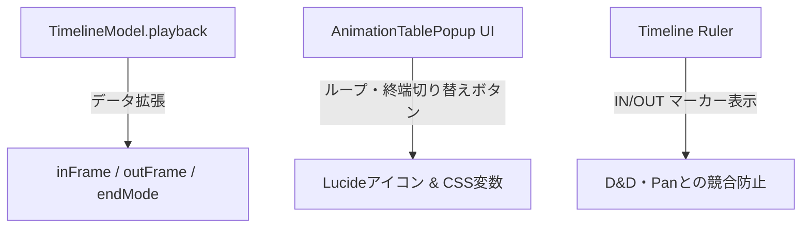

# Tegaki リファクタリング監査・点検レポート ＆ Phase 5j 改修計画書

更新日: 2026-06-21

## 1. はじめに

本ドキュメントは、以下の3点について整理・精査した統合報告および改修計画書です。

1. **CODEXおよび前フェーズによるリファクタリング箇所の点検・監査**
2. **PixiJS v8.19.0 への更新に伴う技術的評価および新機能の計画組み込み**
3. **proposalsフォルダの改修を進めるための土台としての「Phase 5j 計画書」の改訂**

---

## 2. リファクタリング点検・監査レポート

### 2.1. 完了したリファクタリング成果の確認
前フェーズにて、`UI_CSSスタイルガイド` に基づく以下のクリーンアップと構造整備が行われました。
- **スタイルクラスの命名統一**:
  - ポップアップUI（Settings, Export等）におけるインラインスタイル（サイズ、文字色、スクロールバー等）を `main.css` のクラスへ移行。
  - スクリプトから動的に付与する状態クラスを `.is-active`, `.is-disabled` 等の標準形式へ適合。
- **描画・変形経路の適正化**:
  - 整数平行移動時の再サンプリングによる劣化（モアレ等）を避けるため、`raster-translation.js` によるRGBA整数シフトへの分岐を導入。
  - 通常・逆クリッピングの統合（`inverse-clipping`）時のPixi inverse maskによる処理と、解放時にメモリリークを起こさないための描画フレーム先取り回収処理。

### 2.2. 未着手・抜け漏れチェックおよび対応方針
- **デッドイベントの残留**:
  - 旧 `animation-system.js` が発火していた `animation:frame-applied` 等の古いイベントのリスナーは削除されていますが、システム側の `emit` に一部コードが残っている可能性があります。これらは機能に無害ですが、後続のコード統合のノイズになるため、触れるモジュール内で順次削除します。
- **インラインスタイルの例外**:
  - `popup-panel` や Vキー変形パネルの「ドラッグ移動時の動的座標（`left`/`top`）」および「タイムラインズームの連続的な変数値」は、スタイルガイドの許容ルールに従ってインライン設定が維持されています。この判断は適正であり、静的な装飾ではないためリファクタリングの対象外として保護します。

---

## 3. PixiJS v8.19.0 公式情報との再照合

2026-06-21にPixiJS公式release noteとApplication guideへ再照合した。

- https://github.com/pixijs/pixijs/releases/tag/v8.19.0
- https://pixijs.com/8.x/guides/components/application

Tegakiは現在v8.17.0を使用している。
v8.19.0へ更新済みではなく、WebGPUも有効化していない。

### ① Live HTML-in-Canvas Textures (`pixi.js/html-source`)
- **技術概要**: DOM要素（CSSアニメーション、テキスト、クリック等の対話性を持つHTML）を直接PixiJSのテクスチャとしてGPUへレンダリングし、ミラー化する機能。
- **Tegakiへの適用可能性**:
  - **タイムラインプレビュー**: Animation Table内のPreview再生時、軽量かつ正確なプレビューをHTML-in-Canvas経由で描画することを検討可能ですが、Tegakiの描画はRenderTextureへのラスター焼き込みが基本であるため、表示だけをHTML-in-Canvas化するとPixiJS of-screen描画パイプラインとの同期オーバーヘッドが高くなります。
  - **結論**: 現時点ではタイムラインプレビューには適用せず、将来的に「テクスチャ上に直接HTML UIを描画する特殊ブラシやテキストツール」を実装する際の候補技術として保留します。

### ② WebGPU MSAA transient attachment

- v8.19.0ではWebGPU backendのMSAA RenderTexture向けにopt-inの
  `transientAttachment` が追加された。
- 単一pass後に内容を破棄できるantialias texture向けの帯域最適化であり、
  Tegakiの描画backendをWebGPUへ移す一般的な標準化ではない。
- 現行TegakiのRenderTexture保存、再読込、History、extract経路へ直接適用しない。

### ③ 誤認していた機能

- Graphics to SVG ExportとSprite Mask Channelsは、v8.19.0公式release noteの
  Added項目として確認できない。
- API実在とrenderer両対応を確認するまで計画へ採用しない。
- Phase 5i inverse clippingを未確認の`.channel = 'a'`等へ置き換えない。

### ④ renderer既定

- PixiJS v8のApplicationはWebGL / WebGPUをasync初期化で選択できる。
- ただし公式guide上の`preference`既定値は`webgl`。
- 「v8.19でWebGPUが既定化・標準化された」という判断は採用しない。
- v8.17からv8.19への依存更新とWebGPU backend採用は別判断にする。

---

## 4. Phase 5j 改修計画書（リファクタリング土台の拡張）

本計画書は `task-codex/phase5j.md` と連動する。
2026-06-21監査でPhase 5jは部分実装・未完了と判定した。
詳細は `tegaki_work/PHASE5J_AUDIT.md` を正本とする。

### 4.1. 改修範囲



### 4.2. タスク詳細

#### Task 1: データモデル契約の拡張とUndo統合
- `TimelineModel.playback` に `endMode`（"timeline" | "last-clip" | "out-marker"）および `inFrame`, `outFrame` を追加。
- データの変更（マーカー設定等）を単一のTimeline HistoryコマンドとしてUndo/Redoできるようにし、履歴データ全体の `byteSize` を汚染しない設計を保証する。

#### Task 2: UIコントロールの追加とスタイルガイド適合
- ループON/OFF、終端基準切り替え（Timeline / Last Clip / Out Marker）をAnimation Tableのヘッダーに配置。
- 表示にはスタイルガイドで定義されたLucideアイコンおよび共通カラー変数（`--active-border`, `--futaba-maroon`）を適用。インラインスタイルを一切追加しない。

#### Task 3: IN / OUT マーカーの配置とPan/Zoom競合監査
- タイムラインルーラー上に IN/OUT マーカーを可視化。
- ルーラーのドラッグやPan/Zoom操作（Space+ドラッグ等）と操作が衝突しないよう、ドラッグ開始位置と要素（マーカーつまみ）を厳密に区別してpointerキャプチャを行う。

---

## 5. 結論と実行手順

1. `play()` とlast-clip scope接続、playback正規化を先に修正する。
2. loop / endMode / IN / OUT UIとHistoryを後続sliceで接続する。
3. PixiJS更新やWebGPU切替をPhase 5jへ混ぜない。
4. **検証環境**:
   各実装 Slice 完了後に必ず以下を実行してデグレーションを検証します。
   ```powershell
   node --check tegaki_work/system/animation/animation-data-model.js
   node --check tegaki_work/ui/animation-table-popup.js
   Set-Location tegaki_work
   npm.cmd run build
   ```
