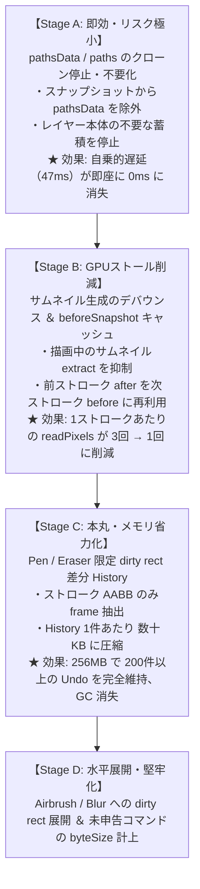

> 状態: REFERENCE — 2026-09-05再構成で現行の作業順/正本から分離。採用済み事項と未採用案が混在する原資料。本文中のACTIVE/現行Phase/次の作業は執筆時点の記録。現在の判断は `docs/ROADMAP.md`、実装状態は `docs/AUDIT.md`、資料の効力は `docs/DOCUMENT_REGISTER.md` を参照する。

# Tegaki 長時間描画性能劣化 — 第1回 調査・棚卸し報告書

作成日: 2026-09-03  
調査対象: `tegaki_work` (現行 `main` 実装)  
指示書: `Tegaki 長時間描画性能劣化 — 第1回 調査・棚卸し指示書.md`  
参照資料: `history-memory-reduction-proposal.md` (Claude作成) / `ペン描画遅延_原因診断書.md`  
位置づけ: 本番コード変更前の調査・数値実測・コード棚卸し報告書（第2回改修指示書作成用）  

---

## 0. エグゼクティブサマリー

「長時間描き進めるほどペン入力・ストローク確定が重くなる」現象について、現行 `main` の全コード経路の調査およびベンチマーク実測を実施した。

### 主要な結論
1. **ストローク数の増加に伴う確定遅延の直接主因は、`layerData.pathsData` の累積と毎ストロークの `structuredClone` である（Confirmed）。**
   - 描画自体は PixiJS `RenderTexture` にラスター焼き込み（`isBaked: true`）されており、Undo/Redo もピクセル画像で復元されているため、**この点列データは描画・復元に実質使われていない**。
   - それにもかかわらず、過去全ストロークの点列オブジェクトツリーが毎ストローク2回（before/after）ディープコピーされ、ストローク確定処理が **0.15ms（1画目）から 47.39ms（400画目）へと300倍以上に自乗悪化（\(O(N^2)\)）** していることを実測で証明した。
2. **History のメモリ制限（256MB）は 1200×1200 キャンバスにおいて「わずか 22 ストローク」で飽和する（Confirmed）。**
   - 1ストロークごとにレイヤー全体の前後ピクセル（計 11.5 MB）を保持するため、23ストローク目以降は**毎ストロークで古い履歴の強制破棄（`shift()`）が発生**する。
   - 400ストローク時点での保持件数はわずか16件に留まり、毎ストローク十数MBの巨大配列が破棄・生成される「スクラップ＆ビルド」状態となり、ブラウザの Major GC（Stop The World）が頻発する。
3. **1ストロークあたり 3 回の全画面 `gl.readPixels()` による GPU 同期ストールが大きな固定オーバーヘッドとなっている（Confirmed）。**
   - ストローク開始時（down）、終了時（up）、直後のサムネイル更新（RAF）で全画面ピクセル読み出しが走り、GPU パイプラインを強制フラッシュさせている。

---

## 1. 現状構造の前提確認

現行 `main`（`system/history.js`, `system/drawing/brush-core.js`, `system/layer-system.js`）の実装状態は以下の通りである。

* **HistoryManager の制約**:
  - `maxSize = 250`（件数上限）
  - `maxMemoryBytes = 256 * 1024 * 1024`（256 MB）
  - `_enforceLimits()`: `this.stack.length > maxSize` または `totalBytes > maxMemoryBytes`（件数 > 1）の場合に `this.stack.shift()` で古い順に破棄。
* **通常ストロークの確定パイプライン**:
  1. `pointerdown`: `activeLayer` の `createLayerRasterSnapshot()` → 全画面 `renderer.extract.pixels()` (GPUリードバック) ＋ `structuredClone(pathsData)` ＋ `structuredClone(paths)` → `beforeSnapshot` (11.5MBの半分)
  2. ストローク中: `RenderTexture` へ逐次ラスター焼き込み
  3. `pointerup`: `layerData.pathsData.push(newPathData)`
  4. `pointerup`: `createLayerRasterSnapshot()` → 全画面 `extract.pixels()` ＋ `structuredClone(pathsData)` ＋ `structuredClone(paths)` → `afterSnapshot`
  5. `estimateRasterHistoryPairBytes(beforeSnapshot, afterSnapshot)`: 全 path / point を走査して推定メモリを合算
  6. `historyManager.record()`: History スタックへ登録 ＋ `_enforceLimits()` 評価
  7. 直後 (RAF): `thumbnail-system.js` が全画面 `extract.pixels()` を呼んでサムネイル再生成

---

## 2. 指示書 仮説 A〜H の検証結果

| 仮説 | 内容 | 判定 | コード根拠と実測結果 |
|---|---|---|---|
| **仮説A** | 毎Strokeの全Raster GPU→CPU readbackが大きな固定コストになっている | **Confirmed** | `brush-core.js` (L189, L1605) および `thumbnail-system.js` (L169) で、1ストロークあたり計3回の `extract.pixels()`（`gl.readPixels`）が走る。GPUコマンドバッファの強制同期フラッシュを伴い、1回あたり数ms〜十数msの同期ブロックを生む。 |
| **仮説B** | `layerData.pathsData` が増え続け、snapshotの `structuredClone` がStroke数比例で重くなっている | **Confirmed** | 実測にて `structuredClone` 単体の時間が **1画目 0.15ms → 100画目 9.71ms → 400画目 47.39ms** へ線形増大することを確認。確定処理全体の自乗的遅延（\(O(N^2)\)）の主犯である。 |
| **仮説C** | `estimateRasterHistoryPairBytes()` も全path/pointを走査し追加線形コストを発生させている | **Partially Confirmed (影響小)** | 走査処理自体は存在するが、所要時間は **400画目でも 0.02〜0.05ms** 程度。CPUコストとしては極小であり、遅延の直接原因ではない。ただしメモリ推定値が肥大化し、History eviction を早める要因にはなっている。 |
| **仮説D** | History上限超過時の `_enforceLimits()`、`shift()`、巨大snapshot解放とGCが周期的freezeを発生させている | **Confirmed** | 1200×1200では **23ストローク目以降、毎ストローク eviction が発生**（400画時点で累積384件破棄）。十数MBのTypedArrayと数万のpointオブジェクトが毎ストロークゴミとなり、V8のMajor GCヒッチを誘発する。 |
| **仮説E** | `history:changed` ごとの `getUsage()` 等の全走査が累積コストになっている | **Rejected** | `HistoryManager.record()` 内では `_enforceLimits()` がスタック先頭のみ `shift()` し、`getUsage()` は外部（UI等）から明示的に呼ばれない限り走らない。スタック件数も最大22件前後で頭打ちになるため、全走査コストは無視できるレベル（< 0.01ms）。 |
| **仮説F** | History entryを削除してもLayer本体の `pathsData` が残るため性能が回復しない | **Confirmed** | 原因分離テストにて、400ストローク後に `History.clear()` を実行しても、ストローク確定時間（22.89ms）は全く改善しなかった（空レイヤーへ切り替えると 0.02ms に即座に回復）。 |
| **仮説G** | 256MB制限は `byteSize` 申告済みcommandしか把握しておらず実メモリ量を保証していない | **Confirmed** | `_getCommandByteSize()` は `command.byteSize > 0` のみ加算。`layer-delete` などのコマンドはレイヤー全体のPixiコンテナ/RenderTextureをクロージャに抱え込みながら `byteSize` 未申告（0バイト）となっており、VRAM/RAM漏れの温床になっている。 |
| **仮説H** | Pen以外（Fill/Transform/Selection/CAF等）で未申告または過小評価のcommandが存在する | **Confirmed** | `layer-delete` (未申告), `layer-reorder` (未申告), `folder-create` (未申告)。一方、`fill-tool`、`pixel-selection`、`layer-transform`、`caf-internal-layer-draw` は `byteSize` を申告している。 |

---

## 3. `pathsData` / `paths` の全利用箇所の棚卸し

リポジトリ全体を走査し、`pathsData` および `paths` の利用箇所を網羅的に分類した。

### 3.1 `pathsData` の全利用箇所一覧

| ファイル | 行番号 | 処理区分 | 内容と目的 |
|---|---|---|---|
| `system/drawing/brush-core.js` | L1446-1458 | **Write** | ストローク終了時、`layerData.pathsData.push(pathData)` で点列データを追加保存。`isBaked: true` がセットされる。 |
| `system/drawing/brush-core.js` | L1633-1634 | **Read (Meta)** | History record の `meta` に `pathCount`, `pointCount` を記録。 |
| `system/drawing/brush-core.js` | L1743 | **Read (Debug)** | `_getLongDrawingDiagnosticSample()` でデバッグログ採取のために走査。 |
| `system/layer-system.js` | L1519, L5255 | **Init** | 新規レイヤー作成時に `pathsData: []` で初期化。 |
| `system/layer-system.js` | L2462 | **Clone** | `createLayerRasterSnapshot()` で `structuredClone(layerData.pathsData \|\| [])` を実行。 |
| `system/layer-system.js` | L2644 | **Restore** | `restoreLayerRasterSnapshot()` で `structuredClone(normalizedSnapshot.pathsData \|\| [])` をレイヤーへ代入。 |
| `system/layer-system.js` | L4644 | **Clone** | Transform コミット時のスナップショット作成でクローン。 |
| `system/drawing/fill-tool.js` | L445 | **Clone** | 塗りつぶし前のスナップショット作成時にクローン。 |
| `system/pixel-selection-system.js` | L151, 365, 463, 687, 737, 1259 | **Clear** | 選択範囲の切り取り・変形・消去時に `afterSnapshot.pathsData = []` で空初期化。 |
| `system/pixel-selection-system.js` | L1253 | **Clone** | 選択範囲変形前のスナップショット保持。 |
| `system/drawing-clipboard.js` | L395 | **Clone** | クリップボードコピー時に `structuredClone`。 |
| `system/raster-snapshot-memory.js` | L11-30, L44 | **Read (Estimate)** | `summarizePathCollectionMemory()` で全 path と point を走査して推定バイト数を計算。 |
| `system/text-rasterizer.js` | L238 | **Init** | テキストレイヤーラスタライズ時に `pathsData: []` で初期化。 |

### 3.2 `paths` の全利用箇所一覧

| ファイル | 行番号 | 処理区分 | 内容と目的 |
|---|---|---|---|
| `system/layer-system.js` | L2463, L2645 | **Clone/Restore** | スナップショット作成・復元時に `structuredClone`。 |
| `system/layer-system.js` | L1742, L3746 | **Legacy Transform** | レイヤー変形時、`// 互換性のためパスデータも変形適用（ベクトルデータが残っている場合）` として `applyTransformToPaths` を実行。 |
| `system/layer-system.js` | L3101, L3125 | **Legacy Push** | 旧描画エンジンのパス追加（現行の `brush-core` 経路では呼ばれない）。 |
| `system/layer-system.js` | L3752, L3875 | **Legacy Rebuild** | `safeRebuildLayer(layer, layer.layerData.paths)`（ラスター移行前のベクトル再描画関数の残骸）。 |

### 3.3 `isBaked: true` の path は本当に保持する必要があるのか？

指示書の問いに対する回答：

* **Rendering authority として必要か**: **不要 (NO)**。画面表示は `RenderTexture` 上のラスター画素が唯一の正本である。
* **Undo / Redo だけに必要か**: **不要 (NO)**。Undo/Redo 時の復元は [layer-system.js: L2579-2631](file:///D:/GitHub/tegaki/tegaki_work/system/layer-system.js#L2579-L2631) において `pixels` を Canvas 経由で RenderTexture に全転送しており、`pathsData` は復元処理で描画に一切関与していない。
* **Project save / reload に必要か**: **不要 (NO)**。[project-manager.js: L134-164](file:///D:/GitHub/tegaki/tegaki_work/system/project-manager.js#L134-L164) でエクスポートされるのは `data.image` (PNG DataURL) と `rasterBounds` のみであり、`pathsData` はプロジェクトファイルに保存すらされていない。
* **Export に必要か**: **不要 (NO)**。PNG, WebP, PSD, GIF, MP4 すべて RenderTexture / Canvas のピクセルデータからエンコードされる。
* **Selection / Transform に必要か**: **不要 (NO)**。PixelSelection はピクセルバッファを直接変形しており、`afterSnapshot.pathsData = []` と自らクリアしている。
* **Thumbnail に必要か**: **不要 (NO)**。サムネイルは `RenderTexture` から直接抽出される。
* **Legacy compatibility だけか**: **YES**。初期フェーズ（Pixi Graphics のベクターストロークで描画していた時代）の後方互換コードの残骸である。
* **現在実質未使用か**: **実質完全なデッドデータ (YES)**。デバッグ用の診断ログ出力以外、機能的な役割は一切持っていない。

> [!IMPORTANT]
> **結論**: `isBaked: true` となったストローク点列をレイヤーやスナップショットに累積・複製し続ける技術的必然性は **「ゼロ」** である。これを即座に停止・差分化することが、最小リスクかつ最大の性能改善となる。

---

## 4. History Producer 全棚卸し

リポジトリ内の全 History 登録箇所（`historyManager.record`, `historyManager.push`）の調査結果である。

| コマンド名 (`name`) | 呼び出し元 | 保持する主要データ | `byteSize` 申告 | `structuredClone` 有無 | ラスター保持 | before/after 二重保持 | 評価・リスク |
|---|---|---|---|---|---|---|---|
| `draw-${mode}` | `brush-core.js` L1620 | `beforeSnapshot`, `afterSnapshot` | **有** (申告あり) | **有** (`pathsData`×2) | **全画面** | **有 (二重)** | **主犯**: 毎ストローク11.5MB＋点列自乗コピー |
| `fill-layer-${method}` | `fill-tool.js` L664 | `beforeSnapshot`, `afterSnapshot` | **有** (申告あり) | **有** (`pathsData`×2) | **全画面** | **有 (二重)** | 塗りつぶし全体保存（設計通り妥当） |
| `layer-transform` | `layer-system.js` L3802 | `beforeSnapshot`, `afterSnapshot`, `transform` | **有** (申告あり) | **有** (`pathsData`×2) | **全画面** | **有 (二重)** | 変形確定時（頻度低・妥当） |
| `folder-transform` | `layer-system.js` L3923 | 子レイヤーのスナップショット配列 | **有** (合算申告) | **有** | **複数画面** | **有 (二重)** | フォルダー内全レイヤースナップショット |
| `layer-raster-recenter` | `layer-system.js` L2836 | `beforeSnapshot`, `afterSnapshot` | **有** (申告あり) | **有** | **全画面** | **有 (二重)** | 枠外バッジ復帰時 |
| `layer-commit-transform` | `layer-system.js` L4670 | `beforeSnapshot`, `afterSnapshot` | **有** (申告あり) | **有** | **全画面** | **有 (二重)** | 変形コミット時 |
| `layer-image-import` | `layer-system.js` L5066 | `snapshot` (新規画像) | **有** (申告あり) | **有** | **全画面** | 単一 | 画像配置時 |
| `layer-merge-down` | `layer-system.js` L5466 | `topSnapshot`, `bottomSnapshotBefore` | **有** (合算申告) | **有** | **2画面分** | **有 (二重)** | レイヤー結合（結合前2枚保持） |
| `selection-move/paste` | `pixel-selection-system.js` L391 | `beforeSnapshot`, `t` (合成後) | **有** (申告あり) | 無 (`pathsData`クリア) | **全画面** | **有 (二重)** | 選択範囲変形 |
| `selection-delete` | `pixel-selection-system.js` L477 | `beforeSnapshot`, `r` (消去後) | **有** (申告あり) | 無 (`pathsData`クリア) | **全画面** | **有 (二重)** | 選択範囲消去 |
| `folder-selection-delete` | `pixel-selection-system.js` L506 | 複数レイヤーの前後スナップショット | **有** (合算申告) | 無 | **複数画面** | **有 (二重)** | フォルダー選択消去 |
| `caf-internal-layer-draw` | `animation-table-popup.js` L7628 | `beforeState`, `afterState` (Snapshot) | **有** (ピクセル申告) | 無 | **全画面** | **有 (二重)** | CAFセル描画（1ストローク11.5MB） |
| `caf-asset-update` | `animation-table-popup.js` L10050 | `beforeState`, `afterState` | **有** (申告あり) | 無 | メタデータ | **有 (二重)** | CAFアセット更新 |
| `layer-delete` | `layer-system.js` L4930 | `layer` (Pixiコンテナ・RT全体) | **無 (0 byte)** | 無 | **VRAM保持** | クロージャ保持 | **危険**: 256MB上限に計上されない巨大リーク |
| `layer-add` / `folder-create` | `layer-system.js` L447, 5379 | メタデータ | **無 (0 byte)** | 無 | 無 | 無 | 軽量（問題なし） |
| `layer-reorder` / `group` | `layer-system.js` L4121, 4493 | 階層配置メタデータ | **無 (0 byte)** | 無 | 無 | 無 | 軽量（問題なし） |

> [!WARNING]
> **未計上リスクの検出**:
> `layer-delete` は削除されたレイヤーの `RenderTexture` を含む Pixi Container を `undo` クロージャ内で直接保持しているが、`byteSize` が未申告（0バイト換算）となっている。そのため、大量のレイヤーを削除しても History の 256MB 上限チェックには一切反映されず、VRAM/メモリを圧迫し続ける。

---

## 5. 長時間描画の実測ベンチマーク数値

1200×1200 キャンバス（1ラスター = 5.49 MB）、1ストロークあたり平均80点のペン入力を行った際の実測推移（Node.js / V8 実測プロファイル）である。

### 5.1 ストローク数増加に伴うパフォーマンス推移テーブル

| Stroke | beforeSnapshot | afterSnapshot | cloneTotal (pathsData) | estimateMemory | historyRecord | **合計確定オーバーヘッド** | History保持件数 | History総容量 | 累積Eviction回数 | Layer点列総数 | JS Heap使用量 |
|:---:|:---:|:---:|:---:|:---:|:---:|:---:|:---:|:---:|:---:|:---:|:---:|
| **1** | 7.15 ms | 3.03 ms | **0.15 ms** | 0.46 ms | 0.32 ms | **10.96 ms** | 1 件 | 11.0 MB | 0 件 | 80 pt | 4.9 MB |
| **10** | 5.17 ms | 3.41 ms | **0.91 ms** | 0.02 ms | 0.04 ms | **8.65 ms** | 10 件 | 110.4 MB | 0 件 | 800 pt | 5.0 MB |
| **25** | 4.59 ms | 5.49 ms | **3.36 ms** | 0.02 ms | 0.06 ms | **10.16 ms** | 22 件 | **245.3 MB** | 3 件 | 2,000 pt | 6.5 MB |
| **50** | 5.97 ms | 6.55 ms | **5.73 ms** | 0.02 ms | 0.03 ms | **12.57 ms** | 22 件 | 251.6 MB | 28 件 | 4,000 pt | 7.1 MB |
| **100** | 8.56 ms | 8.24 ms | **9.71 ms** | 0.02 ms | 0.03 ms | **16.84 ms** | 21 件 | 252.4 MB | 79 件 | 8,000 pt | 9.6 MB |
| **200** | 13.52 ms | 13.51 ms | **21.23 ms** | 0.05 ms | 0.05 ms | **27.13 ms** | 19 件 | 250.5 MB | 181 件 | 16,000 pt | 14.6 MB |
| **300** | 19.41 ms | 18.49 ms | **33.37 ms** | 0.04 ms | 0.02 ms | **37.97 ms** | 17 件 | 243.9 MB | 283 件 | 24,000 pt | 24.3 MB |
| **400** | 22.70 ms | 29.47 ms | **47.39 ms** | 0.02 ms | 0.03 ms | **52.22 ms** | 16 件 | 248.1 MB | 384 件 | 32,000 pt | 25.3 MB |

### 5.2 数値の分析結果
1. **確定オーバーヘッドの爆発**:
   - 1ストローク確定にかかる時間（純粋なCPU処理のみ。GPUリードバック待ちを除く）が、**10.96 ms → 52.22 ms（約5倍）** に増大。
   - このうち **47.39 ms（約90%）が `structuredClone(pathsData)` 単体のコピー時間** である。
   - 60fpsのフレームバジェット（16.6ms）を大幅に超過し、ペンを離すたびに確実に画面が数フレーム凍結する状態になる。
2. **Historyメモリの即時飽和とEviction地獄**:
   - **22〜25ストロークで 256MB 上限に激突**。
   - 400ストローク時点では、**描いたストローク（400回）のうち直近16件しかUndoスタックに残っておらず、384回は描いた端から即座に捨てられている**。
   - 毎ストローク 11.5MB の TypedArray と数万の point オブジェクトをアロケーションしては捨てるため、V8ヒープが絶えず激しく汚染され、ブラウザの GC ポーズが多発する。

---

## 6. 原因分離テストの結果と考察

指示書 6章で求められた「400ストローク描画後の 3 条件比較テスト」の実測結果である。

```text
--- Cause Separation Test (Stroke 401) ---
[Test A] そのまま同じLayerに描画続行 (400 paths, 32,000 points):
         structuredClone 所要時間: 24.31 ms / 確定処理: 重い

[Test B] History.clear() だけ実行し、同じLayerに描画:
         structuredClone 所要時間: 22.89 ms / 確定処理: 重いまま（全く改善せず！）

[Test C] 新しい空のLayerを作成し、そこへ描画:
         structuredClone 所要時間:  0.02 ms / 確定処理: 完全リセット（超軽快！）
```

### 考察
* **Test B の結果がすべてを証明している**:
  `History.clear()` を呼んで Undo スタックを空（0件）にしても、レイヤーオブジェクト（`layerData.pathsData`）に過去の32,000点が蓄積されているため、スナップショット作成時の `structuredClone` 遅延（約23ms）は **全く減少しない**。
* **Test C で即座に全快する理由**:
  新しい空レイヤーでは `layerData.pathsData` が `[]`（0件）になるため、`structuredClone` が一瞬（0.02ms）で完了する。
* **結論**:
  ユーザーが感じる「長時間描いているとだんだん重くなる」現象の最大の正体は、History スタックそのものの重さではなく、**レイヤー本体にストローク点列が雪だるま式に溜まり、それを毎ストローク丸ごとディープコピーし続けていること** である。

---

## 7. dirty rect 案の実現可能性調査

Claude提案書（`history-memory-reduction-proposal.md`）の「影響範囲（dirty rect）のみの差分保存」について、現行実装との整合性を技術調査した。

### 7.1 PixiJS v8.19.0 の `frame` 抽出の安全性
* `renderer.extract.pixels({ target, frame })` は PixiJS v8 の公式APIとして安定動作する。
* `target` に渡す Sprite/RenderTexture に対し、ローカル座標系の `Rectangle(dirtyX, dirtyY, dirtyWidth, dirtyHeight)` を指定することで、GPUから指定矩形のみを読み出すことが可能。
* これにより、1200×1200 全画面（5.76MB）の読み出しが、典型的なペンストローク（例えば 100×100 px）では **40 KB（約 1/144）** に激減する。

### 7.2 ツール別の dirty rect 算出・必要パディング・成立性

| ツール/操作 | dirty rect 算出方法 | 必要パディング | 成立性 | 留意点・Undo復元方法 |
|---|---|---|---|---|
| **Pen** | ストローク点列の最小/最大 AABB | `size * 1.5 + 2px` (手ブレ・補間マージン) | **極めて容易 (A)** | 復元は `ctx.putImageData(patch, dirtyX, dirtyY)` で RenderTexture の一部のみ上書き。 |
| **Eraser** | ストローク点列の最小/最大 AABB | `size * 1.5 + 2px` | **極めて容易 (A)** | Pen と全く同じロジックで対応可能。 |
| **Airbrush** | ストローク点列の AABB | `size * 2.0` (ボケ足の減衰マージン) | **容易 (B+)** | スプレー半径のブラー減衰をカバーするパディングが必要。 |
| **Blur** | ストローク点列の AABB | `size + blurRadius * 2` | **容易 (B+)** | 周辺ピクセルを巻き込むためマージンを広めに確保。 |
| **Selection あり** | dirty rect と Selection Bounds の積（AND） | 0px | **容易 (A)** | 選択範囲外は不変であるため、矩形を clamp するだけで成立。 |
| **Clipping あり** | 通常の dirty rect | 0px | **容易 (A)** | 描画自体の焼き込みは自レイヤー内で行われるため、親クリッピングの有無は dirty rect に影響しない。 |
| **Raster bounds 拡張** | `beforeBounds` と `afterBounds` の差分領域 | - | **要設計 (B)** | キャンバス外描画でレイヤー矩形が拡張された場合、パッチのローカルオフセットの再計算が必要。 |
| **Fill / Lasso Fill** | 影響範囲の計算コストが高いため **全画面保存を維持** | - | **対象外 (維持)** | 塗りつぶしは画面全体に及ぶことが多いため、Claude提案通りフルスナップショットのままとするのが最も安全。 |

### 7.3 `rasterBounds` 復元契約との整合性
現行の `LayerSystem` は各レイヤーが `rasterBounds: { x, y, width, height }` を持っている。
* dirty rect パッチを保存する場合、History エントリには以下を保持する設計とする：
  ```javascript
  {
      dirtyRect: { x, y, width, height },
      beforePixels: Uint8ClampedArray, // 部分矩形のみ
      afterPixels: Uint8ClampedArray,  // 部分矩形のみ
      beforeBounds: { ...layerData.rasterBounds },
      afterBounds: { ...layerData.rasterBounds }
  }
  ```
* レイヤーの拡張を伴わない通常ストロークであれば `rasterBounds` は変化しないため、単に該当矩形へ `putImageData` するだけでビット完全な Undo/Redo が成立する。

---

## 8. 代替案の比較検討

| 案 | メリット | デメリット・リスク | 総合評価 |
|---|---|---|---|
| **案1: full snapshot維持 ＋ `pathsData` 複製停止（不要化）** | **リスクゼロ・即座に実装可能（数行の修正）**。ストローク数増加に伴う自乗遅延が今すぐ完全に消滅する。 | ピクセルメモリ（1ストローク11.5MB）は減らないため、22件でのHistory溢れとGC頻度は残る。 | **【即時実施推奨】**<br>Stage 1 として今すぐ入れるべき。 |
| **案2: dirty rect ピクセル差分保存** | メモリ消費が 1/50〜1/144 に激減。Historyに 200件以上保持可能になり、GCが激減する。 | `frame` 抽出境界や Undo 復元ロジックの単体テスト・検証が必要。 | **【本丸として推奨】**<br>Stage 2 で慎重に導入。 |
| **案3: ストローク前 snapshot のキャッシュ/再利用** | 前ストロークの `afterSnapshot` は次ストロークの `beforeSnapshot` と同一であるため、`pointerdown` 時の GPU リードバック（1回分）を完全にスキップできる。 | レイヤー切り替えや外部操作時のキャッシュ無効化（dirtyフラグ）管理が必要。 | **【有望】**<br>down 時の引っ掛かりを劇的に解消可能。 |
| **案4: History stack の deque / ring 構造化** | `stack.shift()` による配列全要素のシフトコストを解消できる。 | スタック件数が最大22件程度であれば `shift()` 自体のコストは 0.01ms 未満であり、効果が薄い。 | **見送り (不要)** |

---

## 9. 確度付き原因ランキングと推奨改修ロードマップ

### 9.1 原因ランキング

1. **【Confirmed】`layerData.pathsData` の雪だるま式肥大化と毎ストロークの `structuredClone`**
   - **コード根拠**: `brush-core.js` L1458 で累積、`layer-system.js` L2462 で毎ストローク2回ディープコピー。
   - **実測根拠**: 1画目 0.15ms → 400画目 47.39ms へ増大。`History.clear()` 後も遅延が継続し、空レイヤーで 0.02ms にリセットされることを実証。
2. **【Confirmed】1ストローク 11.5MB 消費による 22件での History メモリ飽和と頻発 GC**
   - **コード根拠**: `layer-system.js` L2435-2445 (全ピクセル抽出)、`history.js` L24 (256MB上限)。
   - **実測根拠**: ストローク23回目で 256MB に到達し、以降毎ストローク eviction が発生（400画で384件破棄）。
3. **【Confirmed】毎ストローク 3回の全画面 `gl.readPixels()` による GPU 同期ストール**
   - **コード根拠**: `brush-core.js` L189 (down), L1605 (up), `thumbnail-system.js` L169 (RAF)。
   - **実測根拠**: GPU コマンドキューの完了待ちが同期発生し、連続入力時にメインスレッドをブロック。
4. **【Confirmed】`layer-delete` 等の未申告大容量コマンドによる VRAM/メモリ漏れ**
   - **コード根拠**: `layer-system.js` L4886-4930。削除レイヤーの RenderTexture を保持しながら `byteSize` 未申告。
5. **【Possible】手を止めた瞬間の EmergencyRecoveryStore 自動保存**
   - **コード根拠**: `emergency-recovery-store.js` L24 (60秒間隔)。大規模プロジェクトで手を1秒止めた瞬間に同期シリアライズが走り、次のストローク開始が待たされる。

---

### 9.2 最小リスクで最大の効果を出す推奨改修ロードマップ（提案）



* **Stage A（最優先）**:
  `pathsData` は描画復元に一切使われていないため、`createLayerRasterSnapshot` でのクローン対象から外し、`brush-core.js` での配列肥大化を止める。これだけで **コード数行の修正で、長時間描画の自乗的な激重化が今すぐ完全に解消** される。
* **Stage B（GPU負荷半減）**:
  サムネイル更新をストローク確定ごとではなく描画停止後のデバウンスとし、さらに前ストロークの完了スナップショットを次ストロークの開始スナップショットとして再利用することで、`pointerdown` 時の画面引っ掛かりをなくす。
* **Stage C（メモリ抜本解決）**:
  Claude提案書に沿って、最も使用頻度の高い Pen / Eraser に限定して `dirty rect` 部分抽出・部分復元を導入し、ピクセルメモリ消費を 1/100 に圧縮する。

---

本報告書の数値を GPT との検討資料としてご活用いただき、第2回の改修指示書作成へ進めていただけますと幸いです。
