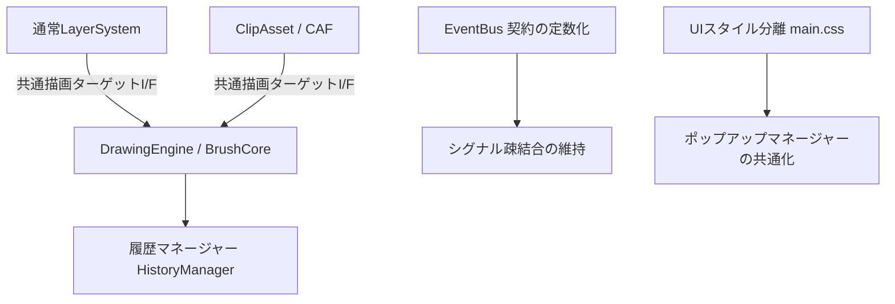

# Tegaki 構造改善・技術負債精査レポート (Code Quality & Technical Debt Report)

更新日: 2026-06-19

## 1. はじめに・本レポートの目的

本レポートは、`tegaki_work/` 内の現行実装について、今後予定されている主要な改修計画（`開発用資料保管庫/proposals/` 内の各種計画）を安全かつ迅速に進めるための前段として、コードの重複、構造の複雑化、命名や設計の不整合、および潜在的な不具合の要因を精査したものです。

特に、以下の観点に焦点を当てています。
1. **データモデルと描画エンジンの責務境界**: 通常レイヤーとCAF（Clip Asset Frame）/TimelineModelの間での重複と依存の混在
2. **イベント駆動設計の整合性**: EventBus のメッセージング契約（名前空間、引数型、デッドハンドラ）
3. **CSS・UI設計のクリーンさ**: JS側からのインラインスタイルの濫用度合い、CSSクラス名規則の統一性
4. **構造変更の推奨ロードマップ**: 改修計画を破綻させずに進めるための事前最適化提案

---

## 2. 構造の精査と技術負債の分析

### 2.1. データモデル・描画ターゲットの重複と依存関係の混在

#### ① 通常レイヤーとCAF（アニメーション内部レイヤー）の二重管理
`layer-system.js` と `animation-system.js` (および新規の `timeline-frame-compositor.js`) の間で、描画ターゲット（PixiJSの `RenderTexture` や `Container`）の同期処理とキャッシュライフサイクルが複雑に絡み合っています。
- **課題**: 通常のレイヤー（`LayerModel`）とCAF内部レイヤーで、同じ PixiJS `Container` や `Sprite` を別々のツリー構造に配置しようとする、あるいは手動で複製する「アダプター境界」の肥大化が見られます。
- **影響**: 描画ターゲット切り替え時（特にCAF内部レイヤーへの直接描画時）に、描画終了イベント `draw:commit` が意図しない側の履歴（History）をキャプチャし、メモリリークや描画の二重焼き込み、アンドゥ・リドゥ時の復元崩れを引き起こしやすくなっています。

#### ② 履歴管理（History）の肥大化と重複
- **課題**: アニメーション編集時、以前はストロークごとに全ClipAsset/DrawingSnapshotのシリアライズを実行していたため、メモリ負荷と遅延（秒単位のフリーズ）が発生していました（Phase 5bで差分制御へ修正されましたが、依然として通常Layer側とCAF側で異なる履歴追跡ロジックが並行稼働しています）。
- **影響**: 今後「変形（Vキー）の履歴監査」や「矩形選択変形の履歴統合」を行う際、通常レイヤー履歴とCAF内部履歴の2つの経路で全く異なる復元処理を二重実装・修正しなければならなくなるリスクがあります。

---

### 2.2. EventBus 契約とグローバル変数の乱雑さ

#### ① イベント命名規則の不統一
`event-bus.js` には `TegakiEventBus.EVENTS` として定数が一部定義されていますが、依然として文字列リテラルを直接指定した `emit` / `on` が散見されます。
- `layer:created` や `history:changed` などのコロン区切り（`namespace:action`）
- `tool:select` や `brush:mode-changed` などのケバブケース
- `camera:resized` と `camera:resize` のように、微妙に表記が異なったり、引数の構造が微妙に異なるイベント名が混在するリスク。

#### ② デッドハンドラ（リスナー無しの発火 / 発火無しのリスナー）
- 旧 `animation-system.js` 由来のイベント（例: `animation:frame-applied` 等）が、新タイムライン（`timeline-ui.js` や `timeline-frame-compositor.js`）の導入により、一部「どこからも受信されていないが発火している」「古いUIのみが待ち受けている」デッドイベントと化している可能性があります。

#### ③ `window` グローバル汚染
- `window.EventBus`, `window.TegakiEventBus`, `window.animationSystem` など、後方互換性のために多くのサブシステムが依然としてグローバル空間に登録されています。
- **影響**: モジュール分割（Viteによるバンドル）のメリットであるスコープ分離を妨げ、テスト時にグローバルモックが必要になり、依存関係の循環を静的解析で検知しにくくしています。

---

### 2.3. CSS設計とUI生成ロジックの課題

#### ① JavaScript 内のインラインスタイルの残存
`AGENTS.md` の第3項第4条（インラインスタイルの禁止）に規定がありますが、ポップアップ（`quick-access-popup.js`, `settings-popup.js`）やレイヤーパネル（`layer-panel-renderer.js`）など、動的配置を行う箇所で `element.style.top` や `element.style.left` だけでなく、配色や透明度・サイズまでインラインで設定されている形跡が残っています。
- **影響**: テーマ（ダークモード）切り替えや画面リサイズ対応を行う際、CSSで上書きできず、JS側の描画ロジックを修正せざるを得なくなります。

#### ② 命名規則の混在 (BEM vs camelCase vs kebab-case)
CSS（`main.css`）内で、以下の規則が混在しています。
- BEM調: `.ui-icon-button--small`
- キャメルケース: `.layerPanelActive`
- ケバブケース: `.canvas-area`
- **推奨**: 今後の新UI（オプション式トップバー、配色ジェネレーター等）を追加する前に、CSSクラス命名のガイドラインを「原則ケバブケースまたはBEM」に統一する必要があります。

---

## 3. 今後の実装（proposals）を進めるための事前構造改善案

proposalsの各計画をスムーズかつ安全に実装するために、事前に以下の構造変更を行うことを強く推奨します。

### 改善案 1: 描画ターゲットの抽象化インターフェース導入 (01_描画・編集・出力 向け)
- **内容**: `DrawingEngine` および `BrushCore` が直接 `LayerSystem` の内部変数を参照するのではなく、「現在アクティブな描画キャンバス（通常レイヤーまたはCAF内部レイヤー）」を抽象化した `IDrawingTarget` インターフェース（または共通アダプター）を介して操作するようにします。
- **効果**: これにより、CAF内部レイヤー直接描画や、将来の「矩形選択変形」「逆クリッピング」の実装時に、描画エンジン側を書き換えることなく、ターゲットを差し替えるだけで動作可能になります。

### 改善案 2: 履歴マネージャーのコマンド化と共通化 (03_アニメーション・CAF・変形 向け)
- **内容**: 履歴の Undo/Redo アクションを、`HistoryCommand` クラスとしてカプセル化（通常描画、CAF描画、変形、レイヤー操作など）。各コマンドが自身の `byteSize` を返し、かつ対象のドメイン（通常レイヤー / CAF）に対して適用されるように設計を統一します。
- **効果**: メモリ使用量の上限監視や自動破棄（Phase 5bで導入されたもの）のロジックがシンプルに一元化され、変形の確定/履歴監査時のバグを根絶できます。

### 改善案 3: イベント契約の完全定義化とデッドコード排除
- **内容**: `TegakiEventBus.EVENTS` オブジェクトにアプリ全体で利用する全てのイベント名を定義し、リテラル文字列による `emit`/`on` を原則禁止にします。不要になった古いアニメーションイベントを廃止します。
- **効果**: イベント名のタイポによる動作不良や、存在しないイベントへのリスナー登録を確実に防止します。

### 改善案 4: ポップアップのDOMマウント・スタイル制御の共通化 (02_UI・操作・カラー 向け)
- **内容**: Phase 5bで導入された「共通overlay mount helper」をさらに抽象化し、すべてのポップアップ（Album, Export, Settings, QAP）のベースとなる `BasePopup` クラスを定義。位置決定やリサイズ時のレイアウト競合（z-index問題）をフレームワークレベルで解決します。
- **効果**: JavaScript 内のインラインスタイル（特に位置や重なり順に関するもの）を完全に排除し、`main.css` 側での一元管理を実現します。

---

## 4. 結論と実装ロードマップ

本精査結果に基づき、以下の順序で計画を実行していくことを提案します。

1. **Step 1: イベント契約と共通ポップアップマウントのクリーンアップ**（低リスク・高効果）
   - グローバル `window` 依存の段階的削減と、`EventBus` 定数化の徹底。
2. **Step 2: 描画ターゲット抽象化（IDrawingTarget）の導入**（中リスク）
   - `01_描画・編集・出力.md` の「キャンバス表示反転」「Vキー変形監査」に着手する前の足場固め。
3. **Step 3: 各機能提案（proposals 1〜5）の各フェーズ実装開始**
   - 整理された土台の上で、計画に沿った機能追加を安全に推進。
